빠른 시작
----------

본 챕터는 CMT를 처음 사용하는 사용자가 설치 직후 첫 마이그레이션을 직접 수행할 수 있도록 만든 단계별 가이드이다. 일반적인 GUI 시나리오 두 가지와 CLI 시나리오 한 가지를 다룬다.

세 시나리오 모두 원본 데이터베이스로 **Oracle**\을 가정한다. Oracle 이외의 원본을 사용하는 경우에도 마법사 흐름은 동일하며, 원본 연결 정보 입력 단계의 필드 일부만 다르다. 마법사 전체 단계의 모든 옵션과 분기 흐름은 :doc:`05_wizard`\에서, 콘솔 명령의 전체 레퍼런스는 :doc:`09_console`\에서 자세히 다룬다.

.. note::
  본 챕터의 화면 예시는 Windows의 한국어 로케일 환경을 기준으로 한다.

시나리오 1: Oracle → 온라인 CUBRID (online → online)
^^^^^^^^^^^^^^^^^^^^^^^^^^^^^^^^^^^^^^^^^^^^^^^^^^^^^

원본 Oracle 데이터베이스의 스키마와 데이터를 운영 중인 CUBRID 데이터베이스에 직접 적재하는 가장 흔한 시나리오이다. 양쪽 모두 JDBC로 직접 접속하므로 별도의 중간 파일이 생기지 않는다.

**사전 준비**

- 원본 Oracle 접속 정보 (호스트, 포트, 데이터베이스 이름(SID 또는 Service Name), 사용자, 비밀번호)
- 대상 CUBRID 접속 정보 (호스트, 포트, DB 이름, 사용자, 비밀번호)
- Oracle JDBC 드라이버
- CUBRID JDBC 드라이버는 CMT 배포본에 포함되어 있다.

A. 새 마이그레이션
""""""""""""""""""""

CMT 메인 화면 상단 툴바에서 **새 마이그레이션** 버튼을 클릭한다. 마이그레이션 마법사 창이 열린다.

.. image:: ./images/새마이그레이션.png

B. 마이그레이션 유형 선택 (1단계)
""""""""""""""""""""""""""""""""""""

마법사의 1단계에서 원본 유형과 대상 유형을 지정한다.

- **원본 유형**: **온라인 Oracle 데이터베이스**
- **대상 유형**: **온라인 CUBRID 데이터베이스**

**다음 >** 버튼을 누른다.

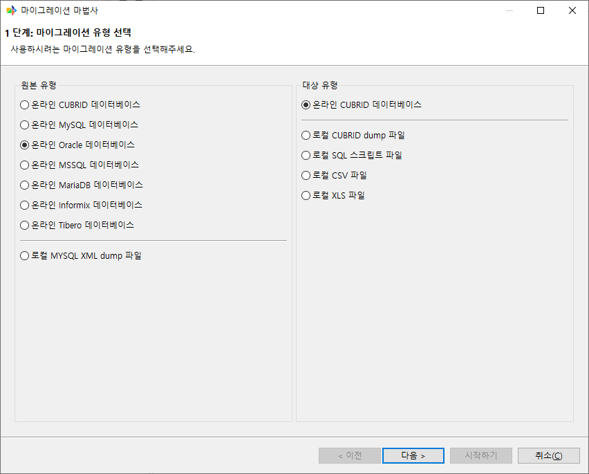

C. 원본 데이터베이스 선택 (2단계)
""""""""""""""""""""""""""""""""""""

저장되어 있는 Oracle 연결 정보를 목록에서 선택한다. 등록된 연결 정보가 없으면 **신규** 버튼을 클릭하여 연결 정보 입력 다이얼로그를 연다.

다이얼로그에서 호스트, 포트(기본 1521), 데이터베이스 이름(SID 또는 Service Name), 사용자, 비밀번호를 입력하고 JDBC 드라이버 경로에 Oracle JDBC 드라이버 JAR 파일을 지정한다. **테스트** 버튼으로 접속을 확인한 뒤 **확인**\으로 저장한다.

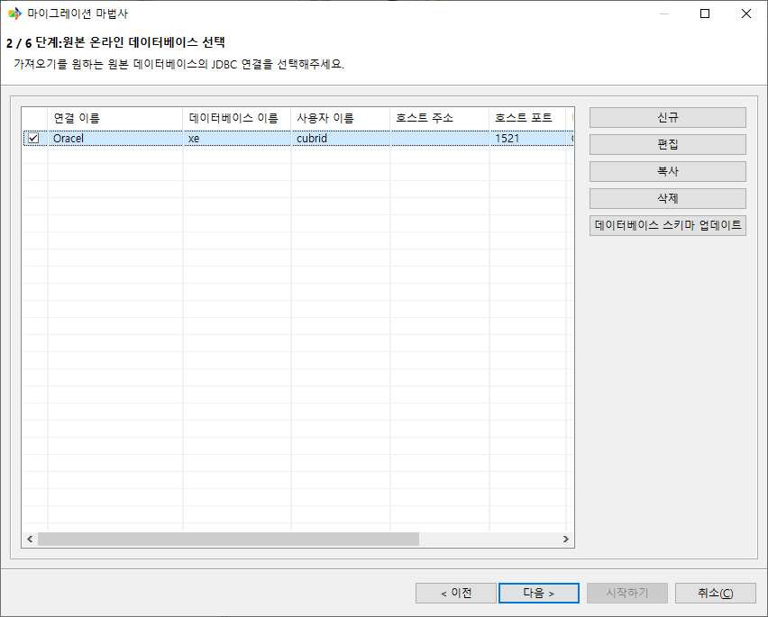

D. 대상 선택 (3단계)
""""""""""""""""""""""""""""""""""""

대상 CUBRID 연결 정보를 같은 방식으로 선택하거나 **신규**\로 새로 등록한다. 호스트, 포트(기본 33000), DB 이름, 사용자, 비밀번호를 입력하고 **테스트** 버튼으로 접속을 확인한다.

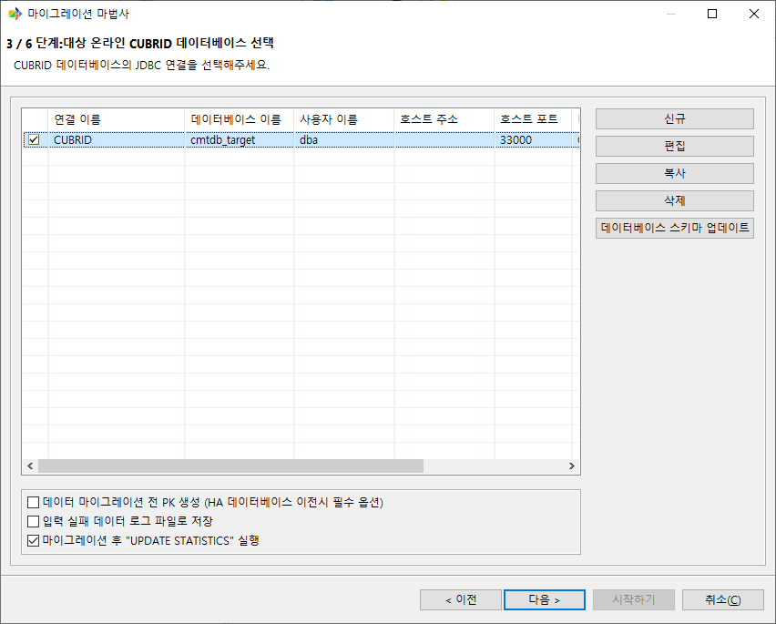

E. 스키마 매핑 (4단계)
""""""""""""""""""""""""

원본 Oracle 사용자(스키마)와 대상 CUBRID 사용자를 매핑한다. 이관할 원본 스키마 행 왼쪽의 체크박스에 체크하고, **대상 스키마** 열에서 대상 CUBRID에서 사용할 스키마 이름을 지정한다.

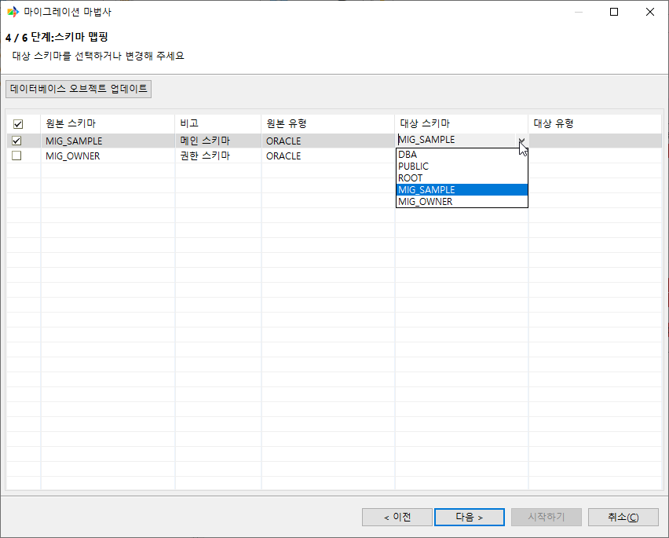

F. 객체 매핑 (5단계)
""""""""""""""""""""""

원본에서 추출한 객체 목록이 좌측 트리에 표시된다. Table, View, Serial(Sequence), Index, Grant, Synonym, Procedure(PL/CSQL), Function(PL/CSQL) 등을 확인할 수 있다. 기본적으로 모든 객체가 선택되어 있으며, 체크박스로 마이그레이션 대상에서 제외할 수 있다.

특정 Table을 클릭하면 우측 패널에 Column 매핑이 나타난다. 데이터 타입, Column명, NULL 허용 여부 등을 개별로 수정할 수 있다. 이번 빠른 시작에서는 기본 매핑을 그대로 사용한다. 데이터 타입 매핑 규칙, WHERE 절 필터, Column 단위 변환 등 객체 매핑의 전체 옵션은 :doc:`06_objects`\에서 다룬다.

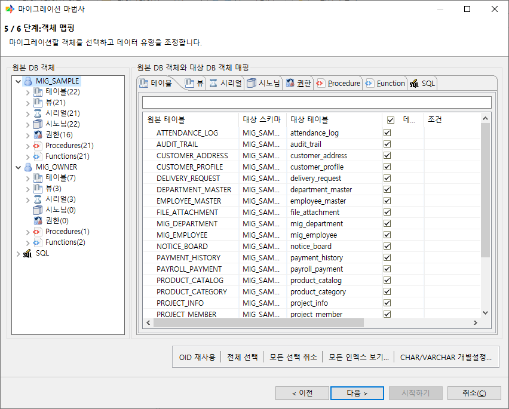

G. 마이그레이션 전 최종 확인 (6단계)
"""""""""""""""""""""""""""""""""""""""

6단계에서는 지금까지 설정한 내용을 한 화면에 모아 보여준다. **DDL 미리보기** 버튼으로 생성될 DDL을 미리 볼 수 있다.

화면 하단의 **고급 성능 설정...** 버튼으로 추출 스레드 개수, 테이블당 입력 스레드 개수, 커밋 주기 등 성능 옵션을 조정할 수 있다. 원본 DB 종류와 대상 형식에 따라 표시되는 항목은 달라진다. 첫 마이그레이션에서는 기본값을 그대로 사용해도 충분하다.

화면 하단의 **시작하기** 버튼을 누르면 실행 모드 다이얼로그가 열린다. **바로 시작하기**\를 선택하면 즉시 실행되고, **예약하기**\를 선택하면 1회 또는 반복 실행으로 등록할 수 있다(:doc:`04_ui` 참고).

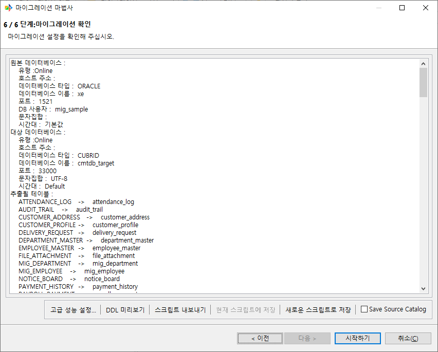

H. 마이그레이션 진행 모니터링
""""""""""""""""""""""""""""""""

**바로 시작하기**\를 누르면 마이그레이션 진행 화면이 작업 영역에 열린다. 상단 진행 표에서 Table별 처리 행 수와 진행률을 실시간으로 확인할 수 있다. 하단 로그 패널에는 현재 처리 중인 객체와 메시지가 출력된다.

진행 중 **중단** 버튼으로 작업을 중단할 수 있다. 작업이 진행되는 동안에는 진행 화면 탭을 닫을 수 없다.

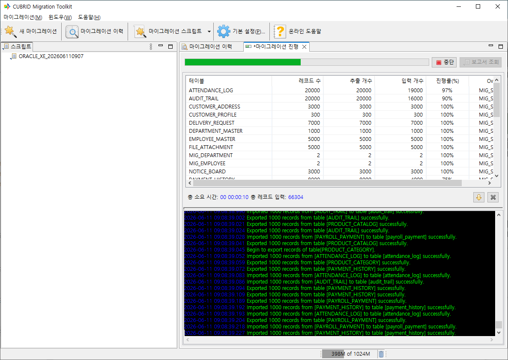

I. 마이그레이션 보고서 확인
""""""""""""""""""""""""""""""

마이그레이션이 끝나면 보고서를 바로 열지 묻는 다이얼로그가 표시된다. 보고서에는 객체 종류별 성공/실패 건수, 마이그레이션된 레코드 수, 오류 메시지 등이 정리되어 있다.

보고서는 워크스페이스에 보관되므로 이후 메인 화면의 **마이그레이션 이력**\에서 다시 열어볼 수 있다. 자세한 내용은 :doc:`10_report`\을 참고한다.

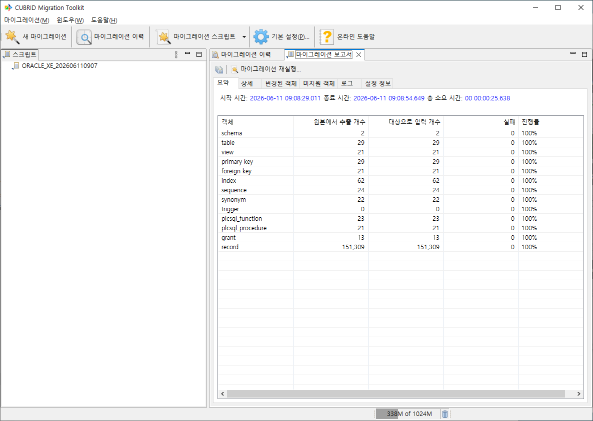

시나리오 2: Oracle → 로컬 dump 파일 (online → offline)
^^^^^^^^^^^^^^^^^^^^^^^^^^^^^^^^^^^^^^^^^^^^^^^^^^^^^^^^^^

대상 CUBRID에 직접 접속할 수 없는 환경에서는 마이그레이션 결과를 로컬 dump 파일로 출력한 뒤 대상 측에서 ``loaddb`` 유틸리티로 적재한다.

마법사의 1단계와 3단계가 다르고 4단계의 대상 스키마 입력 방식이 조금 다를 뿐, 나머지 흐름은 시나리오 1과 같다.

**사전 준비**

- 원본 Oracle 접속 정보 (시나리오 1과 동일)
- 출력 파일을 저장할 로컬 디스크 경로 (예: ``D:\export\oracle_dump``)
- 충분한 디스크 여유 공간

A. 새 마이그레이션
""""""""""""""""""""

상단 툴바의 **새 마이그레이션** 버튼을 클릭한다.

B. 마이그레이션 유형 선택 (1단계)
""""""""""""""""""""""""""""""""""""

- **원본 유형**: **온라인 Oracle 데이터베이스**
- **대상 유형**: **로컬 CUBRID dump 파일**

대상 유형으로 **로컬 SQL 스크립트 파일**·**로컬 CSV 파일**·**로컬 XLS 파일**\을 선택해도 이후 흐름은 거의 같다. 형식별 차이는 :doc:`08_target`\에서 다룬다.

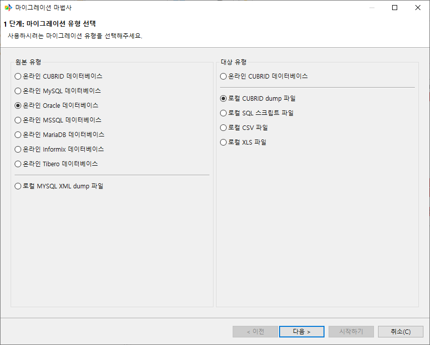

C. 원본 데이터베이스 선택 (2단계)
""""""""""""""""""""""""""""""""""""

시나리오 1과 동일하게 Oracle 연결 정보를 선택한다.

D. 출력 파일 설정 (3단계)
""""""""""""""""""""""""""""

대상 데이터베이스 선택 대신 출력 파일 설정 화면이 나타난다. **파일 경로**\와 **출력 파일의 Prefix**, 적재할 대상의 **CUBRID 버전** 등을 지정한다. 각 항목에 대한 자세한 설명은 :doc:`05_wizard`\의 3단계를 참고한다.

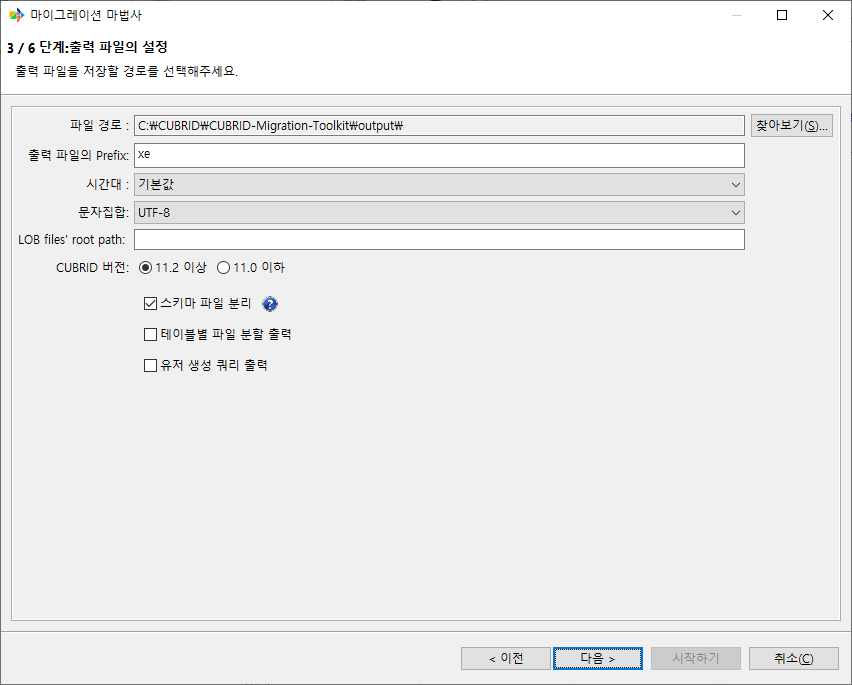

E. 스키마 매핑 (4단계)
""""""""""""""""""""""""

오프라인 출력의 경우 대상 DB 접속 정보가 없으므로 대상 스키마 이름을 직접 입력해야 한다. 기본값으로 원본 스키마와 같은 이름이 채워진다.

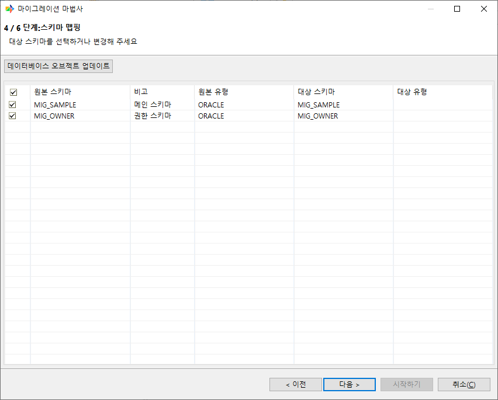

F. 객체 매핑 (5단계)
""""""""""""""""""""""

시나리오 1과 동일하다. 객체 목록을 확인하고 필요 시 조정한다.

G. 마이그레이션 전 최종 확인 (6단계)
"""""""""""""""""""""""""""""""""""""""

설정 요약을 확인하고 **시작하기** 버튼을 누른 뒤 실행 모드 다이얼로그에서 **바로 시작하기**\를 선택한다.

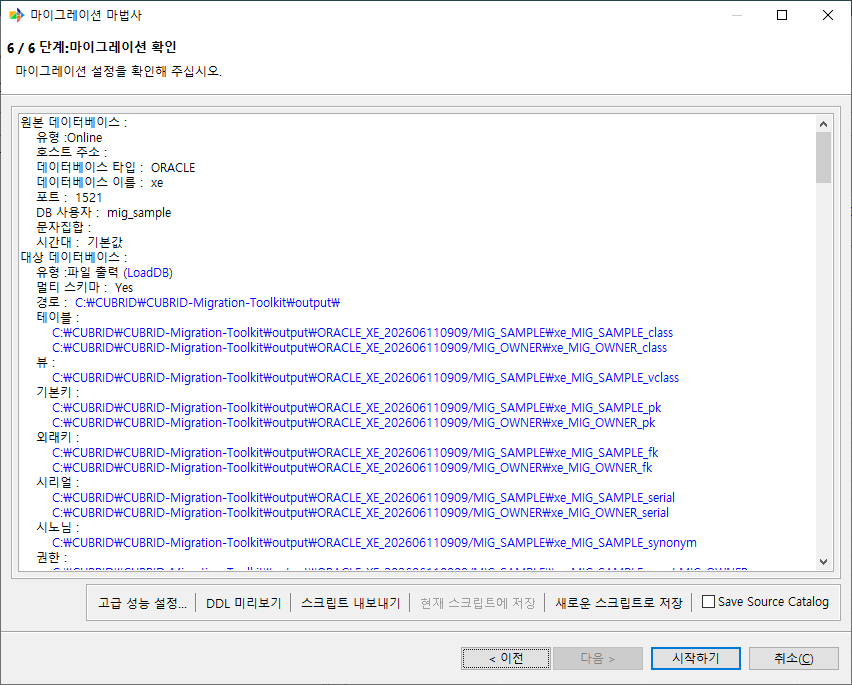

H. 마이그레이션 진행
""""""""""""""""""""""

진행 화면에서 온라인 대상과 동일하게 객체 및 데이터 마이그레이션 진행 상황을 확인한다. 작업이 진행되는 동안 지정한 출력 경로에는 스키마 파일과 데이터 파일이 생성된다.

I. 마이그레이션 보고서 확인
""""""""""""""""""""""""""""""

마이그레이션이 끝나면 보고서가 열린다. 보고서의 **요약** 탭에서 **출력 위치**\를 클릭하면 OS의 파일 탐색기로 출력 디렉토리가 열린다.

.. image:: ./images/마이그레이션_리포트_오프라인.png

생성된 dump 파일은 대상 CUBRID 서버에서 ``loaddb`` 유틸리티로 적재한다.

.. code-block:: bash

  # 스키마 적용
  cubrid loaddb -u dba -s <schema_file> mydb
  # 데이터 적재
  cubrid loaddb -u dba -d <data_file> mydb

실제 파일명과 적재 순서는 스키마 파일 분리, 테이블별 파일 분할 출력 옵션에 따라 달라진다. 전체 디렉토리 구조와 파일 명명 규칙은 :doc:`08_target`\를 참고한다.

시나리오 3: 콘솔로 마이그레이션하기
^^^^^^^^^^^^^^^^^^^^^^^^^^^^^^^^^^^^^^^^

시나리오 1과 같은 작업(Oracle → 온라인 CUBRID)을 콘솔만으로 실행하는 흐름이다.

전체 흐름은 다음 단계로 구성된다.

1. ``db.conf``\에 원본/대상 연결 정보 등록
2. ``script`` 명령으로 마이그레이션 XML 생성
3. ``start`` 명령으로 XML 실행
4. ``report`` / ``log`` 명령으로 실행 결과 확인

1단계: db.conf에 연결 정보 등록
""""""""""""""""""""""""""""""""""""

CMT 설치 디렉토리의 ``db.conf`` 파일에 원본/대상 연결 정보를 추가한다.

.. code-block:: properties

  # 원본 Oracle
  oracle_prod.type=oracle
  oracle_prod.host=oracle.example.com
  oracle_prod.port=1521
  oracle_prod.dbname=ORCL
  oracle_prod.user=scott
  oracle_prod.password=tiger
  oracle_prod.driver=<Oracle JDBC 드라이버 JAR 경로>

  # 대상 CUBRID
  cubrid_prod.type=cubrid
  cubrid_prod.host=cubrid.example.com
  cubrid_prod.port=33000
  cubrid_prod.dbname=mydb
  cubrid_prod.user=dba
  cubrid_prod.password=dba_password
  cubrid_prod.driver=/opt/cubridmigration/jdbc/JDBC-11.3.2.0053-cubrid.jar

``db.conf`` 속성의 전체 목록과 자세한 설명은 :ref:`db-conf`\을 참고한다.

2단계: 마이그레이션 XML 생성
""""""""""""""""""""""""""""""""

``script`` 명령으로 원본 스키마를 조회하여 마이그레이션 XML을 생성한다.

.. code-block:: bash

  cd /opt/cubridmigration
  ./migration.sh script -s oracle_prod -t cubrid_prod -o /tmp/scripts

성공하면 ``/tmp/scripts/`` 아래에 ``ORACLE_ORCL_<timestamp>.xml`` 형식의 파일이 생성된다. ``-o`` 인자는 디렉토리 경로이며, 파일명은 자동으로 생성된다.

생성된 XML에는 원본/대상 연결 파라미터, 객체 목록, 스키마 매핑이 모두 포함되며, 콘솔 모드의 비대화형 실행을 위한 입력 파일로 사용된다.

3단계: 마이그레이션 실행
""""""""""""""""""""""""""""

생성된 XML을 ``start`` 명령으로 실행한다.

.. code-block:: bash

  ./migration.sh start /tmp/scripts/ORACLE_ORCL_202605201030.xml

진행 상황이 콘솔에 실시간으로 표시된다.

4단계: 보고서 확인
""""""""""""""""""""

``report`` 명령으로 가장 최근 마이그레이션의 결과 요약을 확인한다.

.. code-block:: bash

  ./migration.sh report -l

``log`` 명령으로 실행 로그를 페이지 단위로 조회할 수 있다.

.. code-block:: bash

  ./migration.sh log -l -ps 100

콘솔 명령의 모든 옵션과 출력 형식은 :doc:`09_console`\에서 다룬다. 정기 실행을 위한 OS 레벨 스케줄러 등록 예시는 :doc:`12_advanced`\에서 다룬다.

다음 단계
^^^^^^^^^^^

관련 챕터
^^^^^^^^^

- :doc:`04_ui` — 메인 화면, 메뉴, 툴바, 단축키
- :doc:`05_wizard` — 마법사 전체 단계의 모든 옵션과 분기
- :doc:`06_objects` — 데이터 타입 매핑, Column 단위 변환, WHERE 필터
- :doc:`08_target` — dump/SQL/CSV/XLS 형식별 출력 옵션
- :doc:`09_console` — 콘솔 명령 전체 레퍼런스
