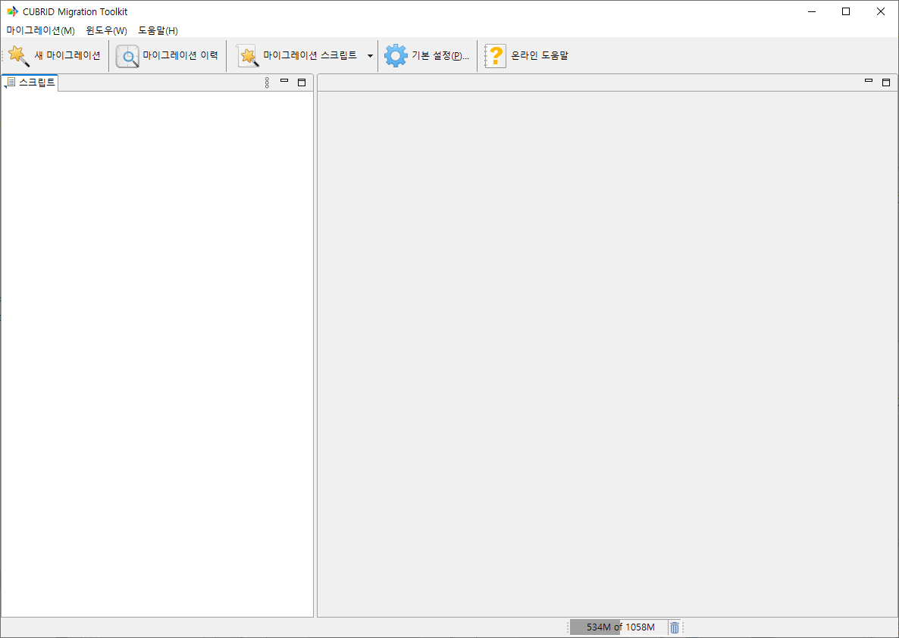
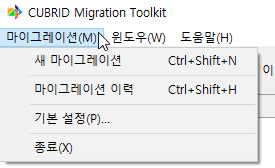
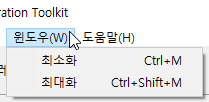
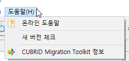
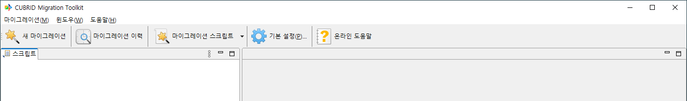
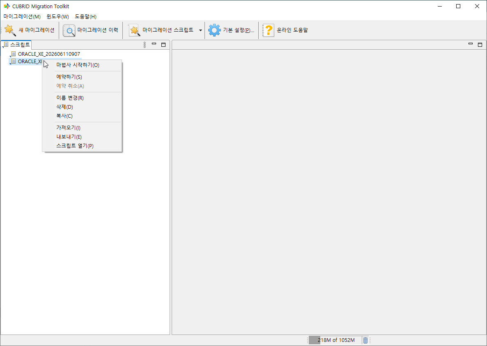
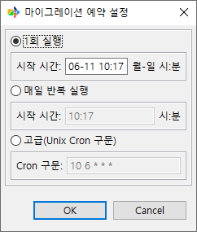
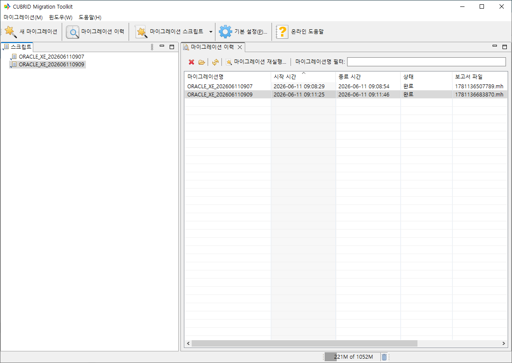

GUI 둘러보기
-------------

본 챕터는 CMT GUI 모드의 화면 구성, 메뉴, 툴바, 주요 뷰와 단축키를 정리한다. 마법사와 다이얼로그의 세부 동작은 :doc:`05_wizard`, :doc:`06_objects`, :doc:`10_report` 등 후속 챕터에서 다룬다.

메인 화면 구성
^^^^^^^^^^^^^^^^^

CMT를 실행하면 다음과 같은 메인 화면이 열린다. 화면은 단일 레이아웃으로 구성되며, 작업은 중앙 영역에 탭으로 열린다.

- **상단 메뉴 바** — **마이그레이션** / **윈도우** / **도움말** 세 개의 최상위 메뉴
- **상단 툴바** — 5개의 주요 액션 버튼. 각 버튼은 아이콘과 텍스트가 함께 표시된다.
- **좌측 패널** — 마이그레이션 스크립트 탐색기.
- **중앙 작업 영역** — 마이그레이션 이력, 진행 화면, 보고서가 이 영역에 탭으로 열린다. 마법사는 별도 창으로 열린다.
- **하단 상태 표시줄** — 현재 메모리 사용량을 표시한다.

메뉴
^^^^^^

상단 메뉴 바는 다음 세 개의 최상위 메뉴를 제공한다.

마이그레이션(M) 메뉴
""""""""""""""""""""""""""""""

.. list-table::
    :header-rows: 1
    :widths: 30 50 20

    * - 항목
      - 설명
      - 단축키
    * - **새 마이그레이션**
      - 새 마이그레이션 마법사를 시작한다. 자세한 흐름은 :doc:`05_wizard` 참고
      - ``Ctrl+Shift+N``
    * - **마이그레이션 이력**
      - 마이그레이션 이력 화면을 작업 영역에 연다.
      - ``Ctrl+Shift+H``
    * - **기본 설정**
      - 환경설정 다이얼로그를 연다. 자세한 내용은 :doc:`11_config` 참고
      - —
    * - **종료**
      - CMT를 종료한다. **종료 확인** 다이얼로그가 표시되며, **종료시 묻지 않고 종료하기** 토글로 다음부터 생략할 수 있다.
      - —

윈도우(W) 메뉴
""""""""""""""""""""""""""""""

.. list-table::
    :header-rows: 1
    :widths: 30 50 20

    * - 항목
      - 설명
      - 단축키
    * - **최소화**
      - 메인 창을 최소화한다.
      - ``Ctrl+M``
    * - **최대화**
      - 메인 창을 최대화하거나 원복한다.
      - ``Ctrl+Shift+M``

도움말(H) 메뉴
""""""""""""""""""""""""""""""

.. list-table::
    :header-rows: 1
    :widths: 30 70

    * - 항목
      - 설명
    * - **온라인 도움말**
      - 기본 브라우저로 온라인 매뉴얼을 연다.
    * - **새 버전 체크**
      - 새 버전이 있는지 즉시 확인한다. 자동 확인 여부는 환경설정의 **자동으로 새로운 업데이트를 검색하고 시작할 때 알림** 옵션으로 제어한다.
    * - **CUBRID Migration Toolkit 정보**
      - 버전, 빌드 정보, 라이선스 정보 다이얼로그를 표시한다.

툴바
^^^^^^

상단 툴바에는 다음 5개 항목이 좌측부터 순서대로 배치된다. 각 버튼은 아이콘과 라벨이 함께 표시된다.

.. list-table::
    :header-rows: 1
    :widths: 5 25 15 55

    * - #
      - 라벨
      - 형태
      - 동작
    * - 1
      - **새 마이그레이션**
      - 버튼
      - 새 마이그레이션 마법사를 연다 (메뉴의 동명 항목과 동일).
    * - 2
      - **마이그레이션 이력**
      - 버튼
      - 마이그레이션 이력 화면을 연다.
    * - 3
      - **마이그레이션 스크립트**
      - 드롭다운
      - 스크립트 관련 액션을 모아 놓은 드롭다운 메뉴. 아래 *컨텍스트 메뉴* 절의 항목과 동일하다.
    * - 4
      - **기본 설정**
      - 버튼
      - 환경설정 다이얼로그를 연다.
    * - 5
      - **온라인 도움말**
      - 버튼
      - 기본 브라우저로 온라인 매뉴얼을 연다.

마이그레이션 스크립트 탐색기
^^^^^^^^^^^^^^^^^^^^^^^^^^^^^^^^

좌측의 **스크립트** 영역은 워크스페이스에 저장된 마이그레이션 스크립트(``.xml``)를 트리 구조로 보여준다. 예약 여부에 따라 스크립트 노드의 아이콘이 다르게 표시된다(예약 없음 / 예약됨).

**스크립트** 패널 제목줄의 뷰 메뉴(드롭다운 메뉴)의 **최상위 요소** 하위 메뉴에서 **목록**\(기본값) 또는 **그룹**\을 선택해 표시 모드를 전환하고, **그룹 설정**\으로 그룹 설정 다이얼로그를 연다.

컨텍스트 메뉴
""""""""""""""""""

스크립트 노드를 우클릭하면 다음 액션이 표시된다.

.. list-table::
    :header-rows: 1
    :widths: 30 70

    * - 항목
      - 동작
    * - **마법사 시작하기**
      - 선택한 스크립트로 마이그레이션 마법사를 연다. 노드 더블클릭과 동일하다.
    * - **예약하기**
      - 예약 다이얼로그를 연다. 아래 *마이그레이션 예약 설정* 절 참고.
    * - **예약 취소**
      - 활성화된 예약을 해제한다.
    * - **이름 변경**
      - 이름 변경 다이얼로그를 연다.
    * - **삭제**
      - 스크립트를 삭제한다. ``Delete`` 키로도 동일하게 동작한다.
    * - **복사**
      - 새 이름으로 복제한다.
    * - **가져오기**
      - 외부 XML 파일에서 스크립트를 가져온다. SSH 원격 가져오기 옵션을 제공한다.
    * - **내보내기**
      - 현재 스크립트를 외부 XML로 저장한다. SSH 업로드 옵션을 제공한다.
    * - **스크립트 열기**
      - 임의 경로의 XML 스크립트를 마법사로 연다.

그룹 설정과 정렬
""""""""""""""""""""""""""""""""""""""""""""""""

**스크립트** 패널의 뷰 메뉴에서 **그룹 설정**\을 선택하면 그룹 설정 다이얼로그가 열린다.

- **그룹 관리 및 순서 변경**

.. list-table::
    :header-rows: 1
    :widths: 30 70

    * - 항목
      - 설명 및 동작
    * - **그룹 선택과 정렬** 목록
      - 현재 등록된 스크립트 그룹이 표시된다.
    * - **추가...** / **편집...**
      - 새 그룹을 생성하거나, 선택한 그룹의 이름 및 포함된 스크립트를 수정한다.
    * - **삭제**
      - 선택한 그룹을 삭제한다.
    * - **맨위** / **위로** / **아래로** / **맨아래**
      - 목록에서 그룹이 표시되는 순서를 변경한다. 아무 그룹도 선택하지 않았거나 이동할 수 없는 위치에 있는 경우 관련 버튼은 비활성화된다.

.. note::
  다른 그룹에 속하지 않은 스크립트는 기본 그룹에 표시된다. 기본 그룹은 편집하거나 삭제할 수 없다.

- **그룹 편집 다이얼로그 규칙**

.. list-table::
    :header-rows: 1
    :widths: 30 70

    * - 항목
      - 규칙 및 제한 사항
    * - **그룹 이름**
      - 필수 입력 항목이며, 중복될 수 없고 최대 50자까지 입력 가능하다.
    * - **스크립트 이동 버튼**
      - 좌우 목록 사이의 ``>``, ``>>``, ``<``, ``<<`` 버튼을 이용해 스크립트를 그룹에 추가하거나 제외할 수 있다.

마이그레이션 예약 설정
""""""""""""""""""""""""""""""""""""""""""""""""

**마이그레이션 예약 설정** 다이얼로그에서는 세 가지 방식 중 하나를 선택한다. 선택한 방식의 입력란만 활성화된다.

.. list-table::
    :header-rows: 1
    :widths: 20 25 55

    * - 모드
      - 입력 형식
      - 설명
    * - **1회 실행**
      - ``월-일 시:분`` (예: ``12-25 09:30``)
      - 지정한 월-일과 시각에 실행되도록 예약한다. 기본값은 현재 시각 기준 약 1시간 뒤이다.
    * - **매일 반복 실행**
      - ``시:분``
      - 매일 지정한 시각에 실행되도록 예약한다.
    * - **고급(Unix Cron 구문)**
      - 5필드 Cron 구문 예: ``10 6 * * *``
      - 분, 시, 일, 월, 요일 순서의 Cron 구문을 직접 입력한다.

입력값이 올바르지 않으면 **오류** 다이얼로그가 표시되고 예약은 저장되지 않는다. 예약 정보는 스크립트 메타데이터에 저장되며, CMT가 실행 중인 상태에서 예약 시각이 되면 마이그레이션 진행 화면이 열린다.

마이그레이션 이력 화면
^^^^^^^^^^^^^^^^^^^^^^^^

``마이그레이션 > 마이그레이션 이력`` 메뉴 또는 툴바의 **마이그레이션 이력** 버튼을 선택하면 이력 화면이 작업 영역에 탭으로 열린다. 워크스페이스 보고서 디렉토리에 저장된 보고서를 표 형식으로 보여준다.

상단 툴바
""""""""""""

좌측에 다음 4개 버튼이 위치하고, 우측에 텍스트 필터가 표시된다.

.. list-table::
    :header-rows: 1
    :widths: 35 65

    * - 버튼
      - 동작
    * - **삭제**
      - 선택된 이력 항목을 삭제한다.
    * - **마이그레이션 이력 가져오기**
      - 외부 보고서 파일을 워크스페이스로 가져온다.
    * - **새로고침**
      - 이력 목록을 다시 읽어 갱신한다.
    * - **마이그레이션 재실행...**
      - 선택된 이력의 마이그레이션 설정으로 마법사를 다시 연다.

필터
""""""

우측의 텍스트 입력 박스에 스크립트 이름 패턴(예: ``orders*``)을 입력하면 표가 즉시 필터링된다.

표 컬럼
""""""""""

다중 선택이 가능하다. **마이그레이션명** 또는 **시작 시간** 헤더를 클릭하면 정렬되며, 기본 정렬은 **시작 시간** 오름차순이다.

.. list-table::
    :header-rows: 1
    :widths: 25 75

    * - 컬럼
      - 설명
    * - **마이그레이션명**
      - 마이그레이션 스크립트 이름
    * - **시작 시간**
      - 마이그레이션 시작 시각
    * - **종료 시간**
      - 종료 시각
    * - **상태**
      - 완료 / 미완료 / 취소 등 상태
    * - **보고서 파일**
      - 보고서 파일 이름

컨텍스트 메뉴
""""""""""""""""

표의 행을 우클릭하면 다음 항목이 표시된다.

.. list-table::
    :header-rows: 1
    :widths: 35 65

    * - 항목
      - 동작
    * - **보고서 열기**
      - 보고서 화면을 연다. 행 더블클릭과 동일하다.
    * - **마법사 시작하기**
      - 저장된 스크립트로 마법사를 다시 연다.
    * - **삭제**
      - 선택된 이력을 삭제한다.
    * - **이력 가져오기**
      - 외부 보고서 파일을 가져온다.
    * - **새로고침**
      - 목록을 갱신한다.

보고서 화면의 탭 구성과 각 컬럼의 의미는 :doc:`10_report`\에서 자세히 다룬다.

키보드 단축키
^^^^^^^^^^^^^^^

CMT가 제공하는 글로벌 단축키는 다음 4개이다.

.. list-table::
    :header-rows: 1
    :widths: 50 50

    * - 동작
      - 단축키
    * - 새 마이그레이션 마법사
      - ``Ctrl+Shift+N``
    * - 마이그레이션 이력 열기
      - ``Ctrl+Shift+H``
    * - 창 최소화
      - ``Ctrl+M``
    * - 창 최대화/원복
      - ``Ctrl+Shift+M``

마이그레이션 스크립트 탐색기에서 노드를 선택한 뒤 ``Delete`` 키를 누르면 **삭제** 액션이 실행된다.

다국어 지원
^^^^^^^^^^^^^

CMT는 여러 언어의 UI 메시지 리소스를 포함한다.

.. list-table::
    :header-rows: 1
    :widths: 35 65

    * - 언어
      - 로케일 코드
    * - 영어
      - ``en`` (기본값)
    * - 한국어
      - ``ko``

UI에는 언어 전환 메뉴가 제공되지 않는다. 다음 둘 중 하나로 로케일이 결정된다.

- OS의 기본 로케일을 그대로 사용
- 실행 시 ``-nl <locale>`` 인자를 전달 (예: ``cubridmigration -nl ko``)

.. tip::
  한국어 환경에서 영어 UI로 실행하려면 ``cubridmigration -nl en``\과 같이 실행한다. ``.ini`` 파일에 ``-nl`` 인자를 추가하면 매번 지정할 필요가 없다(:doc:`11_config` 참고).

날짜와 시각 표기는 OS의 기본 타임존을 따른다.

관련 챕터
^^^^^^^^^

- :doc:`05_wizard` — **새 마이그레이션**\으로 시작하는 마법사의 모든 단계
- :doc:`10_report` — 마이그레이션 이력에서 여는 보고서 화면
- :doc:`12_advanced` — 예약 마이그레이션, 취소된 마이그레이션 재시작
- :doc:`11_config` — 기본 설정(환경 설정) 상세
