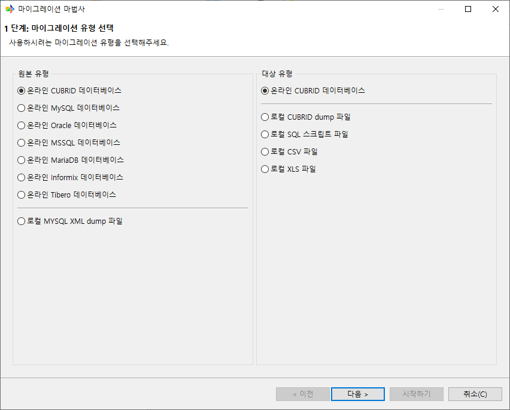
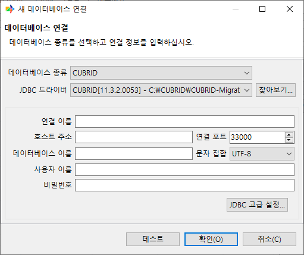
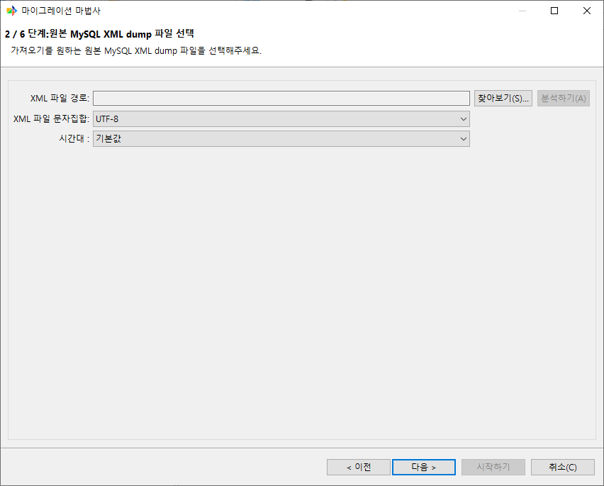
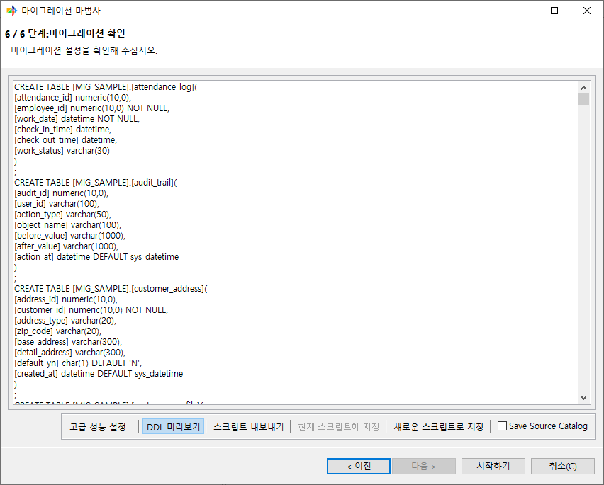

마이그레이션 마법사
-------------------

본 챕터는 CMT의 핵심 화면인 **마이그레이션 마법사(Migration Wizard)**\의 모든 단계와 옵션을 설명한다. 마법사는 원본 데이터베이스와 대상의 종류를 결정한 뒤 객체 단위로 매핑을 조정하고, 마지막 단계에서 실행 또는 예약을 선택하는 6단계 흐름으로 구성된다.

마법사는 다음 경로에서 진입한다.

- 메뉴 ``마이그레이션 > 새 마이그레이션`` 또는 메인 화면 좌상단의 **새 마이그레이션** 버튼
- **스크립트** 뷰에서 기존 스크립트 더블클릭 또는 우클릭 후 **마법사 시작하기**

마법사가 보여 주는 6단계는 다음과 같다.

1. 마이그레이션 유형 선택
2. 원본 데이터베이스 선택
3. 대상 선택
4. 스키마 매핑
5. 객체 매핑
6. 최종 확인

객체별 매핑 옵션(Column, Primary Key, Foreign Key, Index 등)에 대해서는 5단계에서 트리 구조와 공통 동작만 다루며, 객체 유형별 상세는 :doc:`06_objects`\를 참고한다. 원본 데이터베이스 타입별 연결 필드는 :doc:`07_sourcedb`, 대상 출력 형식별 옵션은 :doc:`08_target`\에서 자세히 다룬다.

.. note::
  **시작하기** 버튼은 마지막 단계(6단계 — 최종 확인)에서만 활성화된다.

1단계 — 마이그레이션 유형 선택
^^^^^^^^^^^^^^^^^^^^^^^^^^^^^^^^^^^^^^^^^^^^^^^^^^^^^^^^^^^^

화면은 **원본 유형**\과 **대상 유형** 두 그룹으로 나뉘며, 각 그룹에서는 하나만 선택할 수 있다.

**원본 유형**

CMT가 원본으로 지원하는 데이터베이스 종류는 다음과 같다. 각 항목의 연결 필드와 주의사항은 :doc:`07_sourcedb`\를 참고한다.

.. list-table::
    :header-rows: 1
    :widths: 38 62

    * - 항목
      - 비고
    * - 온라인 CUBRID 데이터베이스
      - CUBRID JDBC Driver를 사용하여 접속
    * - 온라인 Oracle 데이터베이스
      - Oracle JDBC Driver를 사용하여 접속
    * - 온라인 MySQL 데이터베이스
      - MySQL Connector/J를 사용하여 접속
    * - 온라인 MariaDB 데이터베이스
      - MariaDB Connector/J를 사용하여 접속
    * - 온라인 MSSQL 데이터베이스
      - Microsoft JDBC Driver for SQL Server를 사용하여 접속
    * - 온라인 Informix 데이터베이스
      - IBM Informix JDBC Driver를 사용하여 접속
    * - 온라인 Tibero 데이터베이스
      - Tibero JDBC Driver를 사용하여 접속
    * - 로컬 MYSQL XML dump 파일
      - ``mysqldump --xml``\로 생성된 XML 형식의 덤프 파일

**대상 유형**

마이그레이션 결과를 받을 대상의 형태를 선택한다.

.. list-table::
    :header-rows: 1
    :widths: 38 62

    * - 항목
      - 비고
    * - 온라인 CUBRID 데이터베이스
      - 운영 중인 CUBRID에 JDBC로 직접 적재
    * - 로컬 CUBRID dump 파일
      - ``loaddb`` 적재용 dump 파일 출력
    * - 로컬 SQL 스크립트 파일
      - DDL과 데이터를 담은 SQL 스크립트 출력
    * - 로컬 CSV 파일
      - Table별 CSV 파일과 스키마 SQL 파일 출력
    * - 로컬 XLS 파일
      - Table별 XLS 파일과 스키마 SQL 파일 출력

.. note::
  가장 최근에 선택한 조합이 저장되어, 다음 실행 시 그 조합이 기본값으로 선택된다.

2단계 — 원본 데이터베이스 선택
^^^^^^^^^^^^^^^^^^^^^^^^^^^^^^^^^^^^^^^^^^^^^^^^^^^^^^^^^^^^

1단계에서 선택한 원본 유형에 따라 두 가지 화면 중 하나가 표시된다.

온라인 데이터베이스 원본
""""""""""""""""""""""""""""""""""""""""""""""""""""""""""""""""""""

연결 정보 목록과 우측 버튼들이 있는 **연결 정보 관리 영역**\이 표시된다. 1단계에서 선택한 원본 데이터베이스 종류에 해당하는 연결만 노출된다.

.. image:: ./images/마법사_2단계.png

**연결 정보 목록**

목록은 선택 표시 컬럼과 **연결 이름**, **데이터베이스 이름**, **사용자 이름**, **호스트 주소**, **호스트 포트**, **데이터베이스 유형**, **문자 집합** 컬럼으로 구성된다.

행을 우클릭하면 **데이터베이스 스키마 업데이트 / 복사 / 삭제** 컨텍스트 메뉴가 표시된다.

**우측 버튼**

.. list-table::
    :header-rows: 1
    :widths: 20 80

    * - 버튼
      - 동작
    * - **신규**
      - 새 연결 정보를 입력하는 다이얼로그를 연다.
    * - **편집**
      - 선택된 연결 정보를 편집한다. 목록의 행을 더블클릭해도 동일하게 동작한다.
    * - **복사**
      - 선택된 연결 정보를 복제한다. 이름 끝에 ``" - Copy"`` 접미사가 자동으로 붙으며, 다른 호스트나 데이터베이스 이름으로 비슷한 연결을 만들 때 사용한다.
    * - **삭제**
      - 확인 후 선택된 연결을 삭제한다.
    * - **데이터베이스 스키마 업데이트**
      - 캐시된 스키마 정보를 무시하고 원본 데이터베이스에서 카탈로그를 다시 가져온다.

**연결 정보 입력 폼**

**신규** / **편집** / **복사**\를 누르면 연결 정보 입력 폼이 열린다. 폼 구조는 모든 원본 데이터베이스 종류에 공통이며, 데이터베이스별 차이(기본 포트, 추가 파라미터, JDBC URL 패턴 등)는 :doc:`07_sourcedb`\에서 다룬다.

.. list-table::
    :header-rows: 1
    :widths: 24 46

    * - 필드
      - 비고
    * - **데이터베이스 종류**
      - 1단계에서 선택한 데이터베이스 종류가 기본값으로 표시되며, 변경할 수 없다.
    * - **JDBC 드라이버**
      - **찾아보기...**\로 ``*.jar`` 파일을 추가할 수 있다. 중복 등록 시 경고가 표시된다.
    * - **연결 이름**
      - 필수. 워크스페이스 내에서 유일해야 한다.
    * - **호스트 주소**
      - 필수.
    * - **연결 포트**
      - 데이터베이스 종류에 따라 기본 포트가 채워진다.
    * - **데이터베이스 이름**
      - 필수.
    * - **문자 집합**
      - 원본 데이터베이스 종류에 따라 활성화된다(CUBRID, MSSQL).
    * - **사용자 이름 / 비밀번호**
      - 사용자 이름은 필수이며, 비밀번호 입력 여부는 데이터베이스 정책에 따라 선택 사항이다.
    * - **JDBC 고급 설정...**
      - 사용자 정의 JDBC URL 패턴을 입력할 수 있는 다이얼로그를 연다.

**테스트**

폼 하단의 **테스트** 버튼은 입력한 정보로 실제 JDBC 접속을 시도한다. 접속에 성공하면 정보 메시지가, 실패하면 오류 원인을 알려 주는 상세 메시지가 다이얼로그로 표시된다.

**다음으로 이동 시 동작**

**다음 >**\로 페이지를 떠날 때 다음이 일어난다.

1. 선택한 연결의 스키마 카탈로그를 진행률 표시와 함께 가져온다.
2. 기존 스크립트에서 사용 중이던 스키마가 새 카탈로그에 없으면 재매핑 다이얼로그가 열린다.
3. 원본 데이터베이스가 변경되면 이후 단계의 객체 선택은 자동으로 초기화된다.

MySQL XML dump 원본
""""""""""""""""""""""""""""""""""""""""""""""""""""""""""""""""""""

1단계에서 **로컬 MYSQL XML dump 파일**\을 선택한 경우, 연결 목록 대신 XML 파일 입력 폼이 표시된다.

.. list-table::
    :header-rows: 1
    :widths: 26 50

    * - 필드
      - 비고
    * - **XML 파일 경로**
      - 읽기 전용 텍스트 입력란과 **찾아보기...** 버튼. ``*.xml`` 필터. 필수.
    * - **XML 파일 문자집합**
      - 필수.
    * - **시간대**
      - ``기본값`` 선택.
    * - **분석하기**
      - 파일 선택 후 활성화된다. XML을 파싱하여 스키마를 추출한다.

파일이 선택되지 않았거나 **XML 파일 문자집합**\이 비어 있는 경우, 또는 유효하지 않은 mysqldump XML이면 명시적인 오류 메시지가 표시된다.

3단계 — 대상 선택
^^^^^^^^^^^^^^^^^^^^^^^^^^^^^^^^^^^^^^^^^^^^^^^^^^^^^^^^^^^^

1단계에서 선택한 대상 유형에 따라 두 가지 화면으로 분기한다.

대상이 온라인 CUBRID인 경우
""""""""""""""""""""""""""""""""""""""""""""""""""""""""""""""""""""

CUBRID 전용 연결 정보 관리 영역과 마이그레이션 옵션 체크박스가 표시된다.

.. image:: ./images/마법사_3단계_온라인.png

**연결 정보 관리 영역**

2단계의 연결 정보 관리 영역과 동일하지만, 데이터베이스 종류는 CUBRID로 고정된다. 연결 추가·편집·복사·삭제·테스트 동작은 모두 같다.

**하단 체크박스**

.. list-table::
    :header-rows: 1
    :widths: 50 50

    * - 옵션
      - 설명
    * - **데이터 마이그레이션 전 PK 생성**
      - 데이터 적재 전에 Primary Key를 먼저 생성한다. HA 환경에서는 필수 옵션이다.
    * - **입력 실패 데이터 로그 파일로 저장**
      - 적재에 실패한 레코드를 별도 파일로 기록한다.
    * - **마이그레이션 후 "UPDATE STATISTICS" 실행**
      - 데이터 적재가 완료된 후 대상 데이터베이스에서 ``UPDATE STATISTICS``\를 실행한다.

**다음으로 이동 시 동작**

- 대상 CUBRID가 11.2 이상이면 다중 스키마 모드가 자동으로 활성화된다.
- 대상 버전과 대상 사용자 권한이 저장된다. 이후 객체 매핑 단계 진입 시, 대상이 온라인 CUBRID이고 버전이 11.2 미만이면 Synonym·Grant를 마이그레이션할 수 없다는 경고가 표시된다. 11.2 이상이더라도 대상 접속 사용자가 DBA 그룹에 속하지 않으면 Grant를 마이그레이션할 수 없다는 경고가 표시된다.

대상이 파일인 경우
""""""""""""""""""""""""""""""""""""""""""""""""""""""""""""""""""""

대상 유형이 ``로컬 CUBRID dump 파일`` / ``로컬 SQL 스크립트 파일`` / ``로컬 CSV 파일`` / ``로컬 XLS 파일`` 중 하나일 때 표시되는 출력 파일 설정 화면이다.

.. image:: ./images/마법사_3단계_오프라인.png

.. list-table::
    :header-rows: 1
    :widths: 28 22 50

    * - 필드
      - 기본값
      - 비고
    * - **파일 경로**
      - ``<설치 경로>/output/``
      - **찾아보기...**\로 디렉토리를 선택한다. 끝의 ``/``\는 자동으로 추가된다.
    * - **출력 파일의 Prefix**
      - 원본 데이터베이스 이름
      - 산출 파일명 앞에 붙는 문자열. 예: Prefix가 ``oracle``\이고 원본 스키마가 ``HR``\이면 ``oracle_HR_class`` 같은 파일명이 생성된다.
    * - **CSV 설정**
      - —
      - 대상이 CSV일 때만 표시. separator, quote, escape 문자를 지정한다.
    * - **시간대**
      - ``기본값``
      - 출력 데이터의 시간대.
    * - **문자집합**
      - 콤보 첫 항목
      - 출력 파일의 문자 집합. 필수.
    * - **LOB files' root path**
      - 비어 있음
      - 대상이 CUBRID dump일 때만 표시. dump 데이터 파일에 기록할 LOB 기준 경로. 비워 두면 출력 경로 아래의 ``lob/<테이블명>/`` 경로가 기록된다. 다른 경로를 지정한 경우, 생성된 LOB 파일을 대상 서버의 해당 경로에 직접 배치해야 한다.
    * - **CUBRID 버전**
      - ``11.2 이상``
      - ``11.2 이상`` 또는 ``11.0 이하`` 중 선택. 다중 스키마 출력 구조를 결정한다.
    * - **스키마 파일 분리**
      - ON
      - 스키마 DDL을 Table, PK, FK, Index, Serial 등 객체 종류별 파일로 분리한다. 해제하면 스키마 DDL이 통합 파일로 생성된다.
    * - **테이블별 파일 분할 출력**
      - OFF
      - 대상이 CUBRID dump나 SQL일 때만 표시. Table별로 별도 파일을 생성한다.
    * - **유저 생성 쿼리 출력**
      - OFF
      - ``CREATE USER`` 문의 SQL 파일을 생성한다.

대상 출력 형식별 디렉토리 구조와 파일 명명 규약은 :doc:`08_target`\를 참고한다.

4단계 — 스키마 매핑
^^^^^^^^^^^^^^^^^^^^^^^^^^^^^^^^^^^^^^^^^^^^^^^^^^^^^^^^^^^^

원본 데이터베이스의 각 스키마를 대상 CUBRID의 어떤 스키마로 적재할지 결정하는 단계이다.

.. image:: ./images/마법사_4단계_온라인.png

**화면 구성**

- 상단: **데이터베이스 오브젝트 업데이트** 버튼 — 원본 데이터베이스에서 객체들을 조회한다. 기존에 캐시된 객체가 있으면 초기화한 뒤 다시 조회한다.
- 본문: 원본 스키마와 대상 스키마를 매핑하는 표.

**매핑 표 컬럼**

.. list-table::
    :header-rows: 1
    :widths: 25 75

    * - 컬럼
      - 설명
    * - **원본 스키마**
      - 원본 스키마 이름
    * - **대상 스키마**
      - 대상 스키마. 대상이 온라인인 경우 콤보 셀 에디터로 대상 카탈로그의 스키마 목록 중 하나를 선택하거나, 파일 출력인 경우 스키마를 직접 명시할 수 있다.

**권한별 동작**

대상 CUBRID의 접속 사용자가 가진 권한에 따라 가능한 작업이 달라진다.

.. list-table::
    :header-rows: 1
    :widths: 24 24 24 28

    * - 원본 사용자
      - 대상 사용자
      - 선택 가능한 대상 스키마
      - 제한
    * - DBA
      - DBA
      - 모든 스키마 매핑, 새 스키마 생성, Grant 마이그레이션
      - 없음.
    * - DBA
      - 일반 사용자
      - 일반 사용자가 소유한 스키마로만 매핑
      - 새 스키마를 만들 수 없음. Grant 마이그레이션 시 경고.
    * - 일반 사용자
      - DBA
      - 대상의 모든 스키마로 매핑 가능
      - 원본에서 권한이 없는 객체는 노출되지 않는다.
    * - 일반 사용자
      - 일반 사용자
      - 일반 사용자가 소유한 스키마로만 매핑
      - 새 스키마를 만들 수 없음. Grant 마이그레이션 시 경고.

**다중 스키마 처리**

대상 CUBRID 버전에 따라 동작이 다르다.

.. list-table::
    :header-rows: 1
    :widths: 30 70

    * - 대상 버전
      - 동작
    * - 11.2 이상
      - 다중 스키마가 자동으로 활성화된다. 원본 스키마별로 대상 스키마를 별도로 지정할 수 있다.
    * - 11.0 이하
      - 모든 객체가 단일 사용자 스키마로 통합된다. 서로 다른 원본 스키마에 동일한 이름의 객체가 존재하면 다음 단계 진입 시 충돌 안내 다이얼로그가 표시된다.

5단계 — 객체 매핑
^^^^^^^^^^^^^^^^^^^^^^^^^^^^^^^^^^^^^^^^^^^^^^^^^^^^^^^^^^^^

원본 데이터베이스의 어떤 객체를 어떤 이름과 속성으로 마이그레이션할지 정의하는, 마법사에서 가장 많이 사용되는 단계이다.

.. image:: ./images/마법사_5단계.png

**레이아웃**

화면은 세로로 분할되어 있다.

- **좌측 원본 DB 객체** — 원본 데이터베이스의 모든 객체를 트리로 표시한다.
- **우측 원본 DB 객체와 대상 DB 객체 매핑** — 좌측에서 선택한 노드 종류에 따라 동적으로 변경되는 상세 패널.

**좌측 트리 구조**

.. code-block:: text

  
  스키마
    ├─ 테이블(n)
    │  └─ 테이블 이름
    │     ├─ 컬럼(n)
    │     ├─ 외래키(n)
    │     └─ 인덱스(n)
    ├─ 뷰(n)
    ├─ 시리얼(n)
    ├─ 시노님(n)
    ├─ 권한(n)
    ├─ Procedures(n)
    ├─ Functions(n)
    └─ SQL            ← 사용자 정의 SELECT 가상 Table

**우측 상세 패널**

선택한 트리 노드의 종류에 따라 표시되는 패널이 달라진다.

.. list-table::
    :header-rows: 1
    :widths: 38 62

    * - 선택한 노드
      - 표시되는 내용
    * - Schema / Tables / Views 등 그룹 노드
      - 체크박스와 이름 컬럼이 있는 표. 일괄 포함·제외, 마이그레이션 여부 선택이 가능하다.
    * - 개별 Table (또는 그 하위 FKs / Indexes 노드)
      - 일반, PK, FK, 인덱스, 사용자 정의 SQL 탭으로 편집한다. 컬럼은 일반 탭 하단의 그리드에서 편집한다.
    * - 단일 Column
      - 이름, 데이터 타입, 길이, 정밀도(precision)·스케일(scale), 기본값, NULL 허용 여부를 편집한다.
    * - 단일 Index / Foreign Key / Serial(Sequence) / View / Synonym
      - 각각의 속성에 맞는 편집 화면이 표시된다.
    * - 단일 Procedure / Function
      - 대상으로 생성될 SQL을 편집한다.
    * - 단일 SQL Table
      - 사용자 정의 SELECT 문을 가상의 Table로 등록한 항목을 편집한다.

각 화면의 필드와 검증 규칙은 :doc:`06_objects`\에서 자세히 다룬다.

**하단 툴바**

.. list-table::
    :header-rows: 1
    :widths: 28 72

    * - 버튼
      - 동작
    * - **OID 재사용**
      - 모든 대상 Table에 ``REUSE_OID`` 플래그를 일괄 적용한다.
    * - **전체 선택**
      - 모든 원본 객체를 마이그레이션 대상으로 체크한다.
    * - **모든 선택 취소**
      - 확인 후 모든 객체 선택을 해제한다.
    * - **모든 인덱스 보기...**
      - Index를 Table 단위로 일괄 선택·해제하는 다이얼로그를 연다.
    * - **CHAR/VARCHAR 개별설정...**
      - char / varchar Column의 길이를 일괄 변경하는 다이얼로그를 연다.

**페이지 진입 시 자동 안내**

다음 조건에 해당하면 본 단계 진입 시 자동으로 안내 다이얼로그가 열린다.

- 여러 원본 스키마에 동일한 이름의 객체가 존재하고 대상이 단일 스키마일 때 — **다중 스키마 내에 중복된 오브젝트 이름 변경** 안내
- 원본에 LOB Column이 있을 때 — **LOB Information** 안내
- 원본이 CUBRID가 아닌 온라인 데이터베이스일 때 — 식별자가 모두 소문자로 변환된다는 경고
- 원본과 대상의 char / varchar 길이 차이가 변환을 요구할 때 — char Column 길이 조정 다이얼로그
- 대상이 온라인 CUBRID이고 11.2 미만이면 Synonym·Grant 마이그레이션 미지원 경고
- 대상이 온라인 CUBRID 11.2 이상이고 접속 사용자가 DBA 그룹이 아니면 Grant 마이그레이션 미지원 경고

6단계 — 최종 확인
^^^^^^^^^^^^^^^^^^^^^^^^^^^^^^^^^^^^^^^^^^^^^^^^^^^^^^^^^^^^

마법사의 마지막 단계로, 설정 요약을 검토하고 성능 옵션을 조정한 뒤 마이그레이션을 실행하거나 예약한다.

.. image:: ./images/마법사_6단계_온라인.png

설정 요약
""""""""""""""""""""""""""""""""""""""""""""""""""""""""""""""""""""

화면 본문에는 읽기 전용 텍스트로 다음 항목이 표시된다.

- **원본 데이터베이스** — 원본 유형, 호스트 주소, 데이터베이스 종류와 이름, 포트, 사용자, 문자셋, 시간대. XML dump의 경우 파일 경로와 문자셋, 시간대.
- **대상 데이터베이스** — 대상 유형. 파일 대상의 경우 출력 경로, 다중 스키마 사용 여부, 객체 카테고리별(Table / View / PK / FK / Serial / Synonym / Grant / Procedure / Function / Unique Index / Index / Data / UPDATE STATISTICS) 출력 경로가 파란색으로 강조되어 표시된다.
- **추출될 테이블 / 추출될 뷰 / 추출될 SQL 데이터 / 추출될 외래키 / 추출될 인덱스 / 추출될 시리얼** — 원본과 대상의 매핑 목록.
- **추출될 시노님 / 추출될 권한** — 대상이 온라인 CUBRID인 경우 11.2 이상일 때만 표시된다(파일 대상에서는 항상 표시).

성능 설정 다이얼로그
""""""""""""""""""""""""""""""""""""""""""""""""""""""""""""""""""""

하단 툴바의 **고급 성능 설정...**\을 누르면 성능 설정 다이얼로그가 열린다. **추출 스레드 개수**, **테이블당 입력 스레드 개수**, **커밋 주기**, **테이블별 진행률 생략**\을 조정할 수 있으며, 원본/대상 조합에 따라 항목이 추가로 표시된다. 설정한 값은 작업별로 저장되어 환경 설정의 기본값을 덮어쓴다.

.. image:: ./images/성능설정_다이얼로그.png

**기본값** 버튼은 모든 값을 환경 설정의 **마이그레이션** 페이지에 설정된 값으로 되돌린다.

각 항목의 의미·기본값·허용 범위는 :doc:`12_advanced`\의 성능 튜닝 절을 참고한다.

DDL 미리보기
""""""""""""""""""""""""""""""""""""""""""""""""""""""""""""""""""""

하단 툴바의 **DDL 미리보기** 토글 버튼을 누르면 요약 화면이 DDL 미리보기 화면으로 전환되어, 마이그레이션 시 생성될 객체들의 DDL을 보여 준다. 토글을 한 번 더 누르면 요약 화면으로 돌아간다.

스크립트 저장 / 내보내기
""""""""""""""""""""""""""""""""""""""""""""""""""""""""""""""""""""

하단 툴바의 스크립트 관련 버튼은 세 종류이다.

- **스크립트 내보내기** — 마이그레이션 설정을 XML 파일로 저장하거나 SSH 원격으로 업로드한다.
- **현재 스크립트에 저장** — 기존 스크립트에서 마법사를 시작한 경우에만 활성화된다. 동일한 파일에 변경 사항을 덮어쓴다.
- **새로운 스크립트로 저장** — 새 스크립트 이름을 입력하면 워크스페이스에 새 스크립트로 저장된다.

체크박스 **Save Source Catalog**\를 켜면 원본 데이터베이스의 카탈로그가 스크립트 XML에 함께 저장된다. 다음에 동일한 스크립트로 다시 실행할 때 원본 데이터베이스에 접속하지 않고도 객체 매핑을 복원할 수 있다.

실행 또는 예약
""""""""""""""""""""""""""""""""""""""""""""""""""""""""""""""""""""

**시작하기**\를 누르면 다음 순서로 동작한다.

1. 메모리 위험을 감지하면 경고 다이얼로그가 표시된다.
2. 실행 모드 다이얼로그가 열린다.

실행 모드 다이얼로그는 다음 항목으로 구성된다.

- **Migration Name** — 현재 설정 이름이 채워져 있다. 워크스페이스 내에서 유일한 이름이어야 한다.
- **바로 시작하기** — 즉시 마이그레이션을 시작하고 진행 화면을 연다.
- **예약하기** — 스크립트를 저장한 뒤 예약 다이얼로그를 연다.
- **취소** — 닫고 6단계로 돌아간다.

**예약하기**\를 누르면 예약 다이얼로그가 열린다. 다음 세 가지 모드 중 하나를 선택한다.

.. list-table::
    :header-rows: 1
    :widths: 24 24 52

    * - 모드
      - 입력 형식
      - 비고
    * - **1회 실행**
      - ``월-일 시:분``
      - 1회만 실행. 예: ``12-25 09:30``.
    * - **매일 반복 실행**
      - ``시:분``
      - 매일 같은 시각에 반복. 예: ``02:00``.
    * - **고급(Unix Cron 구문)**
      - Cron 패턴
      - 선택 시 활성화되는 **Cron 구문:** 입력란에 자유롭게 입력한다. 기본값은 ``10 6 * * *``.

마이그레이션 실행 및 모니터링
^^^^^^^^^^^^^^^^^^^^^^^^^^^^^^^^^^^^^^^^^^^^^^^^^^^^^^^^^^^^

**바로 시작하기**\를 누르면 작업 영역에 진행 화면이 열리고 실제 마이그레이션이 시작된다.

.. image:: ./images/마이그레이션_진행.png

화면 구성
""""""""""""""""""""""""""""""""""""""""""""""""""""""""""""""""""""

진행 화면은 두 영역으로 구성된다.

- **상단** — 전체 진행률 바와 **중단** / **보고서 조회** 버튼, Table별 진행 표.
- **하단** — 총 경과 시간, 누적 적재 레코드 수, 로그 패널 숨기기·지우기 버튼, 검은색 배경의 로그 패널.

Table별 진행 표
""""""""""""""""""""""""""""""""""""""""""""""""""""""""""""""""""""

진행 표의 컬럼은 다음과 같다.

.. list-table::
    :header-rows: 1
    :widths: 24 76

    * - 컬럼
      - 내용
    * - **테이블**
      - 테이블 이름.
    * - **레코드 수**
      - 원본의 총 레코드 수.
    * - **추출 개수**
      - 원본에서 읽어들인 누적 행 수.
    * - **입력 개수**
      - 대상에 적재된 누적 행 수.
    * - **진행률(%)**
      - 진행률 백분율.
    * - **Owner**
      - 스키마 소유자. 원본이 다중 스키마를 지원하지 않으면 표시되지 않는다.

상단 컨트롤
""""""""""""""""""""""""""""""""""""""""""""""""""""""""""""""""""""

- **중단** — 진행 중인 마이그레이션을 즉시 중단한다. 누르면 확인 다이얼로그가 표시된다.
- **보고서 조회** — 마이그레이션이 종료된 후에 활성화된다. 결과 보고서 화면을 연다.

로그 패널
""""""""""""""""""""""""""""""""""""""""""""""""""""""""""""""""""""

- 로그 패널은 검은 배경의 읽기 전용 영역으로, 진행 메시지·경고·오류가 실시간으로 추가된다.
- **메시지 숨기기 / 메시지 보이기** — 로그 패널을 접거나 펼친다.
- **메시지 초기화** — 로그 내용을 비운다.
- **총 소요 시간** — 총 경과 시간이 파란색으로 표시된다.
- **총 레코드 입력** — 누적 적재 행 수가 파란색으로 표시된다.

종료 시 동작
""""""""""""""""""""""""""""""""""""""""""""""""""""""""""""""""""""

- 마이그레이션이 정상적으로 종료되면 진행 화면 탭의 아이콘이 진행 표시에서 녹색 체크 표시로 바뀐다.
- 사용자가 **바로 시작하기**\로 직접 시작한 경우에는 보고서를 바로 열지 묻는 다이얼로그가 표시된다. 예약으로 시작된 경우에는 묻지 않고 보고서를 조용히 저장한다.

중단과 재시작
""""""""""""""""""""""""""""""""""""""""""""""""""""""""""""""""""""

- 마이그레이션이 진행 중일 때는 진행 화면 탭을 닫을 수 없다. 먼저 **중단**\으로 중단해야 한다.
- 중단된 마이그레이션은 ``마이그레이션 > 마이그레이션 이력`` 화면에서 **마이그레이션 재실행...** 버튼(또는 컨텍스트 메뉴의 **마법사 시작하기**)으로 재시작할 수 있다. 이전 설정이 그대로 복원되므로 옵션을 다시 입력할 필요가 없다.

관련 챕터
^^^^^^^^^

- 객체별 매핑 옵션 — :doc:`06_objects`
- 원본 데이터베이스 타입별 추가 필드 — :doc:`07_sourcedb`
- 대상 출력 형식별 옵션 — :doc:`08_target`
- 마이그레이션 결과 보고서 — :doc:`10_report`
- 명령행에서 동일 작업 실행 — :doc:`09_console`
