객체 매핑 상세
--------------

본 챕터는 마법사 5단계 **객체 매핑**\에서 객체 유형별로 노출되는 옵션을 한곳에 모아 안내한다. 5단계의 트리 구조, 공통 동작, 툴바 버튼은 :doc:`05_wizard`\에서 다루므로 여기서는 다루지 않으며, 트리에서 객체 노드를 선택했을 때 우측에 표시되는 매핑 패널을 객체 종류별로 차례로 설명한다.

객체 매핑 화면은 원본 데이터베이스에서 추출한 객체 카탈로그를 사용자가 검토하고 대상 CUBRID에 맞게 조정하는 작업 공간이다. 각 절은 객체 개요, 노출되는 필드/옵션, 그리고 마이그레이션 결과에 영향을 주는 주의사항으로 구성된다.

객체 종류 개요
^^^^^^^^^^^^^^^^^^^^^^^^^^

객체 매핑 화면 좌측의 **원본 DB 객체** 트리는 원본 카탈로그를 다음 노드로 분해해 보여 준다. 노드를 선택하면 우측의 매핑 패널이 해당 노드 종류에 맞게 교체된다.

.. image:: ./images/마법사_5단계.png

.. list-table::
    :header-rows: 1
    :widths: 25 35 40

    * - 객체 종류
      - 매핑 패널에서 조정하는 내용
      - 비고
    * - Table
      - 대상 Table명, 데이터 마이그레이션, Table 생성/재생성, PK 생성 여부, Column 순서
      - 일반, PK, FK, 인덱스, 사용자 정의 SQL(데이터 마이그레이션 전/후 실행) 탭 포함
    * - Column
      - 대상 Column명, 데이터 유형, NULL 허용, 기본값, 자동증분, 값 변환
      - 개별 Column 노드 선택 시 표시
    * - Primary Key
      - PK 생성 여부, 대상 PK 이름, 대상 PK 컬럼
      - 좌측 트리에 별도 노드로 표시되지 않으며, Table의 PK 탭에서 조정
    * - Foreign Key
      - Table의 FK 탭에서 생성/교체 여부를 조정하고, 개별 FK 상세 패널에서 참조 관계와 동작을 조정
      - 개별 FK 노드 선택 시 상세 패널 표시
    * - Index
      - Table의 인덱스 탭에서 생성/교체 여부를 조정하고, 개별 Index 상세 패널에서 Column 구성과 속성을 조정
      - 개별 Index 노드 선택 시 상세 패널 표시
    * - View
      - 대상 View 이름, View 구문
      - View Query Spec 편집 가능
    * - Serial(Sequence)
      - 대상 Serial 이름, 시작값, 증가값, 최소/최대값, 캐시, 순환 여부
      - Sequence는 CUBRID Serial로 매핑
    * - Synonym
      - Synonym 이름과 생성/교체 여부를 조정하고, 개별 Synonym 상세 패널에서 참조 대상 객체를 조정
      - 대상 CUBRID 11.2 이상에서 PRIVATE Synonym으로 생성
    * - Grant
      - 조회된 객체 권한의 생성 여부
      - CUBRID/Oracle/Tibero만 조회되며, 대상 CUBRID 11.2 이상에서 유효. 온라인 대상 DBA 또는 DBA 그룹 권한 필요
    * - Procedure(PL/CSQL)
      - 대상 Procedure명, PL/CSQL 본문, 생성/교체 여부
      - Oracle/Tibero 원본에서만 지원
    * - Function(PL/CSQL)
      - 대상 Function명, PL/CSQL 본문, 생성/교체 여부
      - Oracle/Tibero 원본에서만 지원
    * - User SQL
      - 사용자 정의 SELECT 결과를 대상 Table로 매핑
      - 객체 매핑 화면에서 직접 추가

.. note::
   좌측 트리에는 객체 종류 노드가 원본 DB와 관계없이 모두 표시된다. 해당 종류의 객체가 없으면(원본 DB가 지원하지 않는 경우 포함) 노드 이름 뒤 괄호 안 개수가 ``0``\으로 표시되고 펼칠 수 없을 뿐, 노드 자체가 사라지지는 않는다. 예를 들어 MySQL/MariaDB 원본에서는 Synonym·Grant 노드가 개수 ``0``\으로 나타난다. 원본 DB별 지원 범위는 :doc:`07_sourcedb`\를 참고한다.

Table & Column
^^^^^^^^^^^^^^^^^^^^^^^^^^

Table은 마이그레이션의 핵심 단위이다. 좌측 트리에서 **테이블** 폴더 또는 개별 Table 노드를 선택하면 우측에 Table 매핑 패널이 표시되고, 단일 Column 노드를 선택하면 Column 매핑 패널로 전환된다.

Table 옵션
""""""""""""""""""""""""""

Table 옵션은 두 곳에서 노출된다. 좌측 트리의 **테이블** 폴더 노드를 선택하면 우측에 모든 Table이 그리드 형태로 나열되며, 각 행에서 핵심 옵션을 빠르게 토글할 수 있다. 개별 Table 노드를 선택하면 일반 탭을 비롯한 상세 패널이 표시된다.

**테이블**

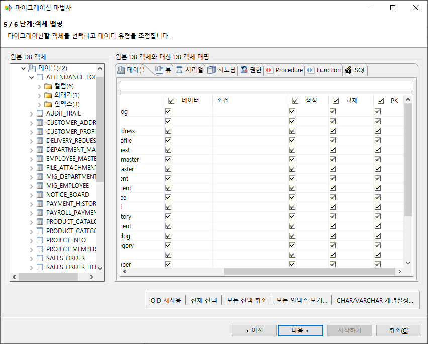

.. list-table::
    :header-rows: 1
    :widths: 25 75

    * - 컬럼
      - 설명
    * - 원본 테이블
      - 원본 Table 이름 (읽기 전용).
    * - 대상 스키마
      - 대상 스키마. 다중 스키마 대상에서 표시된다.
    * - 대상 테이블
      - 대상 CUBRID에서 사용할 Table 이름. 직접 편집할 수 있다.
    * - 데이터
      - 켜면 행 데이터를 적재한다.
    * - 조건
      - ``WHERE`` 절을 자유 입력해 부분 데이터만 추출한다. **데이터**\가 켜져 있고 원본이 온라인 연결일 때만 편집할 수 있다.
    * - 생성
      - 켜면 대상 Table을 ``CREATE TABLE``\로 생성한다.
    * - 교체
      - 켜면 기존 대상 Table을 먼저 ``DROP``\한 뒤 생성한다.
    * - PK
      - 켜면 별도의 ``ALTER TABLE ADD PRIMARY KEY`` 문으로 PK 제약을 추가한다.

**일반 탭**

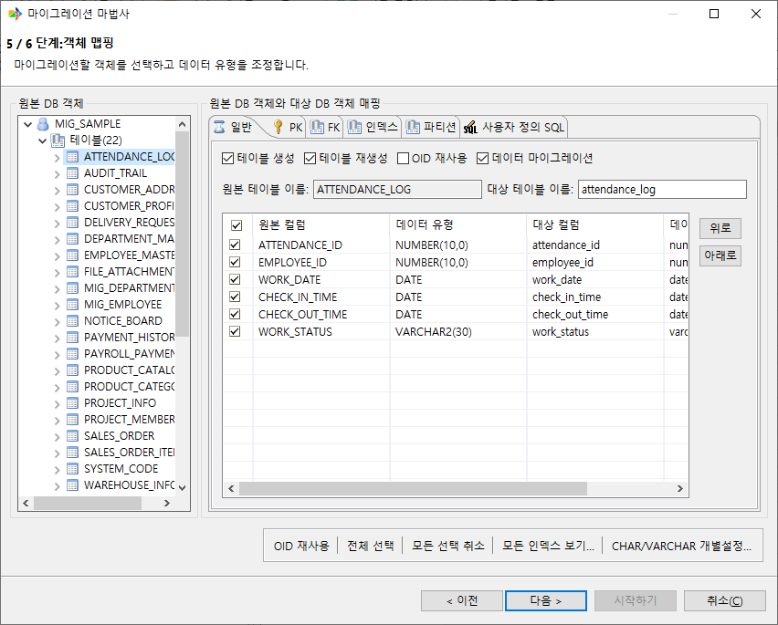

.. list-table::
    :header-rows: 1
    :widths: 25 75

    * - 옵션
      - 설명
    * - 테이블 생성
      - 대상 Table을 ``CREATE TABLE``\로 생성한다. 끄면 ``CREATE TABLE`` 단계를 생략하고 기존 대상 Table에 데이터만 적재한다. 이 옵션을 끄면 **테이블 재생성**, **OID 재사용**, **PK 생성**, FK / 인덱스 탭이 모두 비활성화된다.
    * - 테이블 재생성
      - 켜면 기존 대상 Table을 ``DROP``\한 뒤 다시 생성한다. **테이블 생성**\이 켜져 있을 때만 활성화된다.
    * - OID 재사용
      - 켜면 대상 Table에 ``REUSE_OID`` 속성을 부여한다 (``CREATE TABLE ... REUSE_OID``). **테이블 생성**\이 켜져 있을 때만 활성화된다.
    * - 데이터 마이그레이션
      - 켜면 행 데이터를 적재한다. **테이블 생성** 또는 **데이터 마이그레이션** 중 하나라도 켜져 있어야 **대상 테이블 이름**\과 Column 그리드를 편집할 수 있다.
    * - 원본 테이블 이름
      - 원본 Table 이름 (읽기 전용).
    * - 대상 테이블 이름
      - 대상 CUBRID에서 사용할 Table 이름. 저장 시 소문자로 변환되며 CUBRID 식별자 규칙으로 검증된다.

**내보내기 최적화** 

원본이 온라인 CUBRID일 때만 일반 탭 하단에 표시된다.

.. list-table::
    :header-rows: 1
    :widths: 35 65

    * - 옵션
      - 설명
    * - Primary Key 사용으로 내보내기 최적화
      - 원본 PK Column을 이용해 추출을 최적화한다. **데이터 마이그레이션**\이 켜져 있고 원본 Table에 PK가 있을 때만 활성화된다.
    * - 대상의 최대값으로부터 시작하기 (단일컬럼 PK가 있을 경우에만 지원).
      - 대상 Table의 PK 최대값보다 큰 행만 추출한다. 위 옵션이 켜져 있고, 대상이 온라인이며, **테이블 재생성**\이 꺼져 있고, 단일 Column PK일 때만 활성화된다.

**PK 탭**

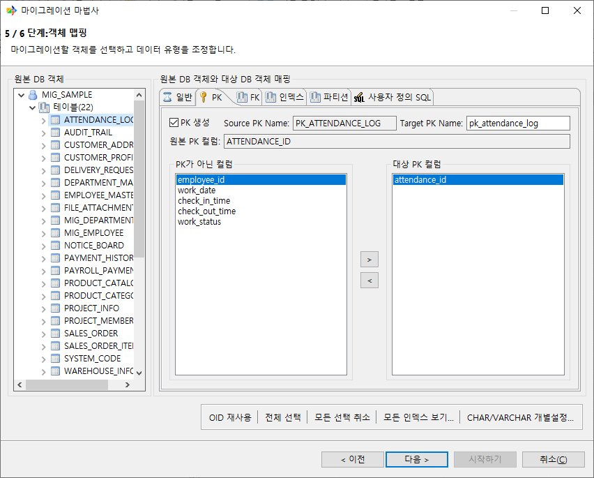

.. list-table::
    :header-rows: 1
    :widths: 25 75

    * - 옵션
      - 설명
    * - PK 생성
      - 끄면 마이그레이션 단계에서 ``ALTER TABLE ADD PRIMARY KEY``\가 실행되지 않는다. ``CREATE TABLE`` DDL 자체에는 PK 절이 포함되지 않으므로, 이 옵션을 끄면 대상 Table이 PK 제약 없이 생성된다. **테이블 생성**\이 켜져 있을 때만 활성화된다.
    * - Source PK Name / Target PK Name
      - 원본 PK 이름(읽기 전용)과 대상에서 사용할 PK 이름.
    * - 원본 PK 컬럼
      - 원본 PK를 구성하는 Column 목록 (읽기 전용, ``,``\로 구분).
    * - PK가 아닌 컬럼 / 대상 PK 컬럼
      - 좌우 두 리스트와 ``>`` / ``<`` 버튼으로 대상 PK 구성 Column을 편집한다. **대상 PK 컬럼**\이 비어 있는 상태로 저장하면 **PK 생성**\이 자동으로 꺼진다.

**FK 탭**

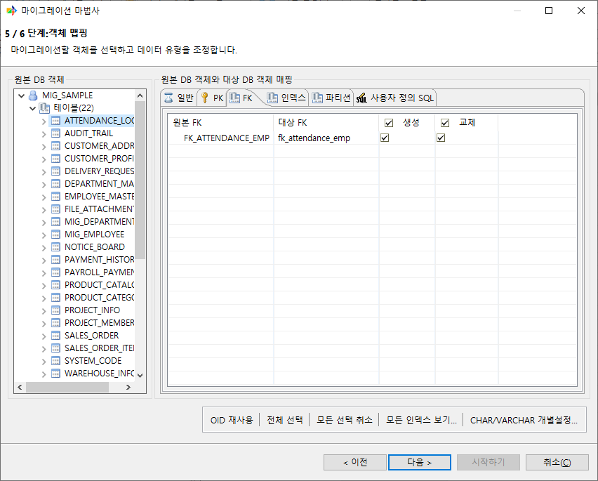

.. list-table::
    :header-rows: 1
    :widths: 25 75

    * - 옵션
      - 설명
    * - 원본 FK
      - 원본 FK 이름 (읽기 전용).
    * - 대상 FK
      - 대상에서 사용할 FK 이름.
    * - 생성
      - 켜면 마이그레이션 단계에서 ``ALTER TABLE ADD CONSTRAINT``\로 FK를 생성한다.
    * - 교체
      - 켜면 마이그레이션 직전에 ``ALTER TABLE DROP CONSTRAINT``\로 기존 FK를 먼저 제거한 뒤 다시 생성한다. 교체를 켜면 생성도 자동으로 켜진다.

일반 탭의 **테이블 생성**\이 꺼져 있으면 이 탭의 그리드 전체가 비활성화된다.
참조 Column, 부모 Table, ON UPDATE / ON DELETE 등 FK 제약의 상세 항목은 좌측 트리의 개별 FK 노드를 선택했을 때 표시되는 별도 패널에서 다룬다.

**인덱스 탭**

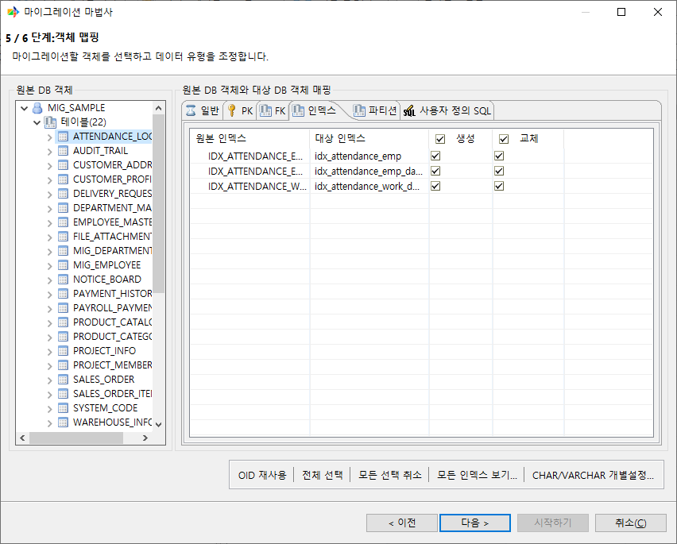

.. list-table::
    :header-rows: 1
    :widths: 25 75

    * - 옵션
      - 설명
    * - 원본 인덱스
      - 원본 Index 이름 (읽기 전용).
    * - 대상 인덱스
      - 대상에서 사용할 Index 이름.
    * - 생성
      - 켜면 마이그레이션 단계에서 Index를 생성한다.
    * - 교체
      - 켜면 마이그레이션 직전에 기존 Index를 ``ALTER TABLE DROP CONSTRAINT``\로 제거한 뒤 다시 생성한다. 교체를 켜면 생성도 자동으로 켜진다.

일반 탭의 **테이블 생성**\이 꺼져 있으면 이 탭의 그리드 전체가 비활성화된다.
UNIQUE / REVERSE / Column 순서 / 정렬 방향(ASC, DESC) 등 Index 정의의 상세 항목은 좌측 트리의 개별 Index 노드를 선택했을 때 표시되는 별도 패널에서 다룬다.

**사용자 정의 SQL 탭**

.. list-table::
    :header-rows: 1
    :widths: 45 55

    * - 영역
      - 설명
    * - 이 SQL은 테이블 데이터 마이그레이션 이전에 실행됩니다.
      - 데이터 마이그레이션 시작 전에 실행할 SQL.
    * - 이 SQL은 테이블 데이터 마이그레이션 이후에 실행됩니다.
      - 데이터 마이그레이션 종료 후에 실행할 SQL.

.. note::
   ``CREATE TABLE`` DDL에는 PRIMARY KEY 절이 포함되지 않는다. Primary Key 제약은 별도의 ``ALTER TABLE ADD PRIMARY KEY`` 문으로 추가된다. **PK 생성**\을 끄면 이 ALTER 문이 실행되지 않을 뿐, ``CREATE TABLE`` 자체에는 영향이 없다.

   **테이블 생성**, **테이블 재생성**, **데이터 마이그레이션**\의 조합이 마이그레이션 결과를 좌우한다. 새로 마이그레이션할 때는 **테이블 생성**\=on, **테이블 재생성**\=off, **데이터 마이그레이션**\=on으로 두고, 데이터만 추가 적재할 때는 **테이블 생성**\=off, **데이터 마이그레이션**\=on으로 둔다.

Column 옵션
""""""""""""""""""""""""""

Column 옵션은 두 곳에서 노출된다. Table 패널의 **일반 탭** 하단의 Column 그리드와, 트리에서 개별 Column 노드를 선택했을 때 표시되는 Column 매핑 패널이다.

**Column 매핑 패널**

개별 Column 노드를 선택하면 **원본** 영역과 **대상** 영역이 표시된다. 원본 영역은 읽기 전용이며, 대상 영역에서 대상 Column 정의를 조정한다.

.. list-table::
    :header-rows: 1
    :widths: 25 75

    * - 항목
      - 설명
    * - 이전될 컬럼
      - 해당 Column을 마이그레이션 대상에 포함할지 선택한다. 선택을 해제하면 대상 영역을 편집할 수 없다.
    * - 테이블 이름
      - Column이 속한 Table 이름을 표시한다.
    * - 컬럼명
      - 대상 CUBRID에서 사용할 Column 이름을 입력한다. 저장 시 소문자로 변환된다.
    * - 데이터 유형
      - 대상 데이터 유형을 입력한다.
    * - NULL 허용(Nullable)
      - 대상 Column의 NULL 허용 여부를 설정한다.
    * - 고유 제약(Unique)
      - 대상 Column에 UNIQUE 제약을 부여할지 설정한다.
    * - 기본값 / 표현식
      - 대상 Column의 DEFAULT 값을 입력한다. **표현식**\을 선택하면 입력값을 리터럴이 아닌 SQL 표현식으로 처리한다.
    * - Shared
      - CUBRID의 SHARED 값을 설정한다.
    * - 자동증분 / 시작값 / 증분값
      - AUTO_INCREMENT 여부와 시작값, 증가값을 설정한다.
    * - 컬럼값 TRIM
      - 적재할 문자열 값의 앞뒤 공백을 제거한다.
    * - 값 교체 표현식
      - ``교체될값:교체후값;...`` 형식으로 데이터 적재 시 값을 치환한다.
    * - 컬럼 데이터 변환 클래스
      - ``jar 파일명:클래스명`` 형식으로 사용자 정의 데이터 변환 클래스를 지정한다.

.. note::
   대상 Column의 데이터 타입은 ``VARCHAR(100)``\처럼 길이/정밀도/스케일이 포함된 단일 문자열로 입력한다. 별도의 길이 입력 필드는 없다.

   CUBRID는 식별자를 소문자로 저장한다. Column 이름은 저장 시 자동으로 소문자로 변환된다.

   Column 길이를 줄이면 원본 데이터가 잘릴 수 있다. 사전에 일괄 조정하려면 객체 매핑 화면 툴바의 **CHAR/VARCHAR 개별설정...** 다이얼로그를 사용한다.

Foreign Key 상세 패널
^^^^^^^^^^^^^^^^^^^^^^^^^^

원본의 Foreign Key(외래키) 제약은 Table 노드 아래의 외래키 폴더에 표시되고, 개별 FK 노드를 선택하면 매핑 패널이 열린다. 패널에서는 참조 Column, 대상 Table, ON UPDATE, ON DELETE를 확인하고 수정할 수 있다.

옵션
""""""""""""""""""""""""""

.. list-table::
    :header-rows: 1
    :widths: 25 75

    * - 항목
      - 설명
    * - 외래키 이름
      - 대상에서 사용할 제약 이름.
    * - 외래 컬럼 정보
      - FK를 구성하는 자식 Table 측 Column 목록.
    * - 참조 테이블 이름
      - FK가 참조하는 부모 Table 이름.
    * - 참조 컬럼
      - 참조되는 부모 Table 측 Column 목록.
    * - ON UPDATE
      - 부모 행 갱신 시 자식 행 동작.
    * - ON DELETE
      - 부모 행 삭제 시 자식 행 동작.

ON UPDATE
""""""""""""""""""""""""""

.. list-table::
    :header-rows: 1
    :widths: 25 75

    * - 옵션
      - 동작
    * - ``NO ACTION``
      - 트랜잭션 종료 시점에 제약을 검사한다.
    * - ``RESTRICT``
      - 참조 행이 있으면 즉시 차단한다.
    * - ``SET NULL``
      - 자식의 FK Column을 ``NULL``\로 설정한다.
    * - ``CASCADE``
      - 콤보에서 선택할 수는 있으나, CUBRID가 ``ON UPDATE CASCADE``\를 지원하지 않으므로 저장 시 오류로 차단된다.

ON DELETE
""""""""""""""""""""""""""

.. list-table::
    :header-rows: 1
    :widths: 25 75

    * - 옵션
      - 동작
    * - ``NO ACTION``
      - 트랜잭션 종료 시점에 제약을 검사한다. Oracle 원본에서 ``ON DELETE`` 절이 없는 FK는 ``NO ACTION``\으로 매핑된다.
    * - ``RESTRICT``
      - 참조 행이 있으면 즉시 차단한다.
    * - ``CASCADE``
      - 부모 삭제를 자식에 전파한다.
    * - ``SET NULL``
      - 자식의 FK Column을 ``NULL``\로 설정한다.

.. note::
   Oracle 원본의 ``DISABLED`` 상태 FK는 마이그레이션 대상에서 자동으로 제외된다. 원본 카탈로그에 ``DISABLED`` FK가 다수 있는 경우, 마이그레이션 후 자식 Table에서 일부 FK가 보이지 않을 수 있다.

Index 상세 패널
^^^^^^^^^^^^^^^^^^^^^^^^^^

트리의 개별 Index 노드를 선택하면 Index 매핑 패널이 열린다. Primary Key, Unique 제약과 별도로 보조 Index를 정의한다.

옵션
""""""""""""""""""""""""""

.. list-table::
    :header-rows: 1
    :widths: 22 78

    * - 항목
      - 설명
    * - 인덱스 이름
      - 대상에서 사용할 Index 이름.
    * - 구성 Column
      - 각 Column별 정렬 방향 ``ASC`` 또는 ``DESC``\를 지정한다.
    * - Unique
      - ``CREATE UNIQUE INDEX``\로 생성한다.
    * - Reverse
      - ``CREATE REVERSE INDEX``\로 생성한다.
    * - 생성
      - 마이그레이션 대상에 포함할지 여부를 체크박스로 지정한다.

.. note::
   Index는 데이터 적재 이후에 생성된다. 대용량 Table의 경우 Index가 많을수록 마이그레이션 종료까지의 총 시간이 길어질 수 있다.

   ``Reverse``\와 ``Unique`` 두 옵션은 동시에 사용할 수 있다 (``CREATE REVERSE UNIQUE INDEX``).

   객체 매핑 화면 툴바의 **모든 인덱스 보기...** 다이얼로그를 사용하면 여러 Table의 Index 포함 여부를 일괄로 토글할 수 있다.

View
^^^^^^^^^^^^^^^^^^^^^^^^^^

원본 View는 좌측 트리의 **뷰** 폴더 아래에 표시된다. **뷰** 폴더를 선택하면 우측에 전체 View 목록이 표시되고, 개별 View 노드를 선택하면 해당 View의 상세 패널이 표시된다.

View 목록
""""""""""""""""""""""""""

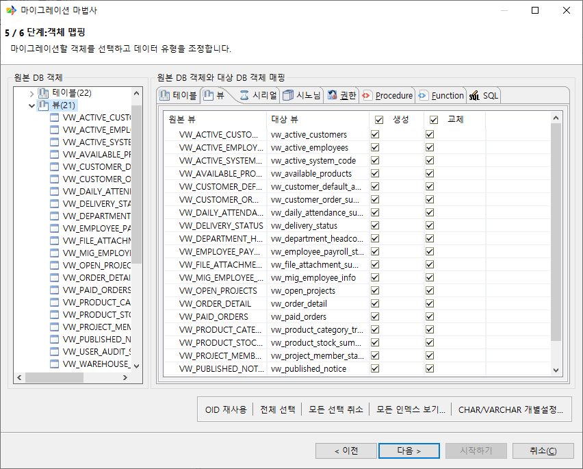

.. list-table::
    :header-rows: 1
    :widths: 25 75

    * - 항목
      - 설명
    * - 원본 뷰
      - 원본 View 이름을 표시한다.
    * - 대상 뷰
      - 대상 CUBRID에서 사용할 View 이름을 입력한다.
    * - 생성
      - 대상 CUBRID에 View를 생성할지 선택한다.
    * - 교체
      - 대상에 같은 이름의 View가 있을 때 기존 View를 삭제한 뒤 다시 생성할지 선택한다.

개별 View 상세 패널
""""""""""""""""""""""""""

개별 View 노드를 선택하면 **생성**, **교체** 옵션과 **대상** 영역이 표시된다. 대상 영역에서는 뷰 이름과 구문을 편집한다.

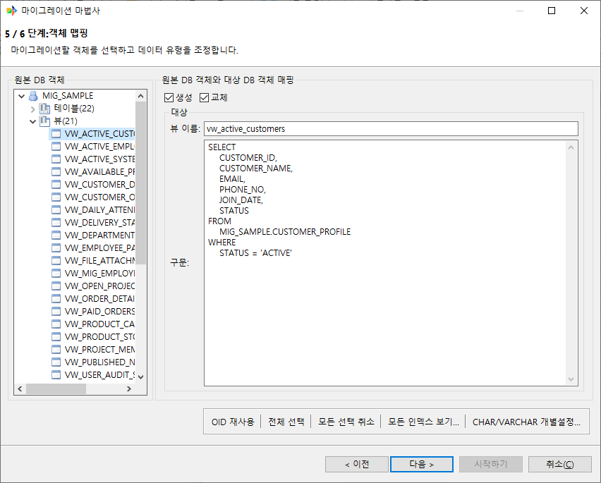

.. list-table::
    :header-rows: 1
    :widths: 25 75

    * - 항목
      - 설명
    * - 생성
      - 해당 View를 마이그레이션 대상에 포함할지 선택한다. 선택을 해제하면 **교체**, **뷰 이름**, **구문** 항목을 편집할 수 없다.
    * - 교체
      - 대상에 같은 이름의 View가 있을 때 기존 View를 삭제한 뒤 다시 생성한다. **생성**\이 선택된 경우에만 사용할 수 있다.
    * - 뷰 이름
      - 대상 CUBRID에서 사용할 View 이름을 입력한다. 저장 시 소문자로 변환되며 CUBRID 식별자 규칙으로 검증된다.
    * - 구문
      - 대상 CUBRID에서 사용할 View Query Spec을 입력한다. 전체 ``CREATE VIEW`` 문이 아니라 View 정의에 사용할 질의 구문을 입력한다.

제약 사항
""""""""""""""""""""""""""

.. warning::
   View의 Query Spec 안에 포함된 ``SELECT`` 문은 자동으로 변환되지 않는다. 구체적으로 다음 항목은 사용자가 직접 검토하고 수정해야 한다.

   - 원본 DB에서 사용된 **스키마명** 참조 — 대상 스키마로 자동 치환되지 않는다.
   - CUBRID **예약어**\에 해당하는 식별자 — ``[ ]`` 또는 ``" "``\로 감싸는 처리가 적용되지 않는다.
   - 원본 DB 특화 함수, 의사 컬럼, 힌트 등 — 대상 CUBRID 문법으로 변환되지 않는다.

   마이그레이션 후 대상 CUBRID에서 View가 정상 동작하는지 확인하고, 필요한 경우 Query Spec을 수동으로 수정한다.

Serial(Sequence)
^^^^^^^^^^^^^^^^^^^^^^^^^^^^^^^^

원본 Serial 또는 Sequence는 좌측 트리의 **시리얼** 폴더 아래에 표시된다. **시리얼** 폴더를 선택하면 전체 Serial 목록이 표시되고, 개별 Serial 노드를 선택하면 해당 Serial의 상세 패널이 표시된다.

Serial 목록
""""""""""""""""""""""""""

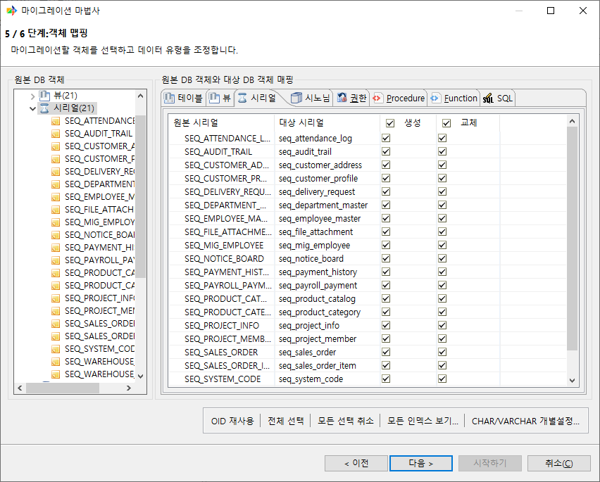

.. list-table::
    :header-rows: 1
    :widths: 25 70

    * - 항목
      - 설명
    * - 원본 시리얼
      - 원본 Serial 또는 Sequence 이름을 표시한다.
    * - 대상 시리얼
      - 대상 CUBRID에서 사용할 Serial 이름을 입력한다.
    * - 생성
      - 대상 CUBRID에 Serial을 생성할지 선택한다.
    * - 교체
      - 대상에 같은 이름의 Serial이 있을 때 기존 Serial을 삭제한 뒤 다시 생성할지 선택한다.

개별 Serial 상세 패널
""""""""""""""""""""""""""

개별 Serial 노드를 선택하면 **원본** 영역과 **대상** 영역이 표시된다. 원본 영역은 읽기 전용이며, 대상 영역에서 대상 CUBRID Serial 정의를 조정한다.

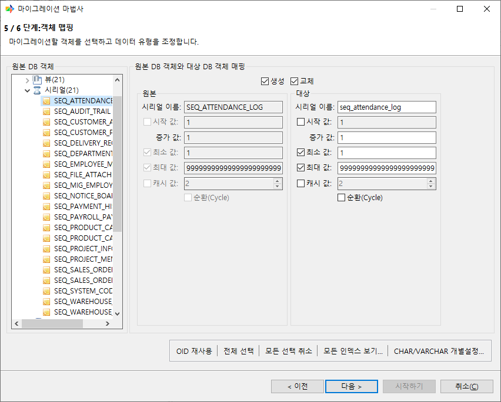

.. list-table::
    :header-rows: 1
    :widths: 25 75

    * - 항목
      - 설명
    * - 생성
      - 해당 Serial을 마이그레이션 대상에 포함할지 선택한다. 선택을 해제하면 대상 영역을 편집할 수 없다.
    * - 교체
      - 대상에 같은 이름의 Serial이 있을 때 기존 Serial을 삭제한 뒤 다시 생성한다. **생성**\이 선택된 경우에만 사용할 수 있다.
    * - 시리얼 이름
      - 대상 CUBRID에서 사용할 Serial 이름을 입력한다. 저장 시 소문자로 변환되며 CUBRID 식별자 규칙으로 검증된다.
    * - 시작 값
      - ``CREATE SERIAL ... START WITH``\에 사용할 값을 설정한다. 선택하면 사용자가 입력한 값을 사용하고, 선택하지 않으면 마이그레이션 실행 시 원본에서 시작값을 동기화한다.
    * - 증가 값
      - ``INCREMENT BY`` 값을 설정한다. 0은 사용할 수 없다.
    * - 최소 값
      - 선택하면 ``MINVALUE`` 값을 입력한다. 선택하지 않으면 ``NOMINVALUE``\로 처리된다.
    * - 최대 값
      - 선택하면 ``MAXVALUE`` 값을 입력한다. 선택하지 않으면 ``NOMAXVALUE``\로 처리된다.
    * - 캐시 값
      - Serial 캐시 사용 여부와 캐시 크기를 설정한다. 캐시 크기는 2 이상으로 입력한다.
    * - 순환(Cycle)
      - 최대값 또는 최소값에 도달했을 때 순환할지 설정한다.

.. note::
   MySQL/MariaDB의 ``AUTO_INCREMENT`` Column은 독립 Serial 객체로 분리되지 않고, 대상 Column 정의에 CUBRID의 ``AUTO_INCREMENT`` 속성(시드 값이 있으면 ``AUTO_INCREMENT (시드, 증가값)`` 형태)으로 적용된다. 이 동작은 본 절의 Serial 객체 목록과는 별개이며, 해당 Column의 자동증분 설정은 Column 매핑 패널에서 확인한다.

Synonym
^^^^^^^^^^^^^^^^^^^^^^^^^^

원본 Synonym은 좌측 트리의 **시노님** 폴더 아래에 표시된다. **시노님** 폴더를 선택하면 전체 Synonym 목록이 표시되고, 개별 Synonym 노드를 선택하면 해당 Synonym의 상세 패널이 표시된다.

Synonym은 대상 CUBRID 11.2 이상에서 지원된다. 마이그레이션 대상은 PRIVATE Synonym으로 제한되며, PUBLIC Synonym은 추출 단계에서 제외된다.

Synonym 목록
""""""""""""""""""""""""""

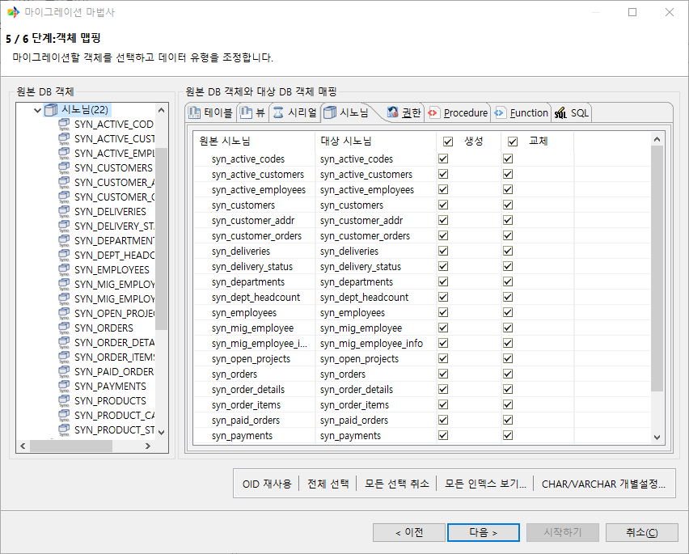

.. list-table::
    :header-rows: 1
    :widths: 28 72

    * - 항목
      - 설명
    * - 원본 시노님
      - 원본 Synonym 이름을 표시한다.
    * - 대상 시노님
      - 대상 CUBRID에서 사용할 Synonym 이름을 입력한다.
    * - 생성
      - 대상 CUBRID에 Synonym을 생성할지 선택한다.
    * - 교체
      - 대상에 같은 이름의 Synonym이 있을 때 기존 Synonym을 삭제한 뒤 다시 생성할지 선택한다.

.. note::
   Synonym이 가리키는 대상 객체가 마이그레이션 범위에 포함되지 않으면 대상 CUBRID에 생성 직후 깨진 Synonym이 될 수 있다. Synonym과 대상 객체를 함께 포함시키는 것을 권장한다.

개별 Synonym 상세 패널
""""""""""""""""""""""""""

개별 Synonym 노드를 선택하면 **원본** 영역과 **대상** 영역이 표시된다. 원본 영역은 읽기 전용이며, 대상 영역에서 대상 CUBRID Synonym 정의를 조정한다.

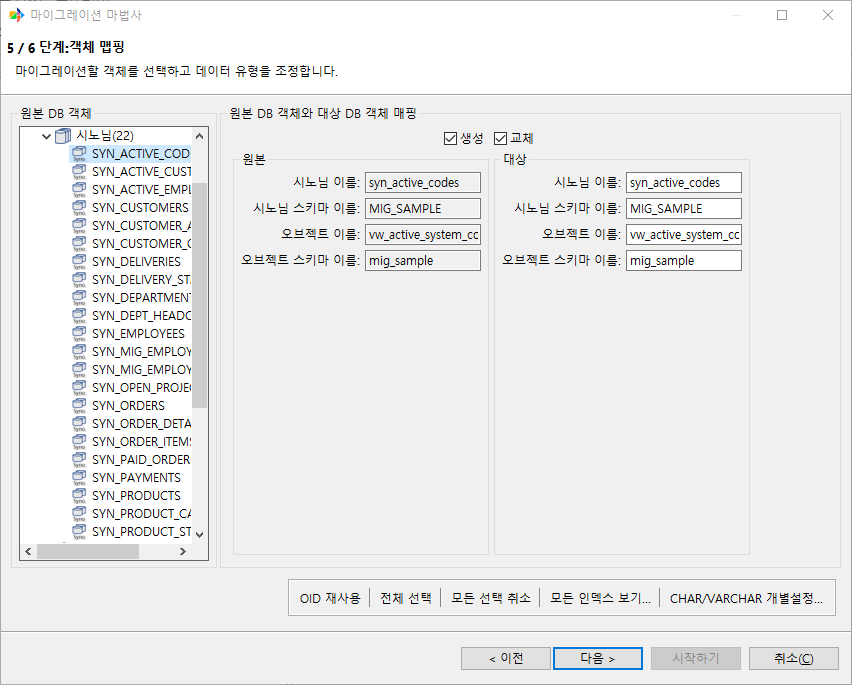

.. list-table::
    :header-rows: 1
    :widths: 25 75

    * - 항목
      - 설명
    * - 생성
      - 해당 Synonym을 마이그레이션 대상에 포함할지 선택한다. 선택을 해제하면 대상 영역을 편집할 수 없다.
    * - 교체
      - 대상에 같은 이름의 Synonym이 있을 때 기존 Synonym을 삭제한 뒤 다시 생성한다. **생성**\이 선택된 경우에만 사용할 수 있다.
    * - 시노님 이름
      - 대상 CUBRID에서 사용할 Synonym 이름을 입력한다.
    * - 시노님 스키마 이름
      - 대상 Synonym이 생성될 스키마 이름을 입력한다.
    * - 오브젝트 이름
      - Synonym이 참조할 대상 객체 이름을 입력한다.
    * - 오브젝트 스키마 이름
      - Synonym이 참조할 대상 객체의 스키마 이름을 입력한다.

Grant
^^^^^^^^^^^^^^^^^^^^^^^^^^

원본 DB에서 조회된 객체 권한을 대상 CUBRID에 ``GRANT`` 문으로 적용할지 선택한다. 객체 매핑 화면에서는 권한별 **생성** 여부만 선택하며, 권한 수신자·부여자·대상 객체 등은 직접 편집하지 않는다.

좌측 트리의 **권한** 폴더에는 선택한 원본 스키마/사용자가 부여받은(Grantee 기준) Table·View 객체 권한이 표시된다. 권한은 부여자(Grantor)별로 묶여 하위에 나열되며, 부여자 노드를 선택하면 해당 부여자의 권한만 표시되고, 권한 종류 노드를 선택하면 부여자와 권한 종류로 한 번 더 필터링된다.

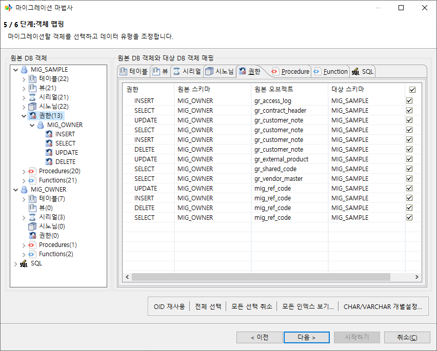

.. list-table::
    :header-rows: 1
    :widths: 28 72

    * - 항목
      - 설명
    * - 권한
      - ``SELECT``, ``INSERT``, ``UPDATE``, ``DELETE``, ``ALTER``, ``INDEX``, ``EXECUTE``, ``ALL PRIVILEGES`` 등 대상 CUBRID에 적용할 권한 종류.
    * - 원본 스키마
      - Grant 대상 객체가 속한 스키마.
    * - 원본 오브젝트
      - Grant 대상 Table 또는 View 이름.
    * - 대상 스키마
      - 스키마 매핑 결과에 따라 권한 수신자가 매핑되는 대상 스키마.
    * - 생성
      - 선택하면 마이그레이션 시 해당 권한에 대한 ``GRANT`` 문을 실행하거나 출력한다.

.. note::
   Grant 마이그레이션은 대상 CUBRID 11.2 이상에서만 지원된다. 온라인 대상 DB로 직접 마이그레이션하는 경우 대상 접속 사용자가 DBA 또는 DBA 그룹 소속이어야 한다. 조건을 만족하지 않으면 객체 매핑 단계 진입 시 경고가 표시된다. 온라인 대상에서 접속 사용자가 DBA(또는 DBA 그룹)가 아니면 권한 목록이 빈 상태로 표시되고 개별 권한의 **생성** 체크박스가 비활성화된다.

Function(PL/CSQL) / Procedure(PL/CSQL)
^^^^^^^^^^^^^^^^^^^^^^^^^^^^^^^^^^^^^^^^

Function과 Procedure의 마이그레이션은 **Oracle/Tibero 원본에서만** 지원된다. PL/SQL 본문을 CUBRID의 PL/CSQL로 변환하는 방식이며, 그 외 원본 DB(CUBRID, MySQL, MariaDB, MSSQL, Informix)는 마이그레이션 대상으로 처리하지 않는다.

Function과 Procedure는 트리의 Procedures, Functions 폴더 아래에 표시된다. 개별 노드를 선택하면 변환된 PL/CSQL DDL이 우측 패널에 표시된다.

Function / Procedure 목록
""""""""""""""""""""""""""

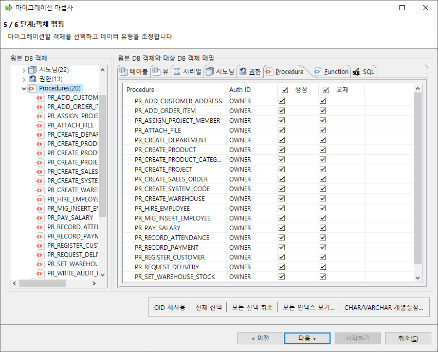

.. list-table::
    :header-rows: 1
    :widths: 28 72

    * - 항목
      - 설명
    * - Function / Procedure
      - 원본 Function 또는 Procedure의 이름을 표시한다.
    * - Auth ID
      - 원본 Function 또는 Procedure의 실행 권한 기준을 표시한다.
    * - 생성
      - 해당 Function 또는 Procedure를 마이그레이션 대상에 포함할지 선택한다.
    * - 교체
      - 켜면 **생성**\도 함께 켜진다.

Function / Procedure 상세 패널
""""""""""""""""""""""""""""""""""""""

Function 또는 Procedure 노드를 선택하면 **대상** 영역이 표시된다. 대상 영역에서 CUBRID에 생성할 PL/CSQL DDL을 확인하고 수정한다.

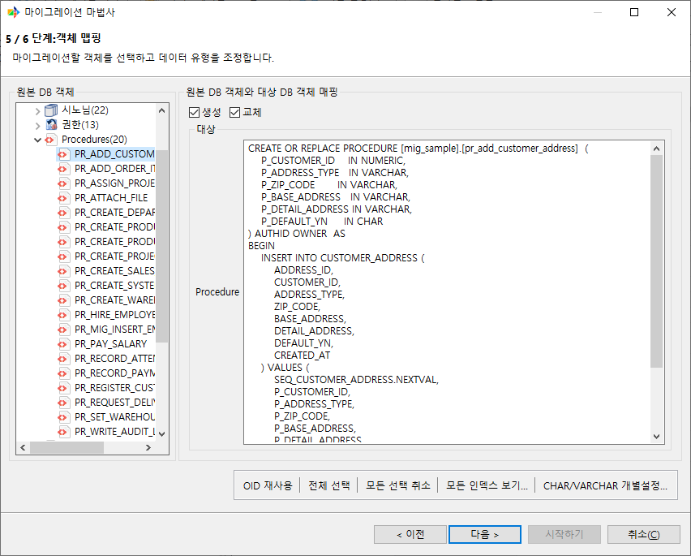

.. list-table::
    :header-rows: 1
    :widths: 28 72

    * - 항목
      - 설명
    * - 생성
      - 해당 Function 또는 Procedure를 마이그레이션 대상에 포함할지 선택한다. 선택을 해제하면 대상 DDL을 편집할 수 없다.
    * - 교체
      - **생성**\이 켜진 경우에만 선택할 수 있다.
    * - Function / Procedure DDL
      - 대상 CUBRID에서 사용할 PL/CSQL DDL을 표시한다. 필요하면 사용자가 직접 수정할 수 있다.

변환 동작
""""""""""""""""""""""""""

원본 Function·Procedure의 DDL을 구문 분석하여 선언부(헤더)와 본문을 분리하고, 선언부와 본문에 사용된 데이터 타입을 CUBRID 타입으로 치환한 뒤 CUBRID PL/CSQL로 옮긴다. 데이터 타입 치환을 제외한 본문의 나머지 구문은 변환하지 않고 원문 그대로 전달한다.

따라서 변환 후에는 대상 CUBRID에서 그대로 동작하지 않는 구문이 남을 수 있으므로, 마이그레이션이 끝난 뒤 본문을 검토하고 필요한 부분을 직접 수정해야 한다.

데이터 타입 치환
""""""""""""""""""""""""""

선언부와 본문에 사용된 Oracle, Tibero 데이터 타입은 대상 CUBRID 타입으로 자동 치환된다. CUBRID에 대응 타입이 없어 치환할 수 없는 타입은 해당 위치가 ``/* 타입명 (unsupported) */`` 형태의 주석으로 대체되므로, 마이그레이션 후 사용자가 직접 수정해야 한다.

헤더 처리
""""""""""""""""""""""""""

Function·Procedure는 두 단계로 생성된다. 먼저 시그니처(선언부)만 등록하는 헤더를 생성하고, 이후 본문을 채운다. 이렇게 하면 Function·Procedure가 서로를 참조하더라도 생성 순서에 관계없이 등록할 수 있다. 오프라인 출력에서는 이 헤더가 ``procedure_header`` / ``function_header`` 파일로 분리되어 나온다.

자동 변환되지 않는 항목
""""""""""""""""""""""""""

.. warning::
   다음 항목은 변환되지 않고 원문 그대로 전달되므로, 마이그레이션 후 직접 검토해야 한다.

   - **본문 내 정적 SQL**: ``SELECT`` / ``INSERT`` / ``UPDATE`` / ``DELETE`` 문은 그대로 옮겨진다. 문장에 사용된 스키마명·객체명은 스키마 매핑을 따르지 않으며, CUBRID 예약어 인용(``[ ]`` / ``" "``)도 자동으로 처리되지 않는다.
   - **내장 함수**: ``NVL``, ``DECODE``, ``TO_CHAR``, ``SYSDATE`` 등 Oracle 내장 함수 이름은 변환되지 않는다.

예를 들어 다음과 같은 Oracle Procedure를 변환하면,

.. code-block:: sql

    CREATE OR REPLACE PROCEDURE raise_salary(p_id IN NUMBER) IS
        v_sal NUMBER;
    BEGIN
        SELECT NVL(salary, 0) INTO v_sal FROM HR.employees WHERE emp_id = p_id;
        UPDATE HR.employees SET salary = v_sal * 1.1 WHERE emp_id = p_id;
    END;

선언부의 데이터 타입 ``NUMBER``\는 ``NUMERIC``\으로 치환되지만, 본문의 ``SELECT`` / ``UPDATE`` 문에 쓰인 스키마명 ``HR``\과 내장 함수 ``NVL``\은 그대로 남는다. 따라서 마이그레이션 후 대상 CUBRID에서 ``HR`` 스키마명과 사용된 함수가 그대로 유효한지 확인해야 한다.

.. note::
   Column **기본값**\에 사용된 ``SYSDATE`` 등은 별도 규칙으로 CUBRID 함수에 매핑되지만(:doc:`07_sourcedb`\의 Oracle 절 참고), 이 규칙은 Function·Procedure **본문**\에는 적용되지 않는다.

변환 실패 처리
""""""""""""""""""""""""""

원본 PL/SQL의 선언부 경계(``IS`` / ``AS``)조차 인식하지 못하는 구문 오류가 있으면 해당 Function·Procedure는 변환에 실패한다.

- 실패한 객체는 보고서의 **상세 > DB 객체** 탭에 실패로 기록되며, **오류** Column에 ``PL/CSQL syntax error: (행, 열) ...`` 형식의 메시지가 표시된다.
- 실패한 객체만 건너뛰고 **나머지 마이그레이션은 계속 진행**\된다.
- 선언부 경계를 인식한 뒤(헤더가 성립한 뒤) 본문에서 일부 미지원 구문 (예: ``PRAGMA EXCEPTION_INIT``)을 만나는 경우에는 변환을 중단하지 않고 본문을 원문 그대로 전달한다.

.. note::
  Oracle에서 ``WRAPPED``\로 난독화된 Function·Procedure는 원본 텍스트가 PL/SQL 구문이 아니므로 변환에 실패하며, 위와 같이 보고서에 실패로 기록된 뒤 건너뛴다.

User SQL (사용자 정의 쿼리)
^^^^^^^^^^^^^^^^^^^^^^^^^^^^^^^^^^^^^^^^^^^^^^^^

Table을 그대로 옮기는 대신, 사용자가 작성한 ``SELECT`` 결과 집합을 하나의 가상 원본 Table로 취급해 대상 CUBRID Table로 적재하는 기능이다. ``JOIN``, 집계, 여러 Table을 결합한 결과 등을 하나의 Table로 만들 때 사용한다.

좌측 트리의 **SQL** 폴더 노드를 선택하면 우측에 등록된 SQL 목록이 표시되고, 개별 SQL 노드를 선택하면 Column 매핑 패널이 표시된다.

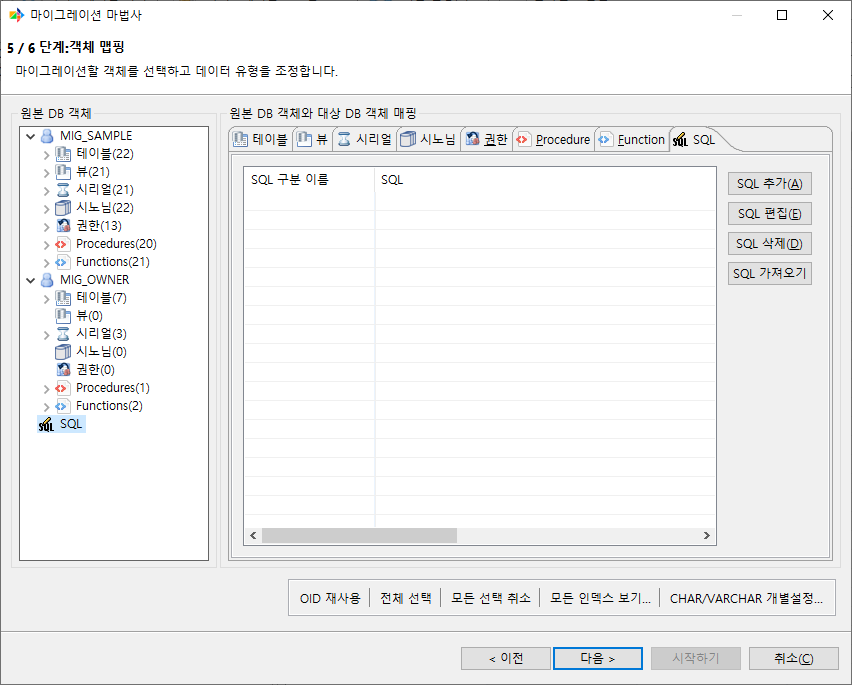

SQL 목록 관리
""""""""""""""""""""""""""

**SQL** 폴더 노드를 선택하면 등록된 SQL이 목록으로 표시된다. 목록의 각 행은 다음 항목을 가진다.

.. list-table::
    :header-rows: 1
    :widths: 25 75

    * - 항목
      - 설명
    * - SQL 구분 이름
      - 등록된 SQL을 식별하는 이름. ``SQL1``, ``SQL2``\처럼 자동으로 부여되며 직접 변경할 수 있다.
    * - SQL
      - 등록된 ``SELECT`` 문. 셀을 더블클릭하면 SQL 편집 다이얼로그가 열린다.
    * - 대상 스키마
      - 결과가 적재될 대상 스키마. 다중 스키마를 사용하는 대상에서만 콤보 박스로 선택할 수 있으며, 그 외에는 원본 접속 계정 이름으로 자동 설정된다.
    * - 대상 테이블
      - 결과가 적재될 대상 CUBRID Table 이름.
    * - 데이터
      - 결과 행을 적재할지 여부.
    * - 생성
      - 대상 Table을 생성할지 여부.
    * - 교체
      - 대상에 같은 이름의 Table이 있을 때 삭제한 뒤 다시 생성할지 여부.

목록 화면의 우클릭 메뉴와 버튼으로 다음 작업을 수행한다.

.. list-table::
    :header-rows: 1
    :widths: 25 75

    * - 항목
      - 동작
    * - **SQL 추가**
      - SQL 편집 다이얼로그를 열어 새 ``SELECT`` 문을 등록한다. 여러 문을 ``;``\로 구분해 한 번에 등록하면 각각 별도 항목으로 생성된다.
    * - **SQL 편집**
      - 선택한 SQL 본문을 편집한다.
    * - **SQL 삭제**
      - 선택한 SQL 항목을 삭제한다.
    * - **대상 테이블 이름 변경**
      - 선택한 SQL의 대상 Table 이름을 변경한다.
    * - **SQL 가져오기** (버튼)
      - 외부 파일에서 SQL을 가져온다. ``.sql`` 파일은 ``;`` 단위로 분리되며, Excel(``.xls`` / ``.xlsx``) 파일은 [구분 이름, SQL, 대상 Table] 형태의 열 구성을 읽는다.

개별 SQL 편집 패널
""""""""""""""""""""""""""

개별 SQL 노드를 선택하면 Column 매핑 패널이 표시된다.

.. list-table::
    :header-rows: 1
    :widths: 25 75

    * - 항목
      - 설명
    * - 테이블 생성 / 테이블 재생성 / 데이터 마이그레이션
      - 일반 Table과 동일한 옵션이다.
    * - 원본 테이블 이름
      - SQL 구분 이름이 읽기 전용으로 표시된다.
    * - 대상 테이블 이름
      - 결과가 적재될 대상 CUBRID Table 이름.
    * - Column 매핑
      - 원본 Column / 원본 타입과 대상 Column / 대상 타입을 표시한다. 대상 Column 이름과 타입을 수정할 수 있다.

대상 Table의 Column 구성은 사용자가 입력한 ``SELECT``\를 실제로 실행해 얻은 결과 집합의 메타데이터에서 자동으로 추론된다. 따라서 Column 개수를 직접 맞출 필요는 없으며, 추론된 대상 Column 이름과 타입을 편집 패널에서 조정한다.

.. note::
  SQL 본문은 결과 집합(Column)을 반환해야 한다. CMT는 입력한 SQL을 결과가 0건이 되도록 감싸 실행하여 Column 정보를 얻으므로, 결과 집합을 반환하지 않는 문은 등록할 수 없다.

이름 검증
^^^^^^^^^^^^^^^^^^^^^^^^^^^^^^^^^^^^^^^^

객체 매핑 화면에서 입력한 대상 이름이 다음에 해당하면 오류로 표시되고 다음 단계로 진행할 수 없다.

- 이름이 비어 있는 경우
- 허용 길이를 초과하는 경우
- ``"``, ``[``, ``]`` 문자를 포함하는 경우

관련 챕터
^^^^^^^^^

- :doc:`05_wizard` — 객체 매핑 화면이 속한 마법사 단계 흐름
- :doc:`07_sourcedb` — 원본 DB별 지원 객체와 주의사항
- :doc:`appendix_typemap` — 데이터 타입 기본 매핑 전체 표
