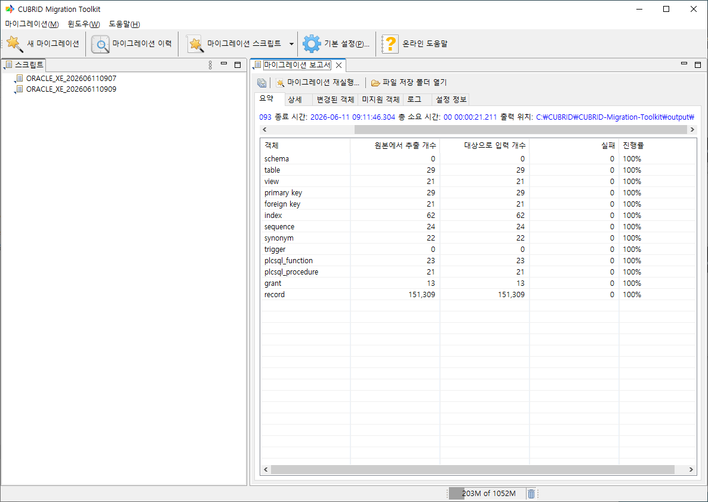

마이그레이션 보고서 & 출력 파일
---------------------------------

본 챕터는 마이그레이션이 끝난 뒤 결과를 확인하는 방법을 다룬다. CMT는 모든 마이그레이션에 대해 보고서를 자동으로 생성한다. GUI에서는 탭으로 구성된 보고서 화면, 콘솔에서는 ``report`` 명령으로 동일한 내용을 확인할 수 있다. 보고서 / 로그 / 산출 파일이 워크스페이스의 어느 디렉토리에 저장되는지도 함께 정리한다.

보고서 화면 (GUI)
^^^^^^^^^^^^^^^^^

보고서 화면은 다음 두 경로에서 열린다.

- 진행 화면 상단의 **보고서 조회** 버튼을 누른다.
- **마이그레이션 이력** 뷰에서 완료된 항목을 더블클릭하거나 컨텍스트 메뉴의 **보고서 열기**\를 선택한다.

상단에는 툴바, 본문에는 6개의 탭이 좌에서 우 순서로 배치된다.

툴바
""""""""""""""""""""""""""""""""""""""""""""""""

상단 툴바에는 최대 세 개의 버튼이 있다.

.. list-table::
    :header-rows: 1
    :widths: 30 70

    * - 버튼
      - 동작
    * - **모든 테이블을 엑셀 파일로 저장**
      - 디렉토리 선택 다이얼로그를 열고, 시작 시각 타임스탬프를 공통 접두사로 하는 4개 파일을 저장한다 (상세는 "보고서 저장" 항목)
    * - **마이그레이션 재실행...** (툴팁: **마이그레이션 마법사 열기**)
      - 동일한 설정으로 마법사를 다시 연다. 1단계부터 모든 입력이 채워진 상태에서 시작되므로, 객체 선택이나 매핑만 일부 조정해 재실행할 수 있다
    * - **파일 저장 폴더 열기**
      - 파일 출력 모드일 때만 표시된다. OS 파일 탐색기로 출력 디렉토리를 연다

탭 구성
""""""""""""""""""""""""""""""""""""""""""""""""

.. list-table::
    :header-rows: 1
    :widths: 24 76

    * - 탭
      - 설명
    * - **요약**
      - 시작 / 종료 시각, 총 소요 시간, 출력 디렉토리, 객체 종류별 카운트와 진행률 요약
    * - **상세**
      - 객체별 / 레코드별 상세. **DB 객체**\와 **이전 통계** 두 개의 서브탭으로 구성
    * - **변경된 객체**
      - 마이그레이션 과정에서 이름이 바뀐 객체 목록
    * - **미지원 객체**
      - 변환에 실패하거나 대상 CUBRID에서 지원하지 않아 생략된 객체 목록
    * - **로그**
      - 마이그레이션 실행 로그 전체 텍스트
    * - **설정 정보**
      - 마법사 6단계 **최종 확인** 페이지에 표시되었던 설정 요약과 동일한 내용

요약 탭
""""""""""""""""""""""""""""""""""""""""""""""""

상단 라벨 영역에는 다음이 표시된다.

- **시작 시간** / **종료 시간** / **총 소요 시간** — 실행 구간과 소요 시간
- **출력 위치** — 파일 출력 모드(CUBRID dump / SQL / CSV / XLS)일 때만 표시된다. 경로를 클릭하면 OS 파일 탐색기로 디렉토리가 열린다

그 아래의 표는 객체 종류별 결과를 다섯 Column으로 보여 준다.

.. list-table::
    :header-rows: 1
    :widths: 22 22 22 14 20

    * - 객체
      - 원본에서 추출 개수
      - 대상으로 입력 개수
      - 실패
      - 진행률
    * - 객체 종류
      - 원본에서 추출이 완료된 객체 / 행 수
      - 대상에 적재된 객체 / 행 수
      - 실패한 객체 / 행 수
      - 진행률 백분율

행을 더블클릭하면 **상세** 탭으로 이동한다. 맨 아래의 **record** 행에서는 **이전 통계** 서브탭, 그 외 객체 종류에서는 **DB 객체** 서브탭이 열린다.

상세 — DB 객체
""""""""""""""""""""""""""""""""""""""""""""""""

객체별로 한 줄씩 처리 결과를 보여 준다.

.. list-table::
    :header-rows: 1
    :widths: 14 18 26 24 18

    * - 상태
      - 유형
      - 이름
      - DDL
      - 오류
    * - 처리 상태 (성공 / 실패 아이콘)
      - 객체 종류
      - 객체 이름
      - 대상에 생성된 DDL 텍스트
      - 실패 시 원인 메시지

행을 더블클릭하면 **DDL**\과 **오류** Column의 긴 텍스트가 별도 다이얼로그로 펼쳐져 한 화면에서 확인할 수 있다.

상세 — 이전 통계
""""""""""""""""""""""""""""""""""""""""""""""""

Table별 데이터 적재 결과를 보여 준다. Column은 9개이다.

.. list-table::
    :header-rows: 1
    :widths: 14 10 14 10 14 10 10 10 8

    * - 테이블 이름
      - 레코드 수
      - 원본에서 추출 개수
      - 추출 소요 시간
      - 대상으로 입력 개수
      - 입력 소요 시간
      - 완료
      - 총 소요 시간
      - Owner
    * - 원본 Table 이름
      - 원본 총 행 수
      - 추출 완료 행 수
      - 추출 소요 시간
      - 적재 완료 행 수
      - 적재 소요 시간
      - 완료율 백분율
      - 추출 시작 ~ 적재 종료 총 경과
      - 원본 스키마(소유자) 이름

행이 하나도 없는 Table은 카운트가 ``0``\으로 표시된다.

변경된 객체
""""""""""""""""""""""""""""""""""""""""""""""""

마이그레이션 과정에서 이름이 바뀐 객체를 **유형 / 원본 객체 / 대상 객체** 세 Column으로 보여 준다. 원본과 다른 이름으로 마이그레이션된 객체를 한눈에 확인하는 용도이다.

미지원 객체
""""""""""""""""""""""""""""""""""""""""""""""""

대상 CUBRID에 생성되지 못한 객체의 DDL이 차례로 나열된다. 예를 들어 대상 CUBRID 버전이 지원하지 않는 객체(11.0 대상의 Synonym, Grant 등)가 여기에 표시된다. 이 탭의 객체는 대상에 생성되지 않으므로, 적재 후 수동으로 보완하거나 마법사 5단계로 돌아가 매핑을 조정한다.

로그
""""""""""""""""""""""""""""""""""""""""""""""""

마이그레이션 실행 중 기록된 전체 로그가 텍스트로 표시된다. 시간 순서대로 단계별 진행 메시지, 경고, 에러가 모두 포함된다. 툴바의 **모든 테이블을 엑셀 파일로 저장** 버튼으로 외부 파일에 보존할 수 있다 (저장 형식은 아래 "보고서 저장" 항목 참고).

설정 정보
""""""""""""""""""""""""""""""""""""""""""""""""

마법사 6단계 **최종 확인**\에서 보았던 설정 요약과 동일한 내용을 텍스트로 보여 준다. 연결 정보, 선택된 객체 목록, 출력 형식, 성능 파라미터 등이 들어 있어 마이그레이션을 어떤 설정으로 실행했는지 사후에 확인할 수 있다. 단, 이 탭의 내용은 **모든 테이블을 엑셀 파일로 저장**\의 저장 대상에는 포함되지 않는다.

보고서 저장
^^^^^^^^^^^

툴바의 **모든 테이블을 엑셀 파일로 저장** 버튼을 누르면, 선택한 디렉토리에 마이그레이션 시작 시각(``yyyy_MM_dd_HH_mm_ss_SSS``)을 공통 접두사로 하는 4개 파일이 저장된다.

::

    [저장 디렉토리]/
    ├── <타임스탬프>.xls       # 요약 / DB 객체 / 이전 통계 3개 시트
    ├── <타임스탬프>.txt       # 미지원 객체 탭
    ├── <타임스탬프>.log       # 로그 탭
    └── <타임스탬프>.rename    # 변경된 객체 탭

**설정 정보** 탭은 저장 대상이 아니다. 설정을 다시 활용하려면 **마이그레이션 재실행...** 버튼을 사용하거나 :doc:`05_wizard`\의 **스크립트 내보내기**\로 내보낸다.

보고서 (콘솔)
^^^^^^^^^^^^^

콘솔에서도 GUI 보고서와 동일한 정보를 텍스트 형태로 얻을 수 있다. 이력에서 보고서를 조회할 때는 ``migration.sh report <mh_file>`` 명령(Windows는 ``migration.bat report <mh_file>``)을 사용한다.

기본 출력 예시는 다음과 같다.

.. code-block:: text

    Reading migration history file: <1716166534123.mh>

    [Overview]
        [table]
               Total:[7]
            Exported:[7]
            Imported:[7]
        [index]
               Total:[12]
            Exported:[12]
            Imported:[12]
        ...

    [Schema migration]
        [table]employees:[successfully]
            DDL:[CREATE TABLE "employees" (...) ]
        [view]v_dept:[successfully]
            DDL:[CREATE VIEW "v_dept" (...) ]
        ...

    [Data migration]
        [employees] >> [employees]
               Total:[120]
            Exported:[120]
            Imported:[120]
        ...

세 섹션은 대괄호 ``[Overview]``, ``[Schema migration]``, ``[Data migration]`` 헤더로 구분된다. 기본 페이지 모드에서는 10건마다 Enter 입력 대기로 멈춘다. 한 번에 전체를 출력하려면 ``-ao`` 옵션을 사용한다.

``report`` 명령의 옵션은 :doc:`09_console`\를 참고한다.

보고서 / 로그 파일 위치
^^^^^^^^^^^^^^^^^^^^^^^^^

GUI / 콘솔 모드 공통으로, 마이그레이션 산출물은 워크스페이스에 저장된다.

::

    <설치 경로>/workspace/cmt/
    ├── report/                                   # 마이그레이션 보고서 (이력 컨테이너)
    │   └── <타임스탬프>.mh                       # 예: 1716166534123.mh
    ├── script/                                   # 저장된 마이그레이션 스크립트 (XML)
    ├── log/                                      # CMT 본체 로그
    │   ├── cubrid-migration.log                  # 현재 활성 로그
    │   └── cubrid-migration.yyyy-MM-dd.N.log.gz  # 롤링 백업
    ├── errors/<타임스탬프>/                      # 적재 실패 행 (원본 Table별 SQL 파일)
    ├── history/                                  # XML dump 파싱 이력 (XmlCatalogHistory.xml)
    ├── schemacache/                              # 원본 스키마 캐시
    └── temp/                                     # 임시 작업 파일

``report/``\의 ``.mh`` 파일이 한 번의 마이그레이션 이력이며, **마이그레이션 이력** 뷰에서 더블클릭하거나 콘솔의 ``report`` / ``log`` 명령으로 다시 조회할 수 있다.

``errors/`` 아래의 SQL 파일은 **입력 실패 데이터 로그 파일로 저장** 옵션이 켜져 있을 때만 기록되며, 수정 후 ``csql``\로 다시 적용해 실패한 행만 보충 적재할 수 있다(:doc:`12_advanced`\의 오류 레코드 저장 참고).

로그 파일
^^^^^^^^^

파일명과 롤링
""""""""""""""""""""""""""""""""""""""""""""""""

CMT 본체 로그는 ``<설치 경로>/workspace/cmt/log/cubrid-migration.log`` 한 파일에 누적된다. 100MB 또는 하루를 넘기면 ``cubrid-migration.yyyy-MM-dd.N.log.gz`` 형태로 압축 롤링된다.

::

    <설치 경로>/workspace/cmt/log/
    ├── cubrid-migration.log              # 현재 활성
    ├── cubrid-migration.2026-05-23.0.log.gz
    └── cubrid-migration.2026-05-22.0.log.gz

GUI / 콘솔 모두 동일한 파일에 기록된다.

로그 형식
""""""""""""""""""""""""""""""""""""""""""""""""

로그 한 줄의 패턴은 ``%d{yyyy-MM-dd HH:mm:ss.SSS} [%thread] %-5level %logger{36} - %msg%n``\이며, 실제 출력 예는 다음과 같다.

.. code-block:: text

    2026-05-23 09:12:34.567 [main] INFO  c.c.c.c.engine.MigrationProcessManager - Exporting table "nation" started
    2026-05-23 09:12:35.123 [pool-3-thread-1] WARN  c.c.c.c.engine.importer.impl.JDBCImporter - Truncated VARCHAR value at row 17
    2026-05-23 09:12:36.789 [pool-3-thread-2] ERROR c.c.c.c.engine.importer.impl.JDBCImporter - FK violation on "city"

레벨
""""""""""""""""""""""""""""""""""""""""""""""""

레벨 종류는 다음과 같다.

.. list-table::
    :header-rows: 1
    :widths: 18 32 50

    * - 레벨
      - 표시 시점
      - 용도
    * - DEBUG
      - 디버그 모드
      - 내부 동작 상세
    * - INFO
      - 기본
      - 단계별 진행 상황
    * - WARN
      - 항상
      - 데이터 잘림 / 기본값 치환 등 복구 가능한 이슈
    * - ERROR
      - 항상
      - 객체 생성 실패, 적재 실패 등 손실로 이어지는 이슈

로그 레벨, 패턴 등 logback 설정은 ``logback.xml`` 파일을 직접 편집해 변경한다. 자세한 절차는 :doc:`12_advanced`\을 참고한다.

관련 챕터
^^^^^^^^^

- :doc:`08_target` — 대상 타입별 출력 디렉토리 구조
- :doc:`09_console` — ``report`` 명령 옵션, 콘솔 출력 형식
- :doc:`11_config` — 환경 설정 (기본 설정, JDBC 드라이버, 워크스페이스)
- :doc:`12_advanced` — 로그 설정 (``logback.xml``) 및 로그 분석 순서
