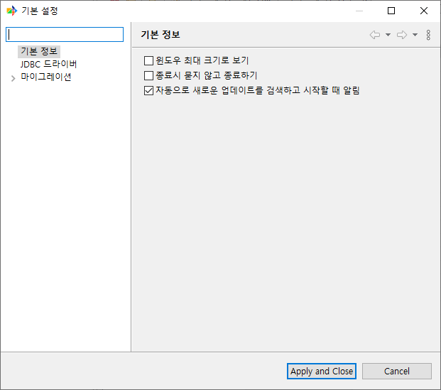
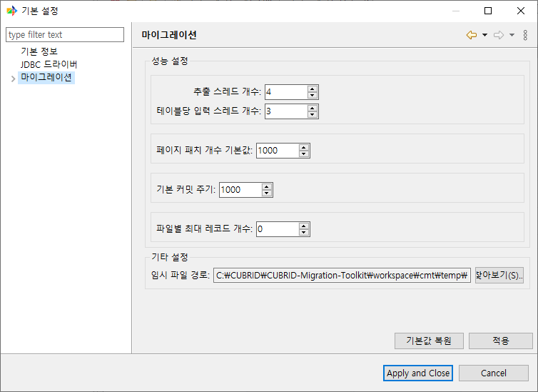
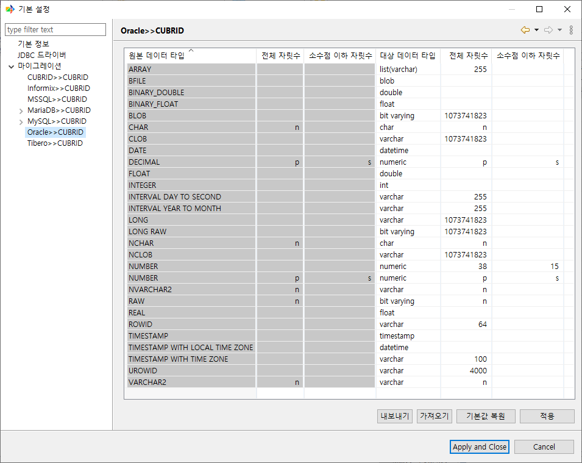
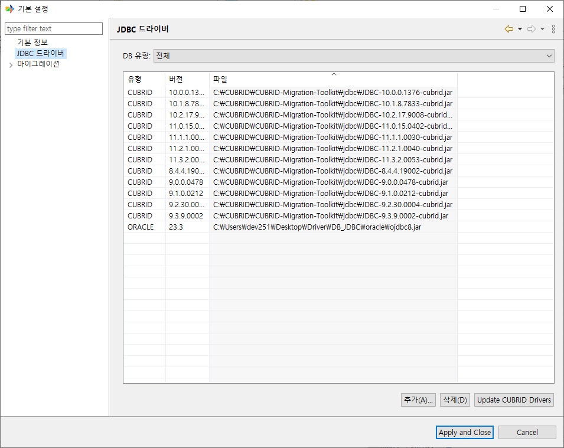

환경 설정
---------

본 챕터는 CMT를 사용하면서 "한 번 설정하면 계속 사용하는" 영역을 다룬다. 환경 설정 다이얼로그의 각 페이지, JDBC 드라이버 관리, 워크스페이스의 위치와 구조를 정리한다.

환경 설정 변경은 즉시 또는 다음 실행 시점부터 반영된다. 대부분의 값은 워크스페이스에 함께 저장되므로 워크스페이스를 백업하면 환경 설정도 함께 보존된다.

환경 설정 열기
^^^^^^^^^^^^^^

상단 메뉴 ``마이그레이션 > 기본 설정``\을 선택하면 환경 설정 다이얼로그가 열린다.

좌측 트리에서 페이지를 선택하면 우측에 해당 설정이 표시된다. CMT가 제공하는 페이지는 다음과 같다.

- **기본 정보** — 시작·종료·업데이트 관련 일반 옵션
- **마이그레이션** — 마이그레이션 기본 성능 값과 임시 디렉토리
- **마이그레이션** 하위 7개 타입 매핑 페이지 — 원본 DB별 데이터 타입 매핑
- **JDBC 드라이버** — JDBC 드라이버 파일 관리

기본 정보 페이지
^^^^^^^^^^^^^^^^

CMT의 시작 동작, 종료 동작, 업데이트 확인 동작을 제어한다.

.. list-table::
    :header-rows: 1
    :widths: 35 50 15

    * - 옵션
      - 설명
      - 기본값
    * - **윈도우 최대 크기로 보기**
      - 시작 시 메인 창을 최대화 상태로 연다.
      - OFF
    * - **종료시 묻지 않고 종료하기**
      - 종료 시 "CUBRID Migration Toolkit를 종료하시겠습니까?" 확인 다이얼로그를 표시하지 않는다. 종료 확인 다이얼로그의 토글을 통해서도 변경 가능.
      - OFF
    * - **자동으로 새로운 업데이트를 검색하고 시작할 때 알림**
      - 시작 시 CMT 새 빌드가 있는지 확인하고 발견되면 알린다.
      - ON

마이그레이션 페이지
^^^^^^^^^^^^^^^^^^^^^^^^

마이그레이션 작업의 기본 성능 값과 임시 디렉토리를 설정한다. 여기서 정한 값은 새 마법사를 시작할 때의 초기값이 되며, 작업별로는 마법사의 **고급 성능 설정**\으로 덮어쓸 수 있다.

성능 설정
""""""""""""""""""""""""""""""""""""""""""""""""

.. list-table::
    :header-rows: 1
    :widths: 30 50 20

    * - 항목
      - 의미
      - 기본값
    * - **추출 스레드 개수**
      - 원본에서 데이터를 추출하는 동시 스레드 수.
      - 4
    * - **테이블당 입력 스레드 개수**
      - 한 Table을 대상 DB로 적재할 때 사용할 병렬 스레드 수.
      - 3
    * - **페이지 패치 개수 기본값**
      - JDBC 결과 집합에서 한 번에 가져올 행 수.
      - 1000
    * - **기본 커밋 주기**
      - 적재 시 몇 행마다 commit을 수행할지.
      - 1000
    * - **파일별 최대 레코드 개수**
      - 파일 출력 모드에서 한 파일에 넣을 최대 레코드 수. 0이면 제한 없음.
      - 0

각 항목의 상세 의미와 허용 범위는 :doc:`12_advanced`\을 참고한다.

기타 설정
""""""""""""""""""""""""""""""""""""""""""""""""

- **임시 파일 경로** — CMT가 마이그레이션 도중 사용하는 임시 파일이 저장되는 디렉토리. **찾아보기...**\로 디렉토리 다이얼로그를 열어 변경한다. 디스크 여유 공간이 부족하거나 임시 파일을 별도 저장 공간에 두고 싶을 때 변경한다.

데이터 타입 매핑 편집
^^^^^^^^^^^^^^^^^^^^^

원본 DB의 데이터 타입을 CUBRID의 어떤 타입으로 변환할지를 정의한다. **마이그레이션** 페이지 하위에 7개의 매핑 페이지가 있다.

.. list-table::
    :header-rows: 1
    :widths: 30 70

    * - 페이지
      - 매핑 대상
    * - **MySQL >> CUBRID**
      - MySQL 원본 → CUBRID 대상
    * - **MariaDB >> CUBRID**
      - MariaDB 원본 → CUBRID 대상
    * - **Oracle >> CUBRID**
      - Oracle 원본 → CUBRID 대상
    * - **Tibero >> CUBRID**
      - Tibero 원본 → CUBRID 대상
    * - **MSSQL >> CUBRID**
      - SQL Server 원본 → CUBRID 대상
    * - **Informix >> CUBRID**
      - Informix 원본 → CUBRID 대상
    * - **CUBRID >> CUBRID**
      - CUBRID 원본 → CUBRID 대상 (버전 간 이관)

매핑은 별도의 추가/편집/삭제 버튼이나 편집 다이얼로그 없이 표에서 직접 셀을 인라인 편집하는 방식이다. 대상 컬럼(대상 데이터 타입·전체 자릿수·소수점 이하 자릿수)만 수정할 수 있으며, 원본 컬럼은 수정할 수 없다.

전체 기본 매핑표는 :doc:`appendix_typemap`\에서 확인한다.

MySQL / MariaDB 하위 기타 설정
""""""""""""""""""""""""""""""""""""""""""""""""

MySQL과 MariaDB 매핑 페이지 아래에는 별도의 **기타 설정** 하위 페이지가 있다. 원본의 비표준 날짜/시간 값과 문자열에 포함된 0x0000 문자의 처리 방식을 지정한다.

.. list-table::
    :header-rows: 1
    :widths: 30 70

    * - 설정
      - 설명
    * - **분석할 수 없는 MySQL TIME을 새로운 값으로 대체 (예: -838:59:59)**
      - 파싱 불가한 ``TIME`` 값을 NULL, ``00:00:00``, 또는 지정한 대체 값으로 바꾼다.
    * - **분석할 수 없는 MySQL DATE를 새로운 값으로 대체 (예: 0000-00-00)**
      - 파싱 불가한 ``DATE`` 값(``0000-00-00`` 등)을 NULL, ``0001-01-01``, 또는 지정한 대체 값으로 바꾼다.
    * - **분석할 수 없는 MySQL DATETIME을 새로운 값으로 대체 (예: 0000-00-00 00:00:00)**
      - 파싱 불가한 ``DATETIME`` 값을 NULL, ``1970-01-02 01:00:00.000``, 또는 지정한 대체 값으로 바꾼다.
    * - **MySQL 문자열에 포함된 0x0000 문자에 대한 새로운 값으로 대체**
      - 문자열 값에 포함된 0x0000 문자를 공백(0x0020), 변경 없음, 또는 지정한 대체 값으로 치환한다.

JDBC 드라이버 관리
^^^^^^^^^^^^^^^^^^

**JDBC 드라이버** 페이지에서 CMT가 사용할 JDBC 드라이버 JAR 파일을 등록·삭제한다.

상단의 **DB 유형:** 콤보로 표시할 드라이버를 데이터베이스 종류별로 필터링할 수 있다(기본값 **전체**).

드라이버 표
""""""""""""""""""""""""""""""""""""""""""""""""

.. list-table::
    :header-rows: 1
    :widths: 20 20 60

    * - 컬럼
      - 의미
      - 비고
    * - **유형**
      - 데이터베이스 종류
      - CUBRID, MySQL, Oracle 등
    * - **버전**
      - 드라이버 버전
      - 드라이버 파일에서 자동 인식
    * - **파일**
      - 드라이버 JAR 파일의 절대 경로
      - 사용자가 추가한 경우 임의 경로

표의 컬럼 헤더를 클릭하면 해당 컬럼 기준으로 정렬된다.

버튼
""""""""""""""""""""""""""""""""""""""""""""""""

.. list-table::
    :header-rows: 1
    :widths: 28 72

    * - 버튼
      - 동작
    * - **추가**
      - 파일 다이얼로그를 열어 JAR 또는 ZIP 파일을 등록한다. 유효성 검사를 통과해야 추가된다.
    * - **삭제**
      - 사용자가 추가한 드라이버를 삭제한다. CMT가 함께 제공하는 번들 드라이버는 삭제되지 않는다.
    * - **Update CUBRID Drivers**
      - cubrid.org에서 CUBRID JDBC 드라이버를 내려받아 자동 등록한다. 진행률 표시가 뜨고, 완료되면 표가 갱신된다.

번들 CUBRID 드라이버
""""""""""""""""""""""""""""""""""""""""""""""""

CMT 설치 디렉토리에는 다음 CUBRID JDBC 드라이버 12종이 함께 제공된다.

.. list-table::
    :header-rows: 1
    :widths: 100

    * - 드라이버 JAR
    * - ``JDBC-8.4.4.19002-cubrid.jar``
    * - ``JDBC-9.0.0.0478-cubrid.jar``
    * - ``JDBC-9.1.0.0212-cubrid.jar``
    * - ``JDBC-9.2.30.0004-cubrid.jar``
    * - ``JDBC-9.3.9.0002-cubrid.jar``
    * - ``JDBC-10.0.0.1376-cubrid.jar``
    * - ``JDBC-10.1.8.7833-cubrid.jar``
    * - ``JDBC-10.2.17.9008-cubrid.jar``
    * - ``JDBC-11.0.15.0402-cubrid.jar``
    * - ``JDBC-11.1.1.0030-cubrid.jar``
    * - ``JDBC-11.2.1.0040-cubrid.jar``
    * - ``JDBC-11.3.2.0053-cubrid.jar``

번들 드라이버는 ``<설치 경로>/jdbc/`` 디렉토리에 위치한다. 그 외 버전의 CUBRID JDBC 드라이버가 필요하면 **Update CUBRID Drivers** 버튼으로 cubrid.org에서 최신 드라이버를 내려받거나, **추가** 버튼으로 직접 JAR 파일을 등록한다.

그 외 DB 드라이버
""""""""""""""""""""""""""""""""""""""""""""""""

Oracle, MySQL, MariaDB, Tibero, MSSQL, Informix 등 다른 DB의 JDBC 드라이버는 라이선스 정책상 CMT에 동봉되지 않는다. 사용자가 각 벤더에서 직접 받아 **추가** 버튼으로 등록해야 한다. 마법사의 연결 다이얼로그에서도 **찾아보기...** 버튼으로 즉시 등록할 수 있다.

워크스페이스
^^^^^^^^^^^^

워크스페이스는 CMT가 사용자별 설정과 마이그레이션 산출물을 모아 두는 디렉토리이다. 한 워크스페이스 안에 연결 정보, 스크립트, 이력, 보고서, 환경 설정이 함께 들어 있다.

위치
""""""""""""""""""""""""""""""""""""""""""""""""

기본 워크스페이스 경로는 ``<설치 경로>/workspace/``\이며, CMT 산출물은 그 아래 ``cmt/`` 디렉토리에 저장된다. OS별 차이는 없으며, CMT가 시작 시 직접 이 경로를 설정한다.

디렉토리 구조
""""""""""""""""""""""""""""""""""""""""""""""""

CMT를 처음 실행하면 다음 구조가 만들어진다.

.. code-block:: text

    <설치 경로>/
    ├── workspace/
    │   └── cmt/
    │       ├── log/             # 로그 파일(cubrid-migration.log 등)
    │       ├── report/          # 마이그레이션 이력 보고서(.mh 파일)
    │       ├── script/          # 저장된 마이그레이션 스크립트(.xml)
    │       ├── history/         # XML dump 파싱 이력(XmlCatalogHistory.xml)
    │       ├── schemacache/     # 원본 스키마 캐시
    │       ├── errors/          # 적재 실패 레코드(타임스탬프 하위 디렉토리)
    │       └── temp/            # 임시 파일(설정으로 변경 가능)
    └── jdbc/                    # 번들 JDBC 드라이버(워크스페이스 아님)

``jdbc/``\는 워크스페이스가 아니라 설치 디렉토리 바로 아래에 위치한다. ``log/``, ``report/``, ``script/``, ``history/``, ``schemacache/``, ``errors/``\는 CMT가 직접 관리하므로 수동으로 편집하지 않는 것을 권장한다. 임시 파일 디렉토리는 **마이그레이션** 페이지의 **임시 파일 경로** 설정으로 변경할 수 있다.

관련 챕터
^^^^^^^^^

- 성능 항목 상세와 메모리 조정 — :doc:`12_advanced`
- 데이터 타입 매핑 전체 표 — :doc:`appendix_typemap`
- 마법사 화면별 연결 정보 사용 방법 — :doc:`05_wizard`
