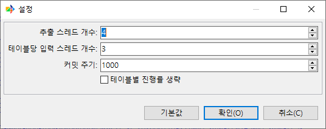
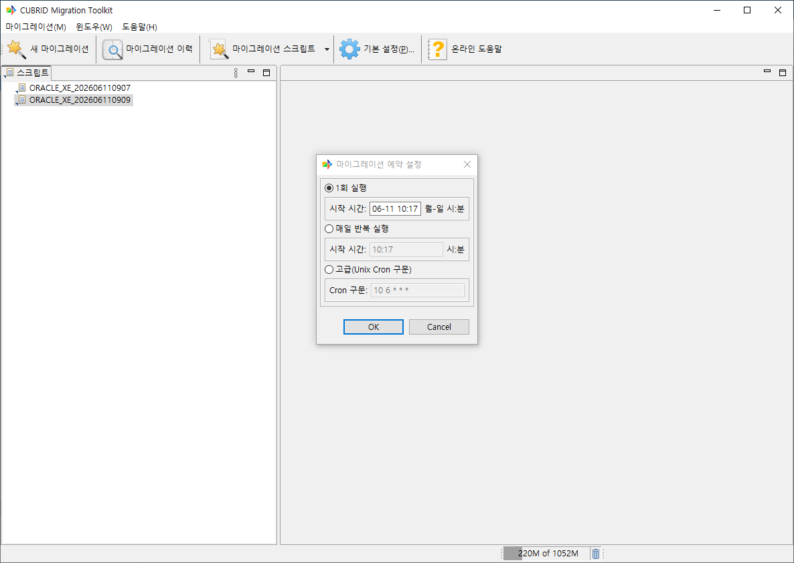
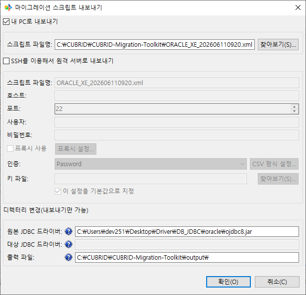
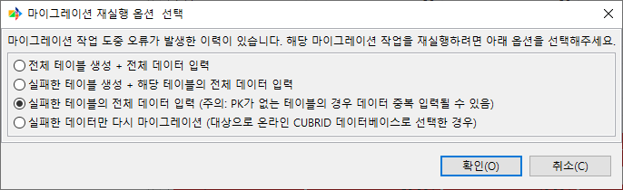

고급 사용
---------

본 챕터는 일상적인 마이그레이션을 넘어 더 큰 데이터, 반복 실행, 원격 운영, 장애 복구 같은 상황에서 CMT를 효과적으로 활용하는 방법을 다룬다. 성능 튜닝, 예약 마이그레이션, SSH 원격 스크립트 관리, 취소된 마이그레이션 재시작, 오류 처리, 로그 분석 순서로 설명한다.

각 절은 독립적으로 읽을 수 있도록 구성되었으며, 환경 설정 화면이나 마법사의 어느 단계에서 해당 기능을 사용할 수 있는지를 함께 기술한다.

성능 튜닝
^^^^^^^^^

마이그레이션 성능과 관련해 설정할 수 있는 항목은 다음과 같다. 각 항목의 의미와 설정 위치만 정리한다.

스레드 수 · 커밋 주기 · 패치 개수
""""""""""""""""""""""""""""""""""""""""""""""""""

마법사 6단계 **최종 확인**\에서 **고급 성능 설정...** 버튼을 누르면 성능 설정 다이얼로그가 열린다. 모든 항목은 작업별로 별도 저장되며, 환경 설정의 기본값을 덮어쓴다.

.. list-table::
    :header-rows: 1
    :widths: 25 40 15 20

    * - 항목
      - 의미
      - 기본값
      - 허용 범위
    * - **추출 스레드 개수**
      - 원본에서 데이터를 추출하는 동시 스레드 수. 스레드는 Table 단위로 할당된다.
      - 4
      - 1 ~ 50
    * - **테이블당 입력 스레드 개수**
      - 한 Table을 대상 DB로 적재할 때 사용할 병렬 스레드 수. 레코드를 병렬로 적재한다.
      - 3
      - 1 ~ 50
    * - **커밋 주기**
      - 적재 시 몇 행마다 commit을 수행할지.
      - 1000
      - 1 ~ 50000
    * - **테이블별 진행률 생략**
      - 적재 전 원본 Table의 총 행 수를 집계(COUNT 질의)하는 단계를 생략한다. 큰 Table의 초기 집계 시간이 단축되지만, 총 행 수를 모르므로 진행률 표시가 정확하지 않을 수 있다.
      - OFF
      - ON/OFF

원본/대상 조합에 따라 다음 항목이 다이얼로그에 추가로 표시된다.

- **1회 페이지 패치 개수** — JDBC 결과 집합에서 한 번에 가져올 행 수 (기본값 1000, 100 이상). 원본이 온라인 CUBRID 또는 MSSQL일 때만 표시된다.
- **파일별 최대 레코드 개수** — 한 파일에 넣을 최대 레코드 수 (기본값 0 = 제한 없음). 대상이 파일 출력이고 **테이블별 파일 분할 출력**\이 켜져 있을 때만 표시된다.

메모리 · JVM 옵션
""""""""""""""""""""""""""""""""""""""""""""""""""

CMT는 JVM 위에서 실행되며 데이터 추출 결과의 일부를 메모리 큐에 보관한다. 기본 힙 크기로는 LOB이 많은 Table이나 행 폭이 큰 Table에서 OutOfMemoryError가 발생할 수 있다.

힙 크기는 CMT 실행 파일 옆의 ``.ini`` 파일에 ``-vmargs`` 다음 줄로 ``-Xms``\(초기) / ``-Xmx``\(최대) 옵션을 두어 조정한다.

.. list-table::
    :header-rows: 1
    :widths: 25 75

    * - OS
      - ``.ini`` 파일 경로
    * - Linux
      - ``<설치 경로>/cubridmigration.ini``
    * - Windows
      - ``<설치 경로>\cubridmigration.ini``

기본값은 ``-Xms1024M -Xmx4096M``\이다. ``-Xms``\/``-Xmx`` 값을 조정해 힙 크기를 늘리거나 줄일 수 있다.

``.ini`` 수정 후 CMT를 재시작해야 적용된다.

예약 마이그레이션
^^^^^^^^^^^^^^^^^

이미 저장된 스크립트를 정해진 시각에 자동 실행한다.

GUI 예약
""""""""""""""""""""""""""""""""""""""""""""""""

좌측의 **스크립트**\에서 스크립트를 우클릭한 뒤 **예약하기**\를 선택한다. 마법사 6단계에서 **시작하기**\를 누른 뒤 표시되는 실행 모드 다이얼로그의 **예약하기** 버튼을 눌러도 동일한 다이얼로그가 열린다.

예약 다이얼로그에서는 다음 세 가지 모드 중 하나만 선택할 수 있다.

.. list-table::
    :header-rows: 1
    :widths: 25 35 40

    * - 모드
      - 입력 형식
      - 의미
    * - **1회 실행**
      - ``MM-DD HH:MM``\(예: ``12-25 09:30``)
      - 지정한 날짜/시각에 한 번 실행한다.
    * - **매일 반복 실행**
      - ``HH:MM``\(예: ``02:30``)
      - 매일 지정한 시각에 실행한다.
    * - **고급(Unix Cron 구문)**
      - **Cron 구문:** 입력 필드 (기본 ``10 6 * * *``)
      - 지정한 Cron 패턴에 따라 반복 실행한다.

Cron 패턴은 분 / 시 / 일 / 월 / 요일 5필드 표준 형식이다. 각 필드는 숫자, ``*``, 범위(``1-5``), 리스트(``1,3,5``), 간격(``*/15``)을 지원한다.

.. list-table::
    :header-rows: 1
    :widths: 35 65

    * - Cron 패턴
      - 의미
    * - ``0 22 * * *``
      - 매일 22:00
    * - ``30 2 * * 1-5``
      - 평일 02:30
    * - ``0 */6 * * *``
      - 6시간 간격(00:00, 06:00, 12:00, 18:00)
    * - ``0 3 1 * *``
      - 매월 1일 03:00
    * - ``15 0 * * 0``
      - 매주 일요일 00:15

예약을 취소하려면 같은 컨텍스트 메뉴에서 **예약 취소**\를 선택한다. 예약 중인 스크립트는 트리에서 예약 아이콘으로 표시된다.

GUI 예약은 CMT가 실행 중일 때만 트리거된다. CMT를 꺼 둔 시간에도 예약 실행이 필요하면 콘솔 모드와 OS 스케줄러를 결합한다.

콘솔 + OS 스케줄러 결합
""""""""""""""""""""""""""""""""""""""""""""""""

서버나 무인 환경에서는 콘솔 모드(``migration.sh start <script.xml>``)와 OS 스케줄러를 결합한다.

Linux의 ``cron``:

.. code-block:: bash

    # 매일 새벽 2시에 실행
    0 2 * * * cd /opt/cmt && ./migration.sh start /scripts/nightly.xml >> /var/log/cmt/nightly.log 2>&1

콘솔 실행 결과는 종료 코드만으로 판정하지 말고 ``report`` / ``log`` 출력과 본체 로그를 함께 저장해 확인한다. 콘솔 사용법은 :doc:`09_console`\를 참고한다.

SSH로 원격 스크립트 관리
^^^^^^^^^^^^^^^^^^^^^^^^

마이그레이션 스크립트를 원격 호스트에 올리거나 원격에서 가져온다. 운영 서버에 보관해 둔 스크립트를 검토용 워크스테이션에서 받거나, 작성한 스크립트를 야간 실행 서버로 배포할 때 사용한다.

가져오기 / 내보내기
""""""""""""""""""""""""""""""""""""""""""""""""

- **가져오기** — 스크립트 트리 컨텍스트 메뉴의 **가져오기**\를 선택하면 **마이그레이션 스크립트 가져오기** 다이얼로그가 열린다. **내 PC에서 가져오기**\와 **SSH를 이용해서 원격 서버에서 가져오기** 두 가지 소스 중 하나만 선택할 수 있다. 원격을 선택하면 SSH 연결 다이얼로그가 호출된다.
- **내보내기** — 마법사 6단계 **최종 확인**\의 **스크립트 내보내기** 버튼 또는 스크립트 트리의 **내보내기** 메뉴에서 호출한다. 저장 대상으로 **내 PC로 내보내기**\와 **SSH를 이용해서 원격 서버로 내보내기**\를 선택할 수 있다.

취소된 마이그레이션 재시작
^^^^^^^^^^^^^^^^^^^^^^^^^^

마이그레이션이 중간에 멈춘 경우 같은 스크립트로 다시 실행할 수 있다. 보고서 화면에서 직접 다시 시작하면 마법사의 모든 입력을 다시 거치지 않는다.

범위 선택 다이얼로그 표시 조건
""""""""""""""""""""""""""""""""""""""""""""""""

**마이그레이션 이력** 뷰의 **마이그레이션 재실행...** 버튼은 이력에서 행이 선택되면 상태와 무관하게 항상 활성화된다. 상태에 따라 달라지는 것은 **마이그레이션 재실행...** 버튼을 누른 뒤 표시되는 **마이그레이션 재실행 옵션 선택** 다이얼로그이다. 이 다이얼로그는 다음 중 하나에 해당할 때만 표시된다.

- 보고서에 오류가 있는 경우
- 마이그레이션이 취소된 경우

위 조건에 해당하지 않으면 범위 선택 없이 곧바로 같은 스크립트로 재실행된다.

재시작 절차
""""""""""""""""""""""""""""""""""""""""""""""""

1. 상단 메뉴 ``마이그레이션 > 마이그레이션 이력``\으로 이력 화면을 연다.
2. 다시 시작할 항목을 선택한다.
3. 툴바의 **마이그레이션 재실행...** 버튼을 누른다. 보고서 화면 안에도 동일한 버튼이 있다.
4. 보고서에 오류가 있거나 마이그레이션이 취소된 경우 **마이그레이션 재실행 옵션 선택** 다이얼로그가 표시된다. 다음 네 가지 범위 중 하나만 선택할 수 있다.

   - **전체 테이블 생성 + 전체 데이터 입력** — 스키마와 데이터를 모두 처음부터 다시 마이그레이션한다.
   - **실패한 테이블 생성 + 해당 테이블의 전체 데이터 입력** — 실패한 Table의 스키마와 그 Table의 전체 데이터를 다시 마이그레이션한다.
   - **실패한 테이블의 전체 데이터 입력 (주의: PK가 없는 테이블의 경우 데이터 중복 입력될 수 있음)** — 실패한 Table의 전체 데이터를 다시 적재한다(기본 선택).
   - **실패한 데이터만 다시 마이그레이션 (대상으로 온라인 CUBRID 데이터베이스로 선택한 경우)** — 오류 레코드 SQL 파일을 사용해 실패한 데이터만 재적재한다. 대상이 온라인 CUBRID일 때만 표시된다.

5. 마법사가 해당 단계로 열리고 곧바로 **시작하기**\를 눌러 다시 실행할 수 있다.

전체 범위를 선택하면 같은 스크립트로 처음부터 새로 실행된다. 실패분 관련 범위를 선택하면 선택한 옵션에 따라 실패한 Table의 스키마·데이터 또는 오류 레코드 SQL 파일만 다시 처리된다. PK가 없는 Table은 데이터가 중복 입력될 수 있으므로, 대상 DB에 남은 이전 적재 결과를 사전에 정리한다.

오류 처리
^^^^^^^^^

부분 실패 동작
""""""""""""""""""""""""""""""""""""""""""""""""

CMT는 객체·레코드 단위 실패를 가능한 한 격리한다.

- **객체 단위**\는 한 객체의 실패가 다른 객체의 진행을 막지 않는다. View나 Procedure가 컴파일에 실패해도 Table 적재는 계속 진행된다.
- **레코드 단위**\는 한 행의 INSERT 실패가 같은 Table의 다음 행 적재를 막지 않는다. 실패 행은 별도로 기록되며, 보고서에서 추출 개수와 입력 개수의 차이로 확인할 수 있다.
- **Table 단위 실패**\는 해당 Table의 적재만 중단되고 다른 Table은 정상적으로 진행된다.

전체 결과는 보고서 화면의 **요약** 탭과 **상세 > 이전 통계** 탭에서 확인한다.

오류 레코드 저장
""""""""""""""""""""""""""""""""""""""""""""""""

마법사 3단계(대상 선택, 온라인 CUBRID 대상에서만 표시됨)의 **입력 실패 데이터 로그 파일로 저장** 옵션을 켜면, 적재 실패한 행이 원본 Table별로 SQL 파일에 기록된다.

- **파일 위치**: ``<설치 경로>/workspace/cmt/errors/<타임스탬프>/`` 디렉토리. ``<타임스탬프>``\는 마이그레이션 시작 시각의 밀리초 단위 숫자이다.
- **파일명**: 각 원본 Table에 대해 ``<원본 테이블명>.sql`` 한 개씩 생성된다. 실패가 없는 Table에는 파일이 생성되지 않는다.
- **형식**: 실패한 행의 데이터를 ``INSERT`` 문 형태로만 기록하며, 주석은 포함하지 않는다. 파일명은 원본 Table명을 쓰지만 ``INSERT`` 문의 대상은 대상(target) Table이므로 재적재 시 대상 DB에서 실행한다.
- **재실행**: 원인을 수정한 뒤 ``csql -u <user> <db> -i <원본 테이블명>.sql``\로 다시 적재할 수 있다.

이 옵션은 온라인 CUBRID 대상에서만 의미가 있다. 파일 출력 모드는 적재 자체를 별도 도구로 수행하므로 실패 레코드가 발생하지 않는다.

PL/CSQL 파싱 실패
""""""""""""""""""""""""""""""""""""""""""""""""

Procedure나 Function의 원본 PL/SQL이 CUBRID PL/CSQL로 매핑되지 않는 패턴을 포함하면 변환 단계에서 실패할 수 있다. 이 경우의 동작은 다음과 같다.

- 적재 자체는 계속 진행된다. 즉, 일부 Procedure 실패가 데이터 적재를 막지 않는다.
- 변환에 실패한 객체는 보고서의 **상세 > DB 객체** 탭에 실패로 기록되며, **오류** Column에 원문 오류가 표시된다. 행을 더블클릭하면 전체 오류 본문이 별도 다이얼로그로 표시된다.

수동 수정이 필요한 경우 보고서에서 실패 객체 목록을 추출한 뒤 직접 ``csql``\로 DDL을 작성·적용한다.

로그 분석
^^^^^^^^^

로그 파일 위치
""""""""""""""""""""""""""""""""""""""""""""""""

.. list-table::
    :header-rows: 1
    :widths: 35 65

    * - 로그 종류
      - 위치
    * - 마이그레이션 실행 로그
      - ``<설치 경로>/workspace/cmt/log/cubrid-migration.log``. 일자별 및 파일당 100MB 단위로 ``cubrid-migration.yyyy-MM-dd.N.log.gz``\로 롤링된다.
    * - 오류 레코드 SQL
      - ``<설치 경로>/workspace/cmt/errors/<타임스탬프>/<원본 테이블명>.sql``
    * - 진행 화면의 라이브 로그
      - 진행 화면 하단의 검은 배경 패널(파일로도 함께 기록됨)
    * - GUI 자체의 워크벤치 로그
      - ``<설치 경로>/workspace/.metadata/.log``

로그 설정 변경
""""""""""""""""""""""""""""""""""""""""""""""""

로그 레벨, 패턴, 출력 파일 같은 설정은 CMT를 실행한 작업 디렉토리(예: 설치 디렉토리)의 ``logback.xml`` 파일을 직접 편집해 바꾼다. 기본 ``logback.xml``\에는 자동 스캔(``scan="true"``, 30초 주기)이 설정되어 있어, 수정하면 재시작 없이 약 30초 이내에 자동 반영된다.

관련 챕터
^^^^^^^^^

- 환경 설정 기본값 위치 — :doc:`11_config`
- 마이그레이션 보고서 화면 — :doc:`10_report`
- 콘솔 명령과 보고서 확인 — :doc:`09_console`
