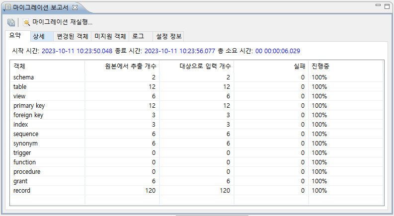
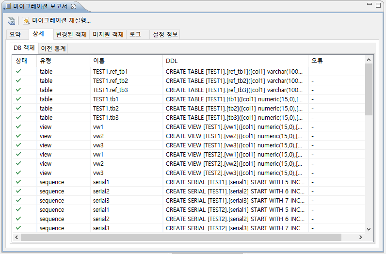
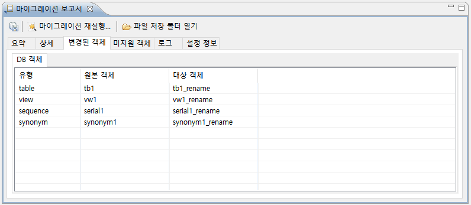

마이그레이션 보고서
--------------------

**저장**
^^^^^^^^^^^^^^^^^^

.. image:: ./images/image41.png
   :width: 6.26805in
   :height: 1.50278in

저장 아이콘을 클릭해 마이그레이션 보고서를 로컬 PC에 저장할 수 있다.

**마이그레이션 재실행**
^^^^^^^^^^^^^^^^^^^^^^^^^^^

.. image:: ./images/image42.png
   :width: 6.15556in
   :height: 1.41667in

수행했던 마이그레이션을 바로 재실행 한다.

**요약**
^^^^^^^^^^^

마이그레이션 한 오브젝트들을 원본 데이터베이스에서 가져온 개수와 대상
데이터베이스로 마이그레이션 된 오브젝트들을 확인할 수 있다.

**상세**
^^^^^^^^^^^

마이그레이션 한 오브젝트들의 유형, 이름, DDL을 확인할 수 있다. 

**변경된 객체**
^^^^^^^^^^^^^^^^^^^^

이름이 변경된 오브젝트들을 확인할 수 있다. schema, table, view, serial, synonym 만 지원한다. 

**미지원 객체**
^^^^^^^^^^^^^^^^^^^^^^^^^

.. image:: ./images/image46.png
   :width: 6.26805in
   :height: 3.79028in

마이그레이션을 지원하지 않는 오브젝트들의 DDL을 확인할 수 있다. 함수, 트리거, 프로시저는 지원하지 않는다. Grant의 경우 온라인 이관 시 대상 데이터베이스 연결 유저가 DBA 권한이 없을 시 마이그레이션을 지원하지 않는다.

**로그**
^^^^^^^^^^^^^^^^^^^^^^^^^

.. image:: ./images/image47.png
   :width: 6.26805in
   :height: 4.12083in

오브젝트 생성 시간, DDL과 성공 여부를 확인할 수 있다.

**설정 정보**
^^^^^^^^^^^^^^^^^^^^^^^^^

.. image:: ./images/image48.png
   :width: 6.26805in
   :height: 4.1625in

마이그레이션 마법사 Step 6에서 확인한 최종 정보를 확인할 수 있다.