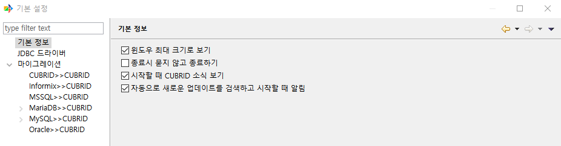
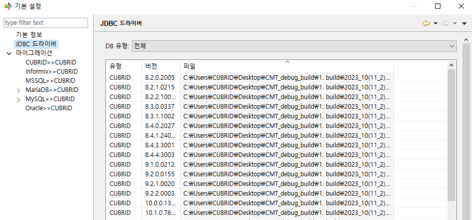

기본 설정
------------

**기본 정보**
^^^^^^^^^^^^^^^^^^^

CMT 설정을 선택할 수 있다.

**JDBC 드라이버**
^^^^^^^^^^^^^^^^^^^^^^^^^^^

CMT에 저장되어 있는 JDBC를 확인할 수 있다. DB 유형별로 확인할 수 있도록 설정할 수 있다.

**마이그레이션**
^^^^^^^^^^^^^^^^^

.. image:: ./cmt_images/image6.png

- 성능 설정
  
  - Default export thread count: 마이그레이션 시 사용할 스레드 개수를 지정할 수 있다. 한 스레드 당 한 개의 테이블의 데이터를 가져올 수 있다.

  - Default import thread count of each table: 마이그레이션 시 각 테이블 별로 데이터를 넣기 위해 사용할 스레드 개수를 지정한다.

  - 기본 커밋 주기: 대량의 데이터를 가져오기 할 경우 데이터베이스에 트랜잭션이 길어 지고 변경 로그가 쌓이게 되면, 데이터베이스 입력이 느려지기 때문에 주기적으로 커밋 하는 것을 권한다. 1000으로 기본 설정되어 있으며, 환경에 따라 그 이상의 값을 설정 할 수 있다.

- 기타 설정

  - 템플릿 파일 경로: 오프라인(CUBRID dump, SQL 스크립트, CSV, XML) 마이그레이션 작업을 하는 동안 임시로 사용하는 temp 파일들이 생성되는 디렉토리를 지정한다.

마이그레이션 항목에서는 각 source DB 별 데이터 타입을 매핑할 수 있다

**CUBRID >> CUBRID**

+------------------+-------------+--------------------+------------------+-------------+--------------------+
| 원본 데이터 타입 | 전체 자릿수 | 소수점 이하 자릿수 | 대상 데이터 타입 | 전체 자릿수 | 소수점 이하 자릿수 |
+==================+=============+====================+==================+=============+====================+
| bigint           |             |                    | bigint           |             |                    |
+------------------+-------------+--------------------+------------------+-------------+--------------------+
| bit              | n           |                    | bit              | n           |                    |
+------------------+-------------+--------------------+------------------+-------------+--------------------+
| n                |             | n                  |                  |             |                    |
+------------------+-------------+--------------------+------------------+-------------+--------------------+
| blob             |             |                    | blob             |             |                    |
+------------------+-------------+--------------------+------------------+-------------+--------------------+
| clob             |             |                    | clob             |             |                    |
+------------------+-------------+--------------------+------------------+-------------+--------------------+
| date             |             |                    | date             |             |                    |
+------------------+-------------+--------------------+------------------+-------------+--------------------+
| datetime         |             |                    | datetime         |             |                    |
+------------------+-------------+--------------------+------------------+-------------+--------------------+
| double           |             |                    | double           |             |                    |
+------------------+-------------+--------------------+------------------+-------------+--------------------+
| enum             |             |                    | enum             |             |                    |
+------------------+-------------+--------------------+------------------+-------------+--------------------+
| float            |             |                    | float            |             |                    |
+------------------+-------------+--------------------+------------------+-------------+--------------------+
| glo              |             |                    | blob             |             |                    |
+------------------+-------------+--------------------+------------------+-------------+--------------------+
| int              |             |                    | int              |             |                    |
+------------------+-------------+--------------------+------------------+-------------+--------------------+
| list             |             |                    | list             |             |                    |
+------------------+-------------+--------------------+------------------+-------------+--------------------+
| monetary         |             |                    | numeric          | 38          | 2                  |
+------------------+-------------+--------------------+------------------+-------------+--------------------+
| multiset         |             |                    | multiset         |             |                    |
+------------------+-------------+--------------------+------------------+-------------+--------------------+
| nchar            | n           |                    | char             | n           |                    |
+------------------+-------------+--------------------+------------------+-------------+--------------------+
| numeric          | p           | s                  | numeric          | p           | s                  |
+------------------+-------------+--------------------+------------------+-------------+--------------------+
| nvarchar         | n           |                    | varchar          | n           |                    |
+------------------+-------------+--------------------+------------------+-------------+--------------------+
| set              |             |                    | set              |             |                    |
+------------------+-------------+--------------------+------------------+-------------+--------------------+
| short            |             |                    | short            |             |                    |
+------------------+-------------+--------------------+------------------+-------------+--------------------+
| time             |             |                    | time             |             |                    |
+------------------+-------------+--------------------+------------------+-------------+--------------------+
| timestamp        |             |                    | timestamp        |             |                    |
+------------------+-------------+--------------------+------------------+-------------+--------------------+

**Informix >> CUBRID**

+------------------+-------------+--------------------+--------------------+-------------+--------------------+
| 원본 데이터 타입 | 전체 자릿수 | 소수점 이하 자릿수 | 대상 데이터 타입   | 전체 자릿수 | 소수점 이하 자릿수 |
+==================+=============+====================+====================+=============+====================+
| bigint           |             |                    | bigint             |             |                    |
+------------------+-------------+--------------------+--------------------+-------------+--------------------+
| bigserial        |             |                    | bigint             |             |                    |
+------------------+-------------+--------------------+--------------------+-------------+--------------------+
| blob             | n           |                    | blob               |             |                    |
+------------------+-------------+--------------------+--------------------+-------------+--------------------+
| boolean          | n           |                    | int                |             |                    |
+------------------+-------------+--------------------+--------------------+-------------+--------------------+
| bson             | n           |                    | json               | n           |                    |
+------------------+-------------+--------------------+--------------------+-------------+--------------------+
| byte             | n           |                    | bit varying        | n           |                    |
+------------------+-------------+--------------------+--------------------+-------------+--------------------+
| char             | n           |                    | char               | n           |                    |
+------------------+-------------+--------------------+--------------------+-------------+--------------------+
| clob             | n           |                    | clob               |             |                    |
+------------------+-------------+--------------------+--------------------+-------------+--------------------+
| date             |             |                    | date               |             |                    |
+------------------+-------------+--------------------+--------------------+-------------+--------------------+
| datetime         |             |                    | datetime           |             |                    |
+------------------+-------------+--------------------+--------------------+-------------+--------------------+
| decimal          | p           | s                  | numeric            | p           | s                  |
+------------------+-------------+--------------------+--------------------+-------------+--------------------+
| float            | n           |                    | double             |             |                    |
+------------------+-------------+--------------------+--------------------+-------------+--------------------+
| int8             |             |                    | bigint             |             |                    |
+------------------+-------------+--------------------+--------------------+-------------+--------------------+
| integer          |             |                    | int                |             |                    |
+------------------+-------------+--------------------+--------------------+-------------+--------------------+
| interval         |             |                    | varchar            | 255         |                    |
+------------------+-------------+--------------------+--------------------+-------------+--------------------+
| json             | n           |                    | json               | n           |                    |
+------------------+-------------+--------------------+--------------------+-------------+--------------------+
| list             |             |                    | list (varchar)     | 255         |                    |
+------------------+-------------+--------------------+--------------------+-------------+--------------------+
| lvarchar         | n           |                    | varchar            | n           |                    |
+------------------+-------------+--------------------+--------------------+-------------+--------------------+
| money            | p           | s                  | numeric            | p           | s                  |
+------------------+-------------+--------------------+--------------------+-------------+--------------------+
| multiset         |             |                    | multiset (varchar) | 255         |                    |
+------------------+-------------+--------------------+--------------------+-------------+--------------------+
| nchar            | n           |                    | char               | n           |                    |
+------------------+-------------+--------------------+--------------------+-------------+--------------------+
| nvarchar         | n           |                    | varchar            | n           |                    |
+------------------+-------------+--------------------+--------------------+-------------+--------------------+
| serial           |             |                    | int                |             |                    |
+------------------+-------------+--------------------+--------------------+-------------+--------------------+
| serial8          |             |                    | bigint             |             |                    |
+------------------+-------------+--------------------+--------------------+-------------+--------------------+
| set              |             |                    | set (varchar)      | 255         |                    |
+------------------+-------------+--------------------+--------------------+-------------+--------------------+
| smallfloat       |             |                    | float              |             |                    |
+------------------+-------------+--------------------+--------------------+-------------+--------------------+
| smallint         |             |                    | short              |             |                    |
+------------------+-------------+--------------------+--------------------+-------------+--------------------+
| text             |             |                    | varchar            | 1073741823  |                    |
+------------------+-------------+--------------------+--------------------+-------------+--------------------+
| varchar          | n           |                    | varchar            | n           |                    |
+------------------+-------------+--------------------+--------------------+-------------+--------------------+

**MSSQL >> CUBRID**

+------------------+-------------+--------------------+------------------+-------------+--------------------+
| 원본 데이터 타입 | 전체 자릿수 | 소수점 이하 자릿수 | 대상 데이터 타입 | 전체 자릿수 | 소수점 이하 자릿수 |
+==================+=============+====================+==================+=============+====================+
| bigint           |             |                    | bigint           |             |                    |
+------------------+-------------+--------------------+------------------+-------------+--------------------+
| binary           | n           |                    | bit              | n           |                    |
+------------------+-------------+--------------------+------------------+-------------+--------------------+
| bit              | 1           |                    | short            |             |                    |
+------------------+-------------+--------------------+------------------+-------------+--------------------+
| char             | n           |                    | char             | n           |                    |
+------------------+-------------+--------------------+------------------+-------------+--------------------+
| date             |             |                    | date             |             |                    |
+------------------+-------------+--------------------+------------------+-------------+--------------------+
| datetime         |             |                    | datetime         |             |                    |
+------------------+-------------+--------------------+------------------+-------------+--------------------+
| datetime2        |             |                    | datetime         |             |                    |
+------------------+-------------+--------------------+------------------+-------------+--------------------+
| datetimeoffset   |             |                    | varchar          | 34          |                    |
+------------------+-------------+--------------------+------------------+-------------+--------------------+
| decimal          | p           | s                  | numeric          | p           | s                  |
+------------------+-------------+--------------------+------------------+-------------+--------------------+
| float            |             |                    | float            |             |                    |
+------------------+-------------+--------------------+------------------+-------------+--------------------+
| geography        |             |                    | bit varying      | 1073741823  |                    |
+------------------+-------------+--------------------+------------------+-------------+--------------------+
| geometry         |             |                    | bit varying      | 1073741823  |                    |
+------------------+-------------+--------------------+------------------+-------------+--------------------+
| hierarchyid      |             |                    | bit varying      | 7136        |                    |
+------------------+-------------+--------------------+------------------+-------------+--------------------+
| image            |             |                    | blob             |             |                    |
+------------------+-------------+--------------------+------------------+-------------+--------------------+
| int              |             |                    | int              |             |                    |
+------------------+-------------+--------------------+------------------+-------------+--------------------+
| money            |             |                    | numeric          | 19          | 4                  |
+------------------+-------------+--------------------+------------------+-------------+--------------------+
| nchar            | n           |                    | char             | n           |                    |
+------------------+-------------+--------------------+------------------+-------------+--------------------+
| ntext            |             |                    | clob             |             |                    |
+------------------+-------------+--------------------+------------------+-------------+--------------------+
| numeric          | p           | s                  | numeric          | p           | s                  |
+------------------+-------------+--------------------+------------------+-------------+--------------------+
| nvarchar         | n           |                    | varchar          | n           |                    |
+------------------+-------------+--------------------+------------------+-------------+--------------------+
| real             |             |                    | float            |             |                    |
+------------------+-------------+--------------------+------------------+-------------+--------------------+
| smalldatetime    |             |                    | datetime         |             |                    |
+------------------+-------------+--------------------+------------------+-------------+--------------------+
| smallint         |             |                    | short            |             |                    |
+------------------+-------------+--------------------+------------------+-------------+--------------------+
| smallmoney       |             |                    | numeric          | 10          | 4                  |
+------------------+-------------+--------------------+------------------+-------------+--------------------+
| sql_variant      |             |                    | varchar          | 8000        |                    |
+------------------+-------------+--------------------+------------------+-------------+--------------------+
| sysname          |             |                    | varchar          | 128         |                    |
+------------------+-------------+--------------------+------------------+-------------+--------------------+
| text             |             |                    | clob             |             |                    |
+------------------+-------------+--------------------+------------------+-------------+--------------------+
| time             |             |                    | time             |             |                    |
+------------------+-------------+--------------------+------------------+-------------+--------------------+
| timestamp        |             |                    | bit varying      | 64          |                    |
+------------------+-------------+--------------------+------------------+-------------+--------------------+
| tinyint          |             |                    | short            |             |                    |
+------------------+-------------+--------------------+------------------+-------------+--------------------+
| uniqueidentifier |             |                    | varchar          | 36          |                    |
+------------------+-------------+--------------------+------------------+-------------+--------------------+
| varbinary        | n           |                    | bit varying      | n           |                    |
+------------------+-------------+--------------------+------------------+-------------+--------------------+
| varchar          | n           |                    | varchar          | n           |                    |
+------------------+-------------+--------------------+------------------+-------------+--------------------+
| xml              |             |                    | clob             |             |                    |
+------------------+-------------+--------------------+------------------+-------------+--------------------+

**MariaDB >> CUBRID**

+--------------------+-------------+--------------------+------------------+-------------+--------------------+
| 원본 데이터 타입   | 전체 자릿수 | 소수점 이하 자릿수 | 대상 데이터 타입 | 전체 자릿수 | 소수점 이하 자릿수 |
+====================+=============+====================+==================+=============+====================+
| bigint             |             |                    | bigint           |             |                    |
+--------------------+-------------+--------------------+------------------+-------------+--------------------+
| bigint unsigned    |             |                    | numeric          | 20          |                    |
+--------------------+-------------+--------------------+------------------+-------------+--------------------+
| binary             | n           |                    | bit              | n           |                    |
+--------------------+-------------+--------------------+------------------+-------------+--------------------+
| bit                | n           |                    | bit              |             |                    |
+--------------------+-------------+--------------------+------------------+-------------+--------------------+
| bit                | 1           |                    | short            |             |                    |
+--------------------+-------------+--------------------+------------------+-------------+--------------------+
| blob               |             |                    | blob             |             |                    |
+--------------------+-------------+--------------------+------------------+-------------+--------------------+
| bool               |             |                    | short            |             |                    |
+--------------------+-------------+--------------------+------------------+-------------+--------------------+
| boolean            |             |                    | short            |             |                    |
+--------------------+-------------+--------------------+------------------+-------------+--------------------+
| char               | n           |                    | char             | n           |                    |
+--------------------+-------------+--------------------+------------------+-------------+--------------------+
| date               |             |                    | date             |             |                    |
+--------------------+-------------+--------------------+------------------+-------------+--------------------+
| datetime           |             |                    | datetime         |             |                    |
+--------------------+-------------+--------------------+------------------+-------------+--------------------+
| decimal            | p           | s                  | numeric          | p           | s                  |
+--------------------+-------------+--------------------+------------------+-------------+--------------------+
| decimal unsigned   | p           | s                  | numeric          | p           | s                  |
+--------------------+-------------+--------------------+------------------+-------------+--------------------+
| double             |             |                    | double           |             |                    |
+--------------------+-------------+--------------------+------------------+-------------+--------------------+
| double unsigned    |             |                    | double           |             |                    |
+--------------------+-------------+--------------------+------------------+-------------+--------------------+
| enum               |             |                    | enum             |             |                    |
+--------------------+-------------+--------------------+------------------+-------------+--------------------+
| float              |             |                    | float            |             |                    |
+--------------------+-------------+--------------------+------------------+-------------+--------------------+
| float unsigned     |             |                    | float            |             |                    |
+--------------------+-------------+--------------------+------------------+-------------+--------------------+
| int                |             |                    | int              |             |                    |
+--------------------+-------------+--------------------+------------------+-------------+--------------------+
| int unsigned       |             |                    | bigint           |             |                    |
+--------------------+-------------+--------------------+------------------+-------------+--------------------+
| longblob           |             |                    | blob             |             |                    |
+--------------------+-------------+--------------------+------------------+-------------+--------------------+
| longtext           |             |                    | varchar          | 1073741823  |                    |
+--------------------+-------------+--------------------+------------------+-------------+--------------------+
| mediumblob         |             |                    | blob             |             |                    |
+--------------------+-------------+--------------------+------------------+-------------+--------------------+
| mediumint          |             |                    | int              |             |                    |
+--------------------+-------------+--------------------+------------------+-------------+--------------------+
| mediumint unsigned |             |                    | int              |             |                    |
+--------------------+-------------+--------------------+------------------+-------------+--------------------+
| mediumtext         |             |                    | varchar          | 16277215    |                    |
+--------------------+-------------+--------------------+------------------+-------------+--------------------+
| numeric            | p           | s                  | numeric          | p           | s                  |
+--------------------+-------------+--------------------+------------------+-------------+--------------------+
| set                |             |                    | set (varchar)    | 255         |                    |
+--------------------+-------------+--------------------+------------------+-------------+--------------------+
| smallint           |             |                    | short            |             |                    |
+--------------------+-------------+--------------------+------------------+-------------+--------------------+
| smallint unsigned  |             |                    |                  | int         |                    |
+--------------------+-------------+--------------------+------------------+-------------+--------------------+
| text               |             |                    | varchar          | 65535       |                    |
+--------------------+-------------+--------------------+------------------+-------------+--------------------+
| time               |             |                    | time             |             |                    |
+--------------------+-------------+--------------------+------------------+-------------+--------------------+
| timestamp          |             |                    | timestamp        |             |                    |
+--------------------+-------------+--------------------+------------------+-------------+--------------------+
| tinyblob           |             |                    | bit varying      | 2040        |                    |
+--------------------+-------------+--------------------+------------------+-------------+--------------------+
| tinyint            |             |                    | short            |             |                    |
+--------------------+-------------+--------------------+------------------+-------------+--------------------+
| tinyint unsigned   |             |                    | short            |             |                    |
+--------------------+-------------+--------------------+------------------+-------------+--------------------+
| tinytext           |             |                    | varchar          | 255         |                    |
+--------------------+-------------+--------------------+------------------+-------------+--------------------+
| varbinary          | nchar       |                    | bit varying      |             |                    |
+--------------------+-------------+--------------------+------------------+-------------+--------------------+
| varchar            | n           |                    | varchar          | n           |                    |
+--------------------+-------------+--------------------+------------------+-------------+--------------------+
| year               |             |                    | char             | 4           |                    |
+--------------------+-------------+--------------------+------------------+-------------+--------------------+

**MySQL >> CUBRID**

+--------------------+-------------+--------------------+------------------+-------------+--------------------+
| 원본 데이터 타입   | 전체 자릿수 | 소수점 이하 자릿수 | 대상 데이터 타입 | 전체 자릿수 | 소수점 이하 자릿수 |
+====================+=============+====================+==================+=============+====================+
| bigint             |             |                    | bigint           |             |                    |
+--------------------+-------------+--------------------+------------------+-------------+--------------------+
| bigint unsigned    |             |                    | numeric          | 20          |                    |
+--------------------+-------------+--------------------+------------------+-------------+--------------------+
| binary             | n           |                    | bit              | n           |                    |
+--------------------+-------------+--------------------+------------------+-------------+--------------------+
| bit                | n           |                    | bit              |             |                    |
+--------------------+-------------+--------------------+------------------+-------------+--------------------+
| bit                | 1           |                    | short            |             |                    |
+--------------------+-------------+--------------------+------------------+-------------+--------------------+
| blob               |             |                    | blob             |             |                    |
+--------------------+-------------+--------------------+------------------+-------------+--------------------+
| bool               |             |                    | short            |             |                    |
+--------------------+-------------+--------------------+------------------+-------------+--------------------+
| boolean            |             |                    | short            |             |                    |
+--------------------+-------------+--------------------+------------------+-------------+--------------------+
| char               | n           |                    | char             | n           |                    |
+--------------------+-------------+--------------------+------------------+-------------+--------------------+
| date               |             |                    | date             |             |                    |
+--------------------+-------------+--------------------+------------------+-------------+--------------------+
| datetime           |             |                    | datetime         |             |                    |
+--------------------+-------------+--------------------+------------------+-------------+--------------------+
| decimal            | p           | s                  | numeric          | p           | s                  |
+--------------------+-------------+--------------------+------------------+-------------+--------------------+
| decimal unsigned   | p           | s                  | numeric          | p           | s                  |
+--------------------+-------------+--------------------+------------------+-------------+--------------------+
| double             |             |                    | double           |             |                    |
+--------------------+-------------+--------------------+------------------+-------------+--------------------+
| double unsigned    |             |                    | double           |             |                    |
+--------------------+-------------+--------------------+------------------+-------------+--------------------+
| enum               |             |                    | enum             |             |                    |
+--------------------+-------------+--------------------+------------------+-------------+--------------------+
| float              |             |                    | float            |             |                    |
+--------------------+-------------+--------------------+------------------+-------------+--------------------+
| float unsigned     |             |                    | float            |             |                    |
+--------------------+-------------+--------------------+------------------+-------------+--------------------+
| int                |             |                    | int              |             |                    |
+--------------------+-------------+--------------------+------------------+-------------+--------------------+
| int unsigned       |             |                    | bigint           |             |                    |
+--------------------+-------------+--------------------+------------------+-------------+--------------------+
| longblob           |             |                    | blob             |             |                    |
+--------------------+-------------+--------------------+------------------+-------------+--------------------+
| longtext           |             |                    | varchar          | 1073741823  |                    |
+--------------------+-------------+--------------------+------------------+-------------+--------------------+
| mediumblob         |             |                    | blob             |             |                    |
+--------------------+-------------+--------------------+------------------+-------------+--------------------+
| mediumint          |             |                    | int              |             |                    |
+--------------------+-------------+--------------------+------------------+-------------+--------------------+
| mediumint unsigned |             |                    | int              |             |                    |
+--------------------+-------------+--------------------+------------------+-------------+--------------------+
| mediumtext         |             |                    | varchar          | 16277215    |                    |
+--------------------+-------------+--------------------+------------------+-------------+--------------------+
| numeric            | p           | s                  | numeric          | p           | s                  |
+--------------------+-------------+--------------------+------------------+-------------+--------------------+
| set                |             |                    | set (varchar)    | 255         |                    |
+--------------------+-------------+--------------------+------------------+-------------+--------------------+
| smallint           |             |                    | short            |             |                    |
+--------------------+-------------+--------------------+------------------+-------------+--------------------+
| smallint unsigned  |             |                    | int              |             |                    |
+--------------------+-------------+--------------------+------------------+-------------+--------------------+
| text               |             |                    | varchar          | 65535       |                    |
+--------------------+-------------+--------------------+------------------+-------------+--------------------+
| time               |             |                    | time             |             |                    |
+--------------------+-------------+--------------------+------------------+-------------+--------------------+
| timestamp          |             |                    | timestamp        |             |                    |
+--------------------+-------------+--------------------+------------------+-------------+--------------------+
| tinyblob           |             |                    | bit varying      | 2040        |                    |
+--------------------+-------------+--------------------+------------------+-------------+--------------------+
| tinyint            |             |                    | short            |             |                    |
+--------------------+-------------+--------------------+------------------+-------------+--------------------+
| tinyint unsigned   |             |                    | short            |             |                    |
+--------------------+-------------+--------------------+------------------+-------------+--------------------+
| tinytext           | n           |                    | varchar          | 255         |                    |
+--------------------+-------------+--------------------+------------------+-------------+--------------------+
| varbinary          |             |                    | bit varying      |             |                    |
+--------------------+-------------+--------------------+------------------+-------------+--------------------+
| varchar            | n           |                    | varchar          | n           |                    |
+--------------------+-------------+--------------------+------------------+-------------+--------------------+
| year               |             |                    | char             | 4           |                    |
+--------------------+-------------+--------------------+------------------+-------------+--------------------+

**Oracle >> CUBRID**

+-------------------------------+-------------+--------------------+------------------+-------------+--------------------+
| 원본 데이터 타입              | 전체 자릿수 | 소수점 이하 자릿수 | 대상 데이터 타입 | 전체 자릿수 | 소수점 이하 자릿수 |
+===============================+=============+====================+==================+=============+====================+
| array                         |             |                    | list (varchar)   | 255         |                    |
+-------------------------------+-------------+--------------------+------------------+-------------+--------------------+
| bfile                         |             |                    | blob             |             |                    |
+-------------------------------+-------------+--------------------+------------------+-------------+--------------------+
| binary_double                 |             |                    | double           |             |                    |
+-------------------------------+-------------+--------------------+------------------+-------------+--------------------+
| binary_float                  |             |                    | float            |             |                    |
+-------------------------------+-------------+--------------------+------------------+-------------+--------------------+
| blob                          |             |                    | blob             |             |                    |
+-------------------------------+-------------+--------------------+------------------+-------------+--------------------+
| char                          | n           |                    | char             | n           |                    |
+-------------------------------+-------------+--------------------+------------------+-------------+--------------------+
| clob                          |             |                    | clob             |             |                    |
+-------------------------------+-------------+--------------------+------------------+-------------+--------------------+
| date                          |             |                    | datetime         |             |                    |
+-------------------------------+-------------+--------------------+------------------+-------------+--------------------+
| decimal                       | p           | s                  | numeric          | p           | s                  |
+-------------------------------+-------------+--------------------+------------------+-------------+--------------------+
| float                         |             |                    | double           |             |                    |
+-------------------------------+-------------+--------------------+------------------+-------------+--------------------+
| integer                       |             |                    | int              |             |                    |
+-------------------------------+-------------+--------------------+------------------+-------------+--------------------+
| interval day to second        |             |                    | varchar          | 255         |                    |
+-------------------------------+-------------+--------------------+------------------+-------------+--------------------+
| interval year to month        |             |                    | varchar          | 255         |                    |
+-------------------------------+-------------+--------------------+------------------+-------------+--------------------+
| long                          |             |                    | varchar          | 1073741823  |                    |
+-------------------------------+-------------+--------------------+------------------+-------------+--------------------+
| long raw                      |             |                    | blob             |             |                    |
+-------------------------------+-------------+--------------------+------------------+-------------+--------------------+
| nchar                         | n           |                    | char             | n           |                    |
+-------------------------------+-------------+--------------------+------------------+-------------+--------------------+
| nclob                         |             |                    | clob             |             |                    |
+-------------------------------+-------------+--------------------+------------------+-------------+--------------------+
| number                        |             |                    | numeric          | 38          | 15                 |
+-------------------------------+-------------+--------------------+------------------+-------------+--------------------+
| number                        | p           | s                  | numeric          | p           | s                  |
+-------------------------------+-------------+--------------------+------------------+-------------+--------------------+
| nvarchar2                     | n           |                    | varchar          | n           |                    |
+-------------------------------+-------------+--------------------+------------------+-------------+--------------------+
| raw                           | n           |                    | bit varying      | n           |                    |
+-------------------------------+-------------+--------------------+------------------+-------------+--------------------+
| real                          |             |                    | float            |             |                    |
+-------------------------------+-------------+--------------------+------------------+-------------+--------------------+
| rowid                         |             |                    | varchar          | 64          |                    |
+-------------------------------+-------------+--------------------+------------------+-------------+--------------------+
| timestamp                     |             |                    | timestamp        |             |                    |
+-------------------------------+-------------+--------------------+------------------+-------------+--------------------+
| timestamp with local timezone |             |                    | datetime         |             |                    |
+-------------------------------+-------------+--------------------+------------------+-------------+--------------------+
| timestamp with timezone       |             |                    | varchar          | 100         |                    |
+-------------------------------+-------------+--------------------+------------------+-------------+--------------------+
| urowid                        |             |                    | varchar          | 4000        |                    |
+-------------------------------+-------------+--------------------+------------------+-------------+--------------------+
| varchar2                      | n           |                    | varchar          | n           |                    |
+-------------------------------+-------------+--------------------+------------------+-------------+--------------------+