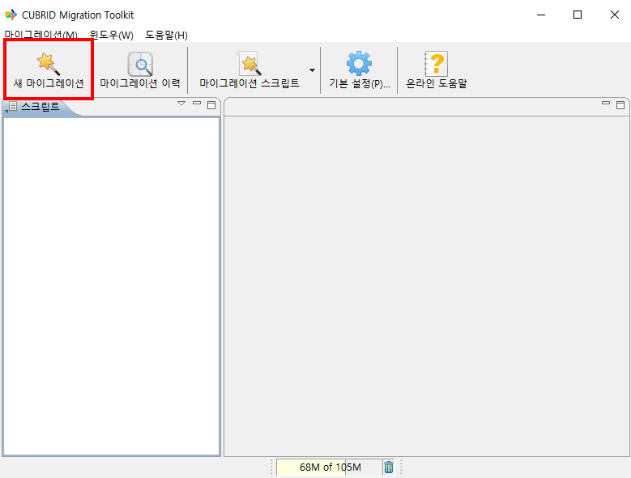
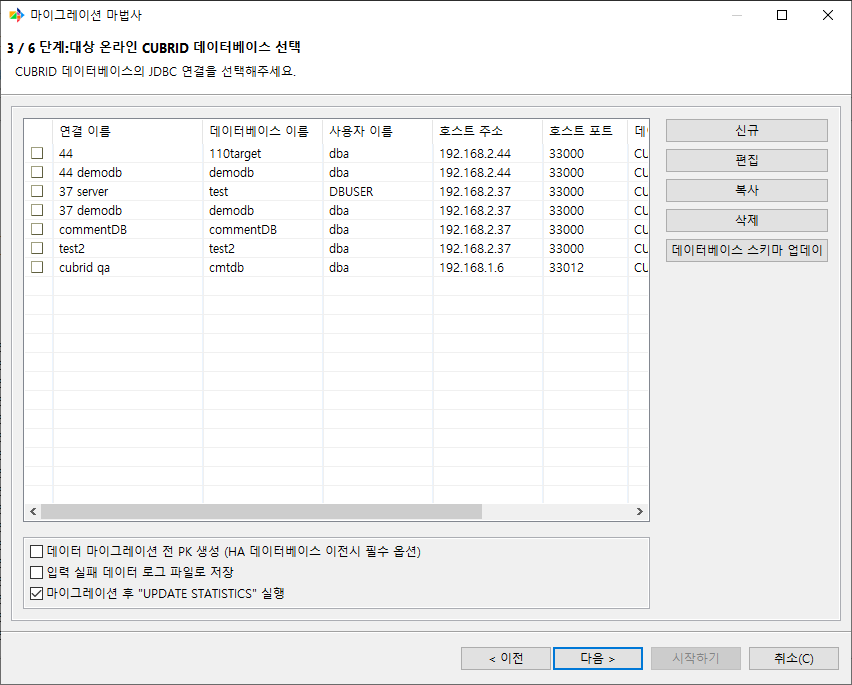
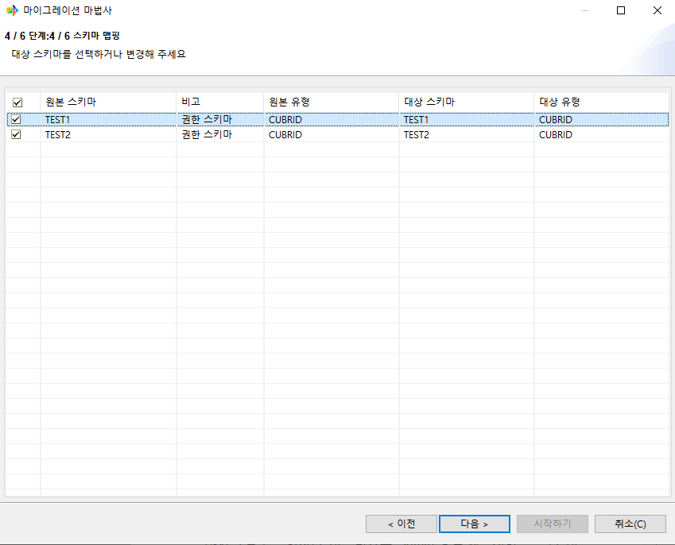
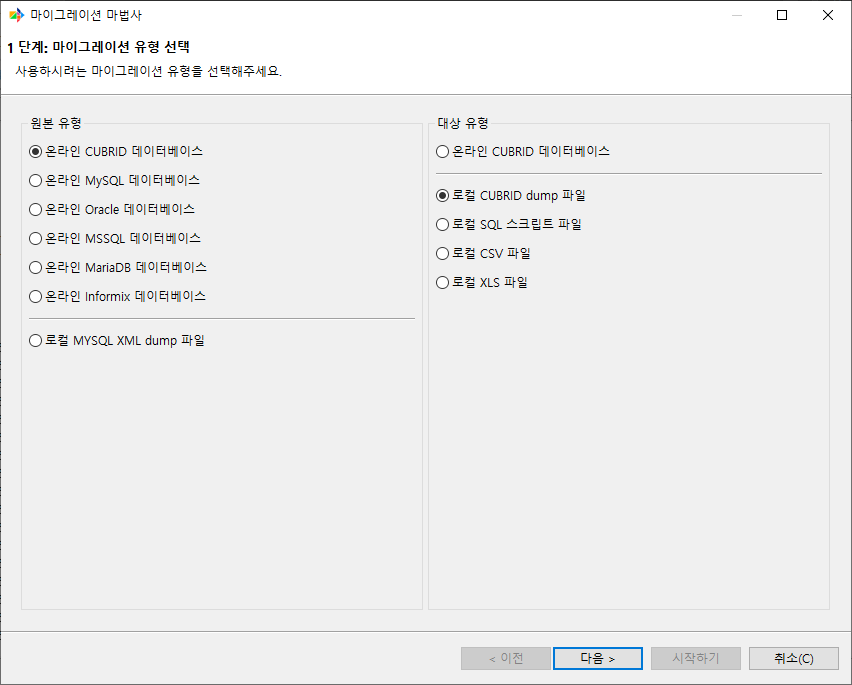
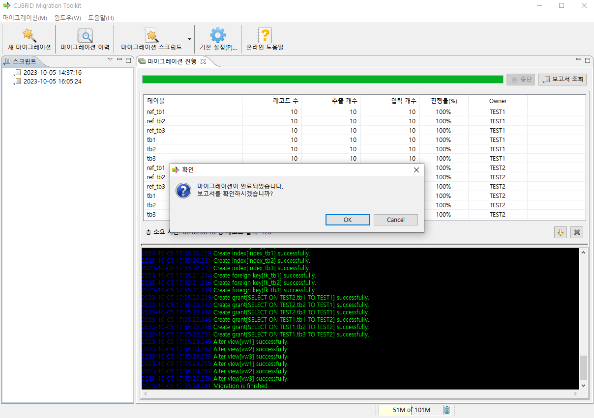
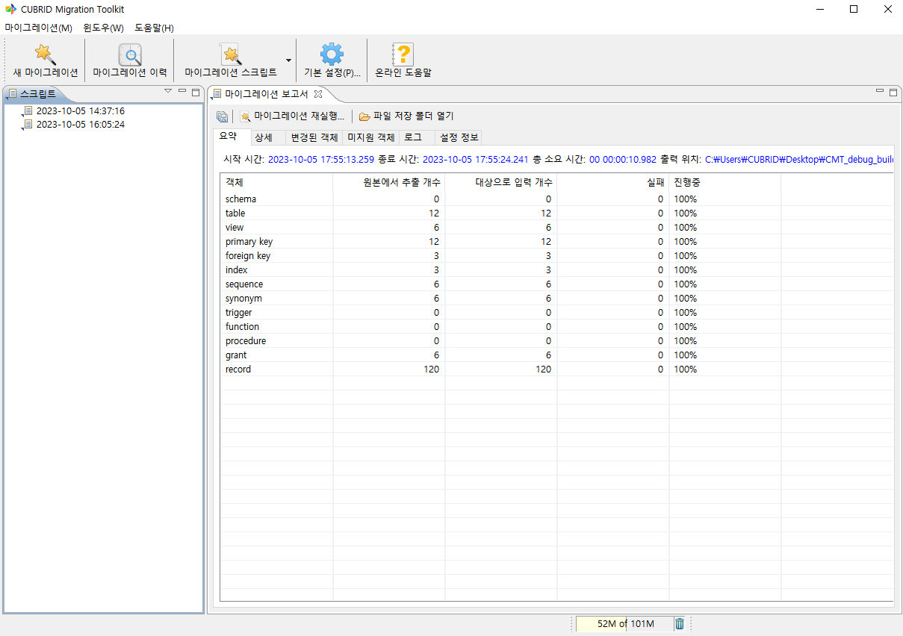

마이그레이션 시나리오
----------------------

CMT를 실행하여 마이그레이션을 진행할 때 사용자가 선택할 수 있는 시나리오는 아래와 같다

- 운영 중인 CUBRID 데이터베이스에 원격 접속하여 마이그레이션 수행(시나리오 1)
- CUBRID 데이터베이스에 로컬 PC로 dump 파일로 마이그레이션 수행(시나리오 2)

두 시나리오는 대상을 선택하는 절차(로컬 PC로 dump 파일 출력, 운영 중인 DB에 DB object, record 입력)만 차이가 있을 뿐 그 외의 절차는 모두 동일하다

각 절차에 대한 화면 예시는 아래 시나리오를 참고

시나리오 1
^^^^^^^^^^^^^^^^^^

**A. 새 마이그레이션**

새로운 마이그레이션 작업을 수행하기 위해 좌측 상단에 있는 [새 마이그레이션]을 클릭하여 마이그레이션 마법사를 실행한다.

**B. 마이그레이션 유형 선택**

원본 유형은 [온라인 CUBRID 데이터베이스], 대상 유형도 [온라인 CUBRID 데이터베이스]를 선택한다.

.. image:: ./cmt_images/image7.png
    :width: 6.26805in
    :height: 5.04306in

**C. 원본 온라인 데이터베이스 선택**

스키마 정보와 데이터를 가져올 원본 데이터베이스를 선택한다.

저장되어 있는 연결 정보가 있다면 선택만 하면 되고, 연결 정보가 없으면 [신규]를 클릭해 연결 정보를 저장 후 선택하면 된다.

.. image:: ./cmt_images/image8.png

**D. 대상 온라인 데이터베이스 선택**

원본 데이터베이스에서 가져온 정보를 이관할 대상 데이터베이스를 선택한다.

저장되어 있는 연결 정보가 있다면 선택만 하면 되고, 연결 정보가 없다면 [신규]를 클릭해 연결 정보를 저장 후 선택하면 된다.

**E. 이관 스키마 선택**

이관하고자 하는 스키마를 선택할 수 있다. 원본 데이터베이스와 대상 데이터베이스 연결 유저에 따라서 대상 스키마를 변경할 수도 있다.

**F. 오브젝트 설정 및 확인**

원본 데이터베이스에서 가져온 오브젝트들을 확인하고 변경할 수 있다.

**G. 마이그레이션 전 최종 확인**

마이그레이션 전 설정한 내용에 대한 최종 확인을 할 수 있다.

우측 하단에 [시작하기]를 클릭하면 마이그레이션이 시작된다.

**H. 마이그레이션 진행**

마이그레이션이 진행되고 있는 상황을 실시간으로 확인할 수 있다.

위 표에는 각 테이블에 있는 레코드들의 진행 상황을 확인할 수 있고, 아래 로그는 현재 수행되고 있는 오브젝트를 확인할 수 있다.

로그는 마이그레이션이 끝난 뒤 마이그레이션 보고서에서 다시 확인할 수 있다.

.. image:: ./cmt_images/image56.png
    :width: 6.26805in
    :height: 4.39028in

**I. 마이그레이션 보고서 확인**

마이그레이션 작업이 끝난 뒤 결과를 보고서로 확인할 수 있다.

시나리오 2
^^^^^^^^^^^^^^^^^^

**A. 새 마이그레이션**

새로운 마이그레이션 작업을 수행하기 위해 좌측 상단에 있는 [새 마이그레이션]을 클릭하여 마이그레이션 마법사를 실행한다.

**B. 마이그레이션 유형 선택**

**C. 원본 온라인 데이터베이스 선택**

스키마 정보와 데이터를 가져올 원본 데이터베이스를 선택한다.

저장되어 있는 연결 정보가 있다면 선택만 하면 되고, 연결 정보가 없으면 [신규]를 클릭해 연결 정보를 저장 후 선택하면 된다.

.. image:: ./cmt_images/image8.png

**D. 출력 파일 설정**

출력 파일을 저장할 경로를 설정하거나, DB 버전, 스키마 파일 분리 여부와 같은 기능들을 선택할 수 있다.

.. image:: ./cmt_images/image13.png
    :width: 6.26805in
    :height: 5.05278in

**E. 이관 스키마 선택**

이관하고자 하는 스키마를 선택할 수 있다. 오프라인 이관의 경우 대상 데이터베이스 접속 유저에 따라 대상 스키마의 이름을 직접 지정해야 한다.

**F. 오브젝트 설정 및 확인**

원본 데이터베이스에서 가져온 오브젝트들을 확인하고 변경할 수 있다.

**G. 마이그레이션 전 최종 확인**

마이그레이션 전 설정한 내용에 대한 최종 확인을 할 수 있다.

우측 하단에 [시작하기]를 클릭하면 마이그레이션이 시작된다.

.. image:: ./cmt_images/image62.png
    :width: 6.26805in
    :height: 5.04028in

**H. 마이그레이션 진행**

마이그레이션이 진행되고 있는 상황을 실시간으로 확인할 수 있다.

위 표에는 각 테이블에 있는 레코드들의 진행 상황을 확인할 수 있고, 아래 로그는 현재 수행되고 있는 오브젝트를 확인할 수 있다.

로그는 마이그레이션이 끝난 뒤 마이그레이션 보고서에서 다시 확인할 수 있다.

**I. 마이그레이션 보고서 확인**

마이그레이션 작업이 끝난 뒤 결과를 보고서로 확인할 수 있다.

