마이그레이션 마법사
--------------------

**1단계 (마이그레이션 유형 선택)**
^^^^^^^^^^^^^^^^^^^^^^^^^^^^^^^^^^^^^^^^^^^^^^^

사용자가 하고자 하는 마이그레이션 유형을 선택할 수 있다.

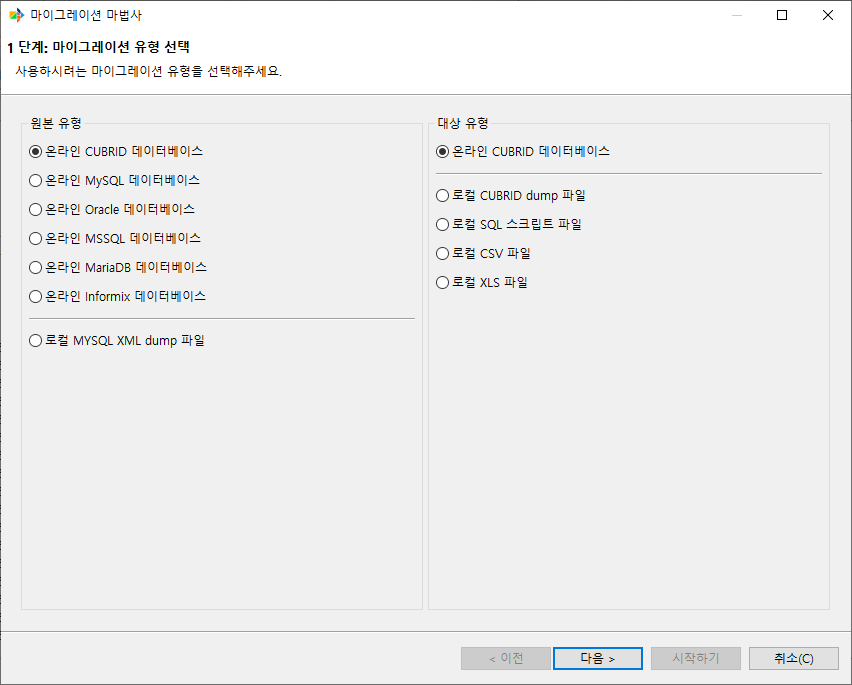

- 원본 유형
    - 데이터를 추출하고자 하는 DB 또는 파일을 선택할 수 있다. DB는 CUBRID, MySQL, Oracle, MSSQL, MariaDB, Informix가 있고, 파일은 MySQL XML dump를 지원한다

- 대상 유형
    - 추출한 데이터를 운영되고 있는 CUBRID DB에 실시간으로 넣는 온라인 이관과 데이터를 파일로 만들어 출력하는 오프라인 이관이 있다. 오프라인 이관은 CUBRID dump, SQL 스크립트, CSV, XLS 파일을 지원한다.

**2단계 (원본 온라인 데이터베이스 선택)**
^^^^^^^^^^^^^^^^^^^^^^^^^^^^^^^^^^^^^^^^^^^^^^^

처음 설치하면 기본적으로 연결 데이터베이스 정보가 없다. 사용자가 가져오기를 원하는 원본 데이터베이스의 호스트 정보와 JDBC 연결을 추가하고 선택해야 한다.

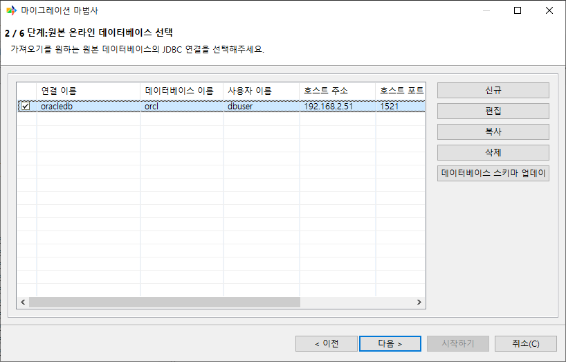

새로운 연결 정보를 만들기 위해서 [신규] 버튼을 클릭한다.

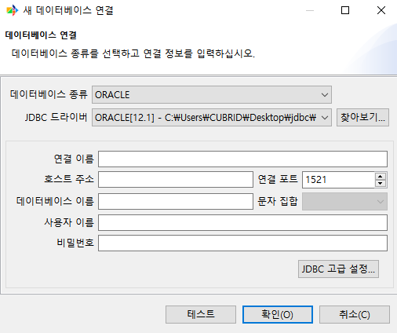

CUBRID는 JDBC 드라이버를 따로 다운로드 받지 않아도 기본적으로 CMT에서 지원을 하고 있다.

.. image:: ./cmt_images/image10.png
   :width: 5.79167in
   :height: 3.29722in

연결 정보를 입력 후 해당 데이터베이스에 접속이 가능한지 [테스트] 버튼을 클릭해 확인할 수 있다.

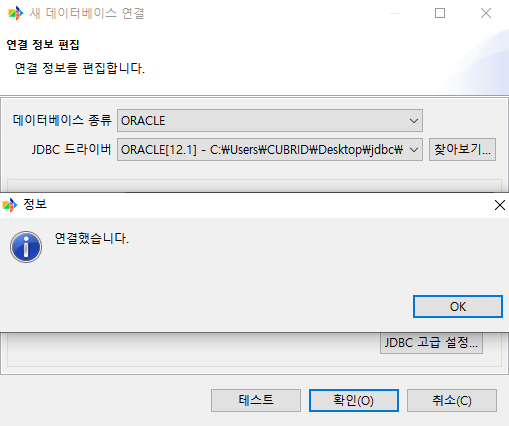

**3-Online단계 (대상 온라인 CUBRID 데이터베이스 선택)**
^^^^^^^^^^^^^^^^^^^^^^^^^^^^^^^^^^^^^^^^^^^^^^^^^^^^^^^^^^

온라인 CUBRID 데이터베이스를 선택한 경우 대상 데이터베이스 연결 정보를 선택해야 한다. 연결 정보가 없다면 원본 데이터베이스에서 연결 정보를 생성한 것과 동일한 방법으로 연결 정보를 생성 후 진행할 수 있다.

.. image:: ./cmt_images/image12.png
   :width: 6.26805in
   :height: 3.76389in

**3-Offline단계 (출력 파일 설정)**
^^^^^^^^^^^^^^^^^^^^^^^^^^^^^^^^^^^^^^^^^^^^^^^

오프라인 마이그레이션 (CUBRID dump, SQL 스크립트, CSV, XLS)을 선택한 경우 설정 정보들은 아래와 같다.

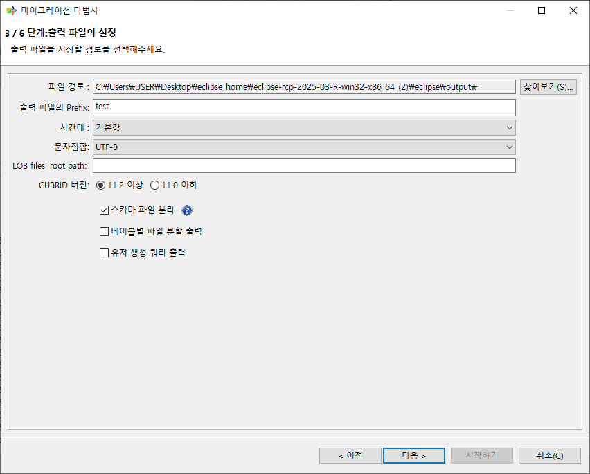

- 파일 경로: 출력되는 파일을 사용자가 원하는 위치로 지정할 수 있다. 기본 경로 설정은 CMT가 설치된 위치에 output 디렉토리 밑으로 지정되어 있다.

- 출력 파일의 Prefix: 출력되는 파일 이름 앞에 붙는 단어로, 원본 데이터베이스 연결 정보에 입력한 사용자 이름이 기본으로 설정된다.

- 시간대: 시간대를 설정

- 문자집합: 파일에 출력할 때 사용할 문자 코드를 지정한다.

- LOB files' root path: LOB 파일이 저장될 디렉토리를 지정한다.

- DB 버전: 11.2 이상을 선택 시 멀티 스키마가 적용된 파일로 출력이 되고, 11.0 이하를 선택 시 멀티 스키마가 적용되지 않은 파일로 출력된다.

- 스키마 파일 분리: 스키마 파일에는 table, view, serial, pk, fk, synonym, grant 오브젝트들이 출력되는데 이를 오브젝트 별로 별도의 파일에 저장하도록 설정할 수 있다.

- 테이블별 파일 분할 출력: 테이블의 data를 테이블 이름의 각각의 파일로 출력할 수 있다.

- 유저 생성 쿼리 출력: 원본 데이터베이스에 접속한 유저가 가지고 있는 권한 스키마들에 대해 유저를 생성할 수 있는 쿼리를 파일로 출력해준다.

**4단계 (스키마 맵핑)**
^^^^^^^^^^^^^^^^^^^^^^^^^^^^

마이그레이션 하고자 하는 스키마들을 선택한다. 온라인의 경우 드롭다운 리스트를 통해 대상 스키마를 선택할 수 있고, 오프라인의 경우 사용자가 직접 스키마 이름을 입력할 수 있다.

원본, 대상 데이터베이스 접속 유저 권한에 따라서 설정할 수 있는 대상 스키마가 달라진다.

.. image:: ./cmt_images/image15.png

+----------------+------------------+------------------------------+------------------+-------------------------------------+
| 원본 \ 대상    | 11.0 일반 유저   | 11.0 DBA                     | 11.2 일반 유저   | 11.2 DBA                            |
+================+==================+==============================+==================+=====================================+
| 11.0 일반 유저 | target 접속 유저 | targetDB + souceDB명         | target 접속 유저 | target 모든 유저                    |
+----------------+------------------+------------------------------+------------------+-------------------------------------+
| 11.0 DBA       | target 접속 유저 | targetDB + souceDB명         | target 접속 유저 | target 모든 유저                    |
+----------------+------------------+------------------------------+------------------+-------------------------------------+
| 11.2 일반 유저 | target 접속 유저 | targetDB + souceDB 접속 유저 | target 접속 유저 | source 접속 유저 + target 모든 유저 |
+----------------+------------------+------------------------------+------------------+-------------------------------------+
| 11.2 DBA       | target 접속 유저 | targetDB + souceDB 모든 유저 | target 접속 유저 | source 접속 유저 + target 모든 유저 |
+----------------+------------------+------------------------------+------------------+-------------------------------------+

마이그레이션 마법사 3단계(출력 파일 설정)에서 설정한 DB 버전에 따라 대상스키마 입력 여부가 달라진다.

+-------------+------------------------------------+------------------+
| 원본 \ 대상 | 11.0 이하                          | 11.2 이상        |
+=============+====================================+==================+
| 11.0 이하   | 원본 스키마명으로 대상 스키마 고정 | 대상 스키마 입력 |
+-------------+------------------------------------+------------------+
| 11.2 이상   | 원본 스키마명으로 대상 스키마 고정 | 대상 스키마 입력 |
+-------------+------------------------------------+------------------+

**5단계 (객체 맵핑)**
^^^^^^^^^^^^^^^^^^^^^^^^^^^^^^

마이그레이션 할 객체들을 확인하고, 변경할 수 있는 단계이다. 확인할 수 있는 객체들은 table, pk, fk, index, view, serial, synonym, grant가 있다.

- Table
    - 원본 테이블, 대상 스키마, 대상 테이블에 대한 정보를 확인할 수 있다.

- 데이터: 테이블의 데이터(row)의 마이그레이션 여부를 선택할 수 있다. 선택하지 않으면 테이블 스키마만 마이그레이션 된다.

- 생성: 해당 테이블을 마이그레이션 대상에서 제외시킨다. 생성을 선택하지 않으면 다른 조건들도 선택할 수 없다.

- 교체: 대상 데이터베이스에 같은 이름의 테이블이 이미 생성되어 있는 경우 삭제하고 새로운 테이블을 생성한다.

- PK: 테이블의 PK를 생성 여부를 선택한다.

테이블 노드를 선택하면 해당 테이블에 컬럼 정보들을 확인할 수 있다.

- 테이블 생성: 테이블을 마이그레이션 대상에서 제외시킨다. 테이블 생성을 체크하지 않으면 테이블 재생성, OID 재사용을 선택할 수 없다.

- 테이블 재생성: 대상 데이터베이스에 같은 이름의 테이블이 이미 생성되어 있는 경우 삭제하고 새로운 테이블을 생성한다.

- OID 재사용: 테이블 생성 시 REUSE_OID 옵션 사용 여부를 선택할 수 있다. REUSE_OID에 대한 자세한 내용은 를 참고하면 된다.

- 데이터 마이그레이션: 테이블의 데이터(row)의 마이그레이션 여부를 선택할 수 있다. 선택하지 않으면 테이블 스키마만 마이그레이션 된다.

PK (Primary key)
^^^^^^^^^^^^^^^^^^^^^^^^

테이블의 PK 정보를 확인할 수 있다. 대상 데이터베이스로 넘어가는 PK에 대한 이름을 변경할 수 있다. PK 컬럼과 아닌 컬럼을 확인할 수 있다.

PK 컬럼을 변경하고 한다면 PK가 아닌 컬럼에 있는 컬럼을 대상 PK 컬럼으로 옮기면 대상 PK 컬럼에 있는 컬럼들로 PK가 만들어진다.

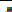

.. image:: ./cmt_images/image23.png
   :width: 5.28333in
   :height: 3.79444in

FK (Foreign key)
^^^^^^^^^^^^^^^^^^^^^^^^

테이블의 FK 이름과 설정들을 확인하고 변경할 수 있다.

.. image:: ./cmt_images/image24.png
   :width: 6.14583in
   :height: 3.44861in

.. image:: ./cmt_images/image25.png
   :width: 6.26805in
   :height: 3.17639in

- 생성: 해당 FK를 마이그레이션 대상에서 제외시킨다. 생성을 선택하지 않으면 교체도 선택할 수 없다.

- 교체: 대상 데이터베이스에 같은 이름의 외래키가 이미 생성되어 있는 경우 삭제하고 새로운 외래키를 생성한다.

- 테이블 이름: FOREIGN KEY를 소유하고 있는 테이블의 이름이다.

- 외래키 이름: FOREIGN KEY 제약 조건의 이름을 지정한다.

- 외래 컬럼 정보: 외래키로 정의한 컬럼의 이름이다.

- 참조 테이블 이름: 참조되는 테이블의 이름이다.

- 참조 컬럼: 참조되는 기본키 컬럼 이름이다.

- On Update: 외래키가 참조하는 기본키 값을 갱신하려 할 때 수행할 작업을 정의한다. NO ACTION, RESTRICT, SET NULL 중 하나의 옵션을 선택할 수 있다.

- On Delete: 외래키가 참조하는 기본키 값을 삭제하려 할 때 수행할 작업을 정의한다. NO ACTION, RESTRICT, CASCADE, SET NULL 중 하나의 옵션을 선택할 수 있다.

Index
^^^^^^^^^^^^^^^^^^

테이블의 인덱스 설정들을 확인하고 변경할 수 있다.

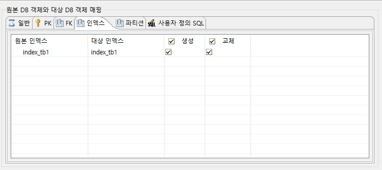

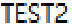

- 생성: 해당 Index를 마이그레이션 대상에서 제외시킨다. 생성을 선택하지 않으면 교체도 선택할 수 없다.

- 교체: 대상 데이터베이스에 같은 이름의 인덱스가 이미 생성되어 있는 경우 삭제하고 새로운 인덱스를 생성한다.

- 테이블 이름: 인덱스를 생성할 테이블의 이름이다.

- 인덱스 이름: 생성하려는 인덱스의 이름이다. 인덱스 이름은 테이블 안에서 고유한 값이어야 한다.

- REVERSE: Reverse Index로 생성한다.

- UNIQUE: 유일한 값을 갖는 고유 인덱스를 생성한다.

- 컬럼: 인덱스를 적용할 컬럼의 이름을 명시한다.

- 순서: 드롭다운 리스트로 ASC, DESC 중 하나를 선택하여 컬럼의 정렬 방향을 설정할 수 있다.

Column
^^^^^^^^^^^^^^^^^^

컬럼 노드를 선택하여 컬럼 세부 설정을 할 수 있다.

.. image:: ./cmt_images/image28.png
   :width: 6.26805in
   :height: 4.10833in

View
^^^^^^^^^^^^^^^^^^

원본 뷰, 대상 뷰 정보를 확인할 수 있다.

.. image:: ./cmt_images/image29.png
   :width: 6.26805in
   :height: 3.60833in

- 생성: 해당 뷰을 이관 대상에서 제외시킨다. 생성을 체크하지 않으면 교체를 선택할 수 없다.

- 교체: 대상 데이터베이스에 같은 이름의 뷰가 이미 생성되어 있는 경우 삭제하고 새로운 뷰 를 생성한다.

    - 뷰 상세 페이지를 통해 뷰 이름, View Query Spec을 변경할 수 있다.

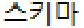

Serial
^^^^^^^^^^^^^^^^^^

원본 시리얼, 대상 시리얼 정보를 확인할 수 있다.

- 생성: 해당 시리얼을 이관 대상에서 제외시킨다. 생성을 체크하지 않으면 교체를 선택할 수 없다.

- 교체: 대상 데이터베이스에 같은 이름의 시리얼이 이미 생성되어 있는 경우 삭제하고 새로운 시리얼을 생성한다.

    - 시리얼 상세 페이지를 통해 이름, 시작 값, 증가 값, 최소 값, 최대 값, 캐시 값, 순환을 변경할 수 있다.

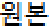

- 시리얼 이름: 시리얼의 이름을 지정한다.

- 시작 값: 처음 생성되는 시리얼 숫자를 지정한다.

- 증가 값: 시리얼 숫자 간의 간격을 지정한다.

- 최소 값: 시리얼의 최소값을 지정한다.

- 최대 값: 시리얼의 최대값을 지정한다.

- 캐시 값: cached_num 값을 지정한다.

- 순환: 시리얼 값이 최대 또는 최소값에 도달한 후에 연속적으로 값을 생성하도록 지정한다.

Synonym
^^^^^^^^^^^^^^^^^^

원본 시노님, 대상 시노님 정보를 확인할 수 있다.

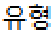

- 생성: 해당 시노님을 이관 대상에서 제외시킨다. 생성을 체크하지 않으면 교체를 선택할 수 없다.

- 교체: 대상 데이터베이스에 같은 이름의 시노님이 이미 생성되어 있는 경우 삭제하고 새로운 시노님을 생성한다.

.. image:: ./cmt_images/image34.png
    :width: 6in
    :height: 2.75in

- 시노님 이름: 동의어의 이름을 지정한다.

- 시노님 스키마 이름: 동의어의 스키마 이름을 지정한다.

- 오브젝트 이름: 대상 객체의 이름을 지정한다.

- 오브젝트 스키마 이름: 대상 객체의 스키마 이름을 지정한다.

Grant
^^^^^^^^^^^^^^^^^^

권한 종류, 원본 스키마, 원본 오브젝트, 대상 스키마 정보를 확인할 수 있다.

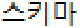

생성: 해당 권한을 이관 대상에서 제외시킨다.

SQL
^^^^^^^^^^^^^^^^^^
사용자가 쿼리를 통해 원하는 record, table을 대상에 출력할 수 있다.

- SQL 추가: 쿼리를 입력하는 창을 표시하여 원하는 쿼리를 입력할 수 있다

- SQL 편집: 입력된 쿼리를 편집할 수 있다

- SQL 삭제: 입력된 쿼리를 삭제할 수 있다

- SQL 가져오기: SQL 파일을 선택하여 쿼리를 가져올 수 있다

- 데이터: 입력한 쿼리를 통해 record 추출 여부를 확인한다

- 생성: 입력한 쿼리를 통해 "대상 테이블" 이름을 가지는 테이블을 생성한다

- 교체: 이미 "대상 테이블" 이름을 가진 테이블이 있을 경우 해당 테이블을 교체한다

**6단계**
^^^^^^^^^^^^^^^^^
마이그레이션을 실행하기 전 설정한 정보들을 확인할 수 있다.

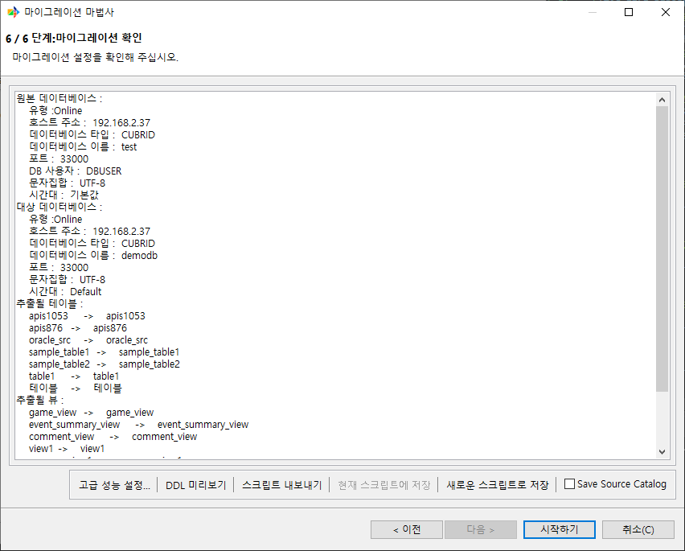

고급 성능 설정

.. image:: ./cmt_images/image37.png
   :width: 5.53056in
   :height: 2.28194in

- 동시 작업 개수: 마이그레이션 시 사용할 스레드 개수를 지정할 수 있다.

- 커밋 주기: 대량의 데이터를 가져오기 할 경우 데이터베이스에 트랜잭션이 길어지고 변경로그가 쌓이게 되면, 데이터베이스 입력이 느려지기 때문에 주기적으로 커밋하는 것을 권한다. 1000으로 기본 설정되어 있으며, 환경에 따라 그 이상의 값을 설정할 수 있다.

- 테이블별 진행율 생략: 마이그레이션 시 실시간으로 테이블별 row 진행 정도를 생략하면서 마이그레이션을 수행할 수 있다.

DDL 미리보기
^^^^^^^^^^^^^^^^^^

이관 대상의 오브젝트의 DDL을 확인해 볼 수 있다.

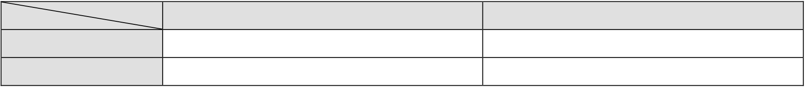

스크립트 내보내기
^^^^^^^^^^^^^^^^^^

- 마이그레이션 마법사에서 설정한 정보를 스크립트 파일로 내보낼 수 있다. 로컬 PC로 내보내거나, 원격 서버로 내보낼 수 있다.

- 현재 스크립트에 저장: 마이그레이션 작업이 스크립트로 실행되었거나, 스크립트로 저장된 작업이라면 마이그레이션 마법사 설정을 하면서 변경한 정보를 현재 스크립트에 덮어서 저장할 수 있다.

- 새로운 스크립트로 저장: 마이그레이션 마법사에서 설정한 정보를 스크립트로 저장할 수 있다.

Save Source Catalog

**마이그레이션 실행**
^^^^^^^^^^^^^^^^^^^^^^^^^^

.. image:: ./cmt_images/image39.png
   :width: 4.92778in
   :height: 2.66667in

- 바로 시작하기: 즉시 마이그레이션이 시작된다.

- 예약하기: 바로 마이그레이션이 시작되지 않고 사용자가 예약한 시간에 실행된다.

- 마이그레이션 예약 설정: 마이그레이션 예약 설정을 할 수 있다.

.. image:: ./cmt_images/image40.png
    :width: 4.10417in
    :height: 3.08333in

- 1회 실행: 사용자가 설정한 시간에 한 번만 마이그레이션이 실행된다.

- 매일 반복 실행: 사용자가 설정한 시간에 매일 반복해서 마이그레이션이 실행된다.
